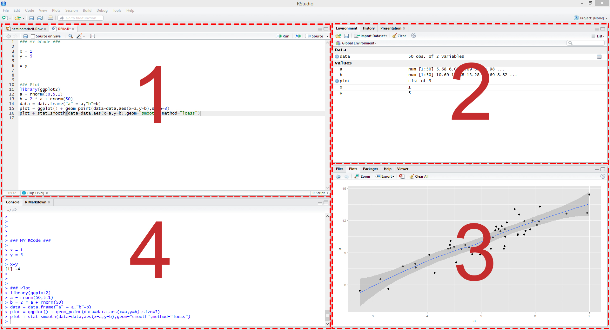

---
output:
  html_document:
    css: !expr c("./assets/style.css")
    includes:
      in_header: !expr c("./assets/header_01.html")
editor_options: 
  chunk_output_type: console
---

<!--..........................................................................-->
<!--..........................................................................-->

````{=html}
```{r, echo=FALSE, results='asis'}
xfun::file_string('./assets/header_02.html')
```
````

```{r,klippy, echo=FALSE, include=TRUE}

# See: https://rlesur.github.io/klippy/articles/klippy.html
klippy::klippy(tooltip_message = 'Click to copy', tooltip_success = 'Done', position = c('top', 'right'))

```

<!--..........................................................................-->
<hr />

# <span class="R">R</span> Basics {.tabset .tabset-fade}

```{r,include=FALSE,eval=FALSE}

notes
-> terms: call return print

```

<!--..........................................................................-->
<hr />

## <span class="R">RStudio</span> Panes {.tabset .tabset-fade}

<!--..........................................................................-->
<!-- <hr /> -->

<p class="reph2">
<span class="R">RStudio</span> Panes
</p>

<!--..........................................................................-->
<hr />

<p class="head01">
General
</p>

The <span class="R">RStudio</span> interface is divided into different panes.

<!-- In the basic set-up there are four panes: -->

<span style="text-decoration:underline">In the basic set-up there are four panes</span>:

* 1 *"Source"* pane
* 2 *"Environment"*, *"History"* and *"Connections"* pane
* 3 *"Files"*, *"Plots"*, *"Packages"*, *"Help"* and *"Viewer"* pane 
* 4 *"Console"* pane

<!--..........................................................................-->
<button type="button" class="collapsible02"> *<span class="R">RStudio</span> Panes*</button>
<div class="col_content">

<!--  -->

<!--  -->



<!--..........................................................................-->
<hr />

<p class="head02">
Legend
</p>

* 1 *"Source"* pane
* 2 *"Environment"*, *"History"* and *"Connections"* pane
* 3 *"Files"*, *"Plots"*, *"Packages"*, *"Help"* and *"Viewer"* pane 
* 4 *"Console"* pane

<!--..........................................................................-->
<hr />

<p class="head02">
Note
</p>

The arrangement of the panes might different in your set-up and can be changed by clicking on "Tools" &#10140; "Global Options..." &#10140; "Pane Layout".

</div>
<!--..........................................................................-->

<!--..........................................................................-->
<hr />

<p class="head01">
*Console* and *Source* pane
</p>

In general, <span class="R">R</span> code is evaluated in the <span class="R">R</span> console.

In <span class="R">RStudio</span> the <span class="R">R</span> console appears is in the *console* pane.

However, to make the code replicable one should use <span class="R">R</span> scripts.

In <span class="R">RStudio</span> <span class="R">R</span> scripts appear in the *source* pane.

<!--..........................................................................-->
<hr />

<p class="back01">
[Back To *Start* of *Practical Class*](./index.html)
</p>

<!--..........................................................................-->
<hr />


<!--..........................................................................-->
<!-- <hr /> -->

## Using <span class="R">R</span> Scripts {.tabset .tabset-fade}

<!--..........................................................................-->
<!-- <hr /> -->

<p class="reph2">
Using <span class="R">R</span> Scripts
</p>

<!--..........................................................................-->
<hr />

<p class="head01">
Open an new <span class="R">R</span> Script
</p>

<!--..........................................................................-->
<hr />

Open a new script by clicking on *"File"* &#10140; *"New File"* &#10140; *"R Script"*.

The new script will appear in the so-called *"Source"* pane (see below).


<!--..........................................................................-->
<hr />

<p class="head01">
Save an new <span class="R">R</span> Script
</p>

<!--..........................................................................-->
<hr />

Save a new script by clicking on *"File"* &#10140; *"Save as"* choose the location and save the file.

The script will be saved as an `.R` file.

<!--..........................................................................-->
<hr />

<p class="head01">
Comments
</p>

<!--..........................................................................-->
<hr />

Use `#` to add comments to your script.

Everything which appears in the same line after `#` will not be evaluated when running the code.

Use comments to structure your script and to describe what you do.

<!--..........................................................................-->
<button type="button" class="collapsible01"> *Show Code* </button>
<div class="cod_content">
```{r,include=TRUE,echo=TRUE,results=FALSE}
# this is a comment...
```
</div>
<!--..........................................................................-->

<!--..........................................................................-->
<hr />

<p class="head01">
Simple calculations
</p>

<!--..........................................................................-->
<hr />

Results of simple calculations can be returned or assigned (see also later)

<!--..........................................................................-->
<button type="button" class="collapsible01"> *Show Code* </button>
<div class="cod_content">
```{r,include=TRUE,echo=TRUE,results=FALSE}
# simple calculations
1 + 1 
```
</div>
<!--..........................................................................-->
<button type="button" class="collapsible01"> *Show Output* </button>
<div class="cod_content">
```{r,include=TRUE,echo=FALSE,results=TRUE}
# simple calculations
1 + 1 
```
</div>
<!--..........................................................................-->

<!--..........................................................................-->
<hr />

<p class="back01">
[Back To *Start* of *Practical Class*](./index.html)
</p>

<!--..........................................................................-->
<hr />


<!--..........................................................................-->
<!-- <hr /> -->

## Variables {.tabset .tabset-fade}

<!--..........................................................................-->
<!-- <hr /> -->

<p class="reph2">
Variables
</p>

<!--..........................................................................-->
<hr />

Information can be assigned to a *variable* using a statement.

<!--..........................................................................-->
<hr />

<p class="head01">
Assigning *Variables*
</p>

<!--..........................................................................-->
<hr />

The most basic statements consists of a *variable* and the assignment operator `<-`.

<!--..........................................................................-->
<button type="button" class="collapsible01"> *Show Code* </button>
<div class="cod_content">
```{r,include=TRUE,echo=TRUE,results=FALSE}
# a basic statement
a <- 1
```
</div>
<!--..........................................................................-->

<!--..........................................................................-->
<hr />

<center> 
<span class="emp02">
Note, the <span class="R">R</span> language is case sensitive, i.e., `a` is interpreted differently as `A`.
</span>
</center>

<!--..........................................................................-->
<hr />

<!--..........................................................................-->
<!-- <hr /> -->

<p class="head01">
Returning *Variables*
</p>

<!--..........................................................................-->
<hr />

The information stored in a *variable* can be returned by calling or returning the *variable*.

<!--..........................................................................-->
<button type="button" class="collapsible01"> *Show Code* </button>
<div class="cod_content">
```{r,include=TRUE,echo=TRUE,results=FALSE}
# return information
a
```
</div>
<!--..........................................................................-->
<button type="button" class="collapsible01"> *Show Output* </button>
<div class="cod_content">
```{r,include=TRUE,echo=FALSE,results=TRUE}
# return information
a
```
</div>
<!--..........................................................................-->

The result of the simple calculation above can now be assigned and returned using a *variable*.

<!--..........................................................................-->
<button type="button" class="collapsible01"> *Show Code* </button>
<div class="cod_content">
```{r,include=TRUE,echo=TRUE,results=FALSE}
# simple calculations (again)
b <- 1 + 1
b
```
</div>
<!--..........................................................................-->
<button type="button" class="collapsible01"> *Show Output* </button>
<div class="cod_content">
```{r,include=TRUE,echo=FALSE,results=TRUE}
# simple calculations (again)
b <- 1 + 1 
b
```
</div>
<!--..........................................................................-->

<!--..........................................................................-->
<hr />

<p class="back01">
[Back To *Start* of *Practical Class*](./index.html)
</p>

<!--..........................................................................-->
<hr />


<!--..........................................................................-->
<!-- <hr /> -->

## Functions {.tabset .tabset-fade}

<!--..........................................................................-->
<!-- <hr /> -->

<p class="reph2">
Functions
</p>

<!--..........................................................................-->
<hr />

More general statements consists of a *variable* and a *function*.

<!-- More general statements consists of *variables* and a *function* connected by the assignment operator `<-`. -->

<!--..........................................................................-->
<hr />

<p class="head01">
A basic *function*
</p>

<!--..........................................................................-->
<hr />

One of the most basic *functions* in <span class="R">R</span> is the *function* `c()`.

The *function* `c()` combines values into a vector.

<!--..........................................................................-->
<button type="button" class="collapsible01"> *Show Code* </button>
<div class="cod_content">
```{r,include=TRUE,echo=TRUE,results=FALSE}
# a basic function
c <- c(1,2)
c
```
</div>
<!--..........................................................................-->
<button type="button" class="collapsible01"> *Show Output* </button>
<div class="cod_content">
```{r,include=TRUE,echo=FALSE,results=TRUE}
# a basic function
c <- c(1,2)
c
```
</div>
<!--..........................................................................-->

In general, *functions* consist of...

* the name of the *function*, i.e., `c`, and, ...
* the arguments of the *function*, i.e., `1,2`, enclosed by brackets `()`.

<!--..........................................................................-->
<hr />

<p class="head01">
Arguments of *functions*
</p>

Another, basic *function* is the *function* `log()`.

The *function* `log()` calculates the logarithms.

<!--..........................................................................-->
<button type="button" class="collapsible01"> *Show Code* </button>
<div class="cod_content">
```{r,include=TRUE,echo=TRUE,results=FALSE}
# log function
d <- log(2)
d
```
</div>
<!--..........................................................................-->
<button type="button" class="collapsible01"> *Show Output* </button>
<div class="cod_content">
```{r,include=TRUE,echo=FALSE,results=TRUE}
# log function
d <- log(2)
d
```
</div>
<!--..........................................................................-->

Arguments of *functions* can be necessary or optional.

* Necessary arguments have to be specified in the call of the *function*.
* Instead, if optional argument are not explicitly specified a default value is used.

<!--..........................................................................-->
<button type="button" class="collapsible01"> *Show Code* </button>
<div class="cod_content">
```{r,include=TRUE,echo=TRUE,results=FALSE}
# log function with base 10
e <- log(2, base=10)
e
```
</div>
<!--..........................................................................-->
<button type="button" class="collapsible01"> *Show Output* </button>
<div class="cod_content">
```{r,include=TRUE,echo=FALSE,results=TRUE}
# log function with base 10
e <- log(2, base=10)
e
```
</div>
<!--..........................................................................-->

Additional arguments of *functions* are usually explicitly assigned using the `=` notation, i.e., `base=10`, in the example above.

<!--..........................................................................-->
<hr />

<p class="head01">
Help for functions
</p>

In general, there is a large amount of pre-defined *functions* available in <span class="R">R</span>.

For more information on a particular *function* click on the *"Help"* pane and type the *function*, e.g., `log`, into the search bar to open the <span class="R">R</span> documentation of the respective *function*.

Alternatively the *function* `help()` can be used to open the <span class="R">R</span> documentation in your browser.

<!--..........................................................................-->
<button type="button" class="collapsible01"> *Show Code* </button>
<div class="cod_content">
```{r,include=TRUE,echo=TRUE,results=FALSE,eval=FALSE}
# help for log function
help(log)
```
</div>

<!--..........................................................................-->
<hr />

<p class="back01">
[Back To *Start* of *Practical Class*](./index.html)
</p>

<!--..........................................................................-->
<hr />


<!--..........................................................................-->
<!-- <hr /> -->

## Packages {.tabset .tabset-fade}

<!--..........................................................................-->
<!-- <hr /> -->

<p class="reph2">
Packages
</p>

<!--..........................................................................-->
<hr />

<p class="head01">
The *Global Environment*
</p>

<!-- In general, anything that is assigned by the user in <span class="R">R</span> is stored as an *object* in the *global environment*. -->

In general, any *object* assigned by the user is stored as an *object* in the *global environment*.

This includes *variables* but also *functions* defined by the user.

<!-- In <span class="R">RStudio</span> all *objects* assigned appear in the *environment* pane. -->

In <span class="R">RStudio</span> all these assigned *objects* appear in the *environment* pane.

Alternatively, all assigned *objects* can be returned using the function `ls()`

<!--..........................................................................-->
<button type="button" class="collapsible01"> *Show Code* </button>
<div class="cod_content">
```{r,include=TRUE,echo=TRUE,results=FALSE}
# all objects in environment
ls()
```
</div>
<!--..........................................................................-->
<button type="button" class="collapsible01"> *Show Output* </button>
<div class="cod_content">
```{r,include=TRUE,echo=FALSE,results=TRUE}
# all objects in environment
ls()
```
</div>
<!--..........................................................................-->

<!--..........................................................................-->
<hr />

<p class="head01">
<span class="R">R</span> Packages (basic <span class="R">R</span> distribution)
</p>

```{r,include=FALSE}

# http://adv-r.had.co.nz/Environments.html
search()

library(pryr)
where("c")
where("log")

```

<!-- However, there are already a lot more pre-defined *functions* available. -->

However, there are a lot more already pre-defined *functions* available.

Examples are the *functions* `c()` and `log()` used above.

<!-- There are even more pre-defined *functions* available for download. -->

In general, these pre-defined *functions* are stored in *packages*.

Basic *packages* such as `stats`, `graphics` are part of the basic distribution of <span class="R">R</span> and do not need to be downloaded for their use anymore.

For example the *functions* `c()` and `log()` are part of the `base` package which is also part of the basic distribution of <span class="R">R</span>.

<!--..........................................................................-->
<hr />

<p class="head01">
Additional <span class="R">R</span> Packages
</p>

There are even more *packages* available for download online.

To use pre-defined *functions* of other *packages*, not part of the basic distribution, one has to...

* first, download the respective *package* using `install.packages()` once, and...
* second, load the respective *package* using `library()` every time when its *functions* are used.

All downloaded *packages* are listed in the "Packages" pane. Thus, alternatively:

* To install a new *package* click on "Install".
* To load an already installed *package* check the box to the left of the respective *package*. 

A popular additional *package* is the *package* `lmtest` ([See](https://cran.r-project.org/))

<!--..........................................................................-->
<button type="button" class="collapsible01"> *Show Code* </button>
<div class="cod_content">
```{r,include=TRUE,echo=TRUE,results=FALSE,eval=FALSE}
# install the package once
install.packages("lmtest")
# load the package every time
library(lmtest)
require(lmtest) # ... or by using require()
```
</div>
<!--..........................................................................-->

<!--..........................................................................-->
<hr />

<p class="back01">
[Back To *Start* of *Practical Class*](./index.html)
</p>

<!--..........................................................................-->
<hr />


<!--..........................................................................-->
<!-- <hr /> -->

## Workflow {.tabset .tabset-fade}

<!--..........................................................................-->
<!-- <hr /> -->

<p class="reph2">
Workflow
</p>

<!--..........................................................................-->
<hr />

<p class="head01">
Clear *Global Environment*
</p>

At the beginning of the script the current *global environment* should be cleared using the *function* `rm()`.

<!--..........................................................................-->
<button type="button" class="collapsible01"> *Show Code* </button>
<div class="cod_content">
```{r,include=TRUE,echo=TRUE,results=FALSE,eval=FALSE}
# clear global environment
rm(list=ls())
```
</div>
<!--..........................................................................-->

<!--..........................................................................-->
<hr />

<p class="head01">
Set working directory
</p>

It is convenient to store all the necessary files of the analysis in one directory and set this directory as the working directory using the *function* `setwd()` at the beginning of the *script*.

<!--..........................................................................-->
<button type="button" class="collapsible01"> *Show Code* </button>
<div class="cod_content">
```{r,include=TRUE,echo=TRUE,results=FALSE,eval=FALSE}
# set working directory
setwd(".../set/your/working/directory/...")
```
</div>
<!--..........................................................................-->

<!--..........................................................................-->
<hr />

<p class="head01">
Save work space
</p>

<!--..........................................................................-->
<hr />

At the end of the *script* the current *global environment* can be saved into the current working directory using the *function* `save.image()`.

<!--..........................................................................-->
<button type="button" class="collapsible01"> *Show Code* </button>
<div class="cod_content">
```{r,include=TRUE,echo=TRUE,results=FALSE,eval=FALSE}
# save the workspace to the file .RData
save.image()
```
</div>
<!--..........................................................................-->

<!--..........................................................................-->
<hr />

<p class="back01">
[Back To *Start* of *Practical Class*](./index.html)
</p>

<!--..........................................................................-->
<hr />


<!--..........................................................................--> 
<!-- THIS IS THE END --> 

<!-- Include bottom -->

````{=html}
```{r, echo=FALSE, results='asis'}
xfun::file_string('./assets/bottom_01.html')
```
````