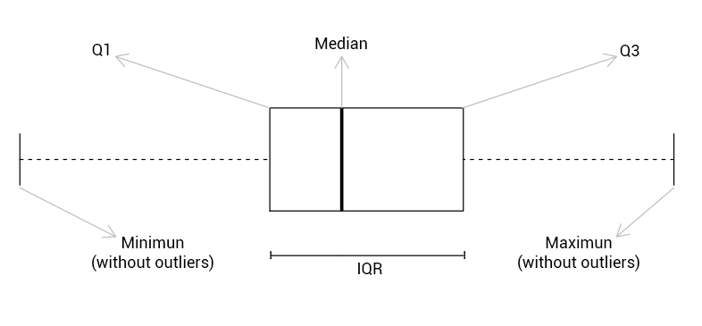

---
output:
  html_document:
    css: !expr c("./assets/style.css")
    includes:
      in_header: !expr c("./assets/header_01.html")
params:
  dat_link_01: "https://ilias.uni-hohenheim.de/goto.php?target=file_1523858_download&client_id=UHOH"
  dat_nam_01: "CASchools_01_data.txt"
editor_options: 
  chunk_output_type: console
---

<!--..........................................................................-->
<!--..........................................................................-->

<!-- Include header -->

````{=html}
```{r, include=TRUE, echo=FALSE, results='asis'}
xfun::file_string('./assets/header_02.html')
```
````

<!--..........................................................................-->
<!--..........................................................................-->

```{r,include=FALSE}

knitr::opts_chunk$set(
  include=FALSE,
  echo = FALSE,
  warning = FALSE,
  message = FALSE,
  fig.align = 'center')
# See: https://stackoverflow.com/questions/36230790/missing-horizontal-scroll-bar-in-r-markdown-html-code-chunks-and-output
options(width=1000)

```

```{r}

# # 1) clear workspace # exclude to be able to use params in yml header!
# rm(list=ls(all=TRUE))

# 2) load libraries
library(kableExtra)

# 3) load r-scripts
source("./r-scripts/texreg_extract_fun.R")
source("./r-scripts/r_helper_functions.R")

# 4) load data
cas.dat <- read.table(file = "./data-sets/CASchools_01_data.txt",
                      header = TRUE,
                      sep = ",",
                      colClasses = c("numeric","numeric","numeric","numeric"))

```

```{r,klippy, echo=FALSE, include=TRUE}

# See: https://rlesur.github.io/klippy/articles/klippy.html
klippy::klippy(tooltip_message = 'Click to copy', tooltip_success = 'Done', position = c('top', 'right'))

```

<!--..........................................................................-->
<!--..........................................................................-->

<hr />

<!--..........................................................................-->
# Exercise Sheet No 01 {.tabset .tabset-fade}
<!--..........................................................................-->

<hr />

<p class="head01">
California Test Score Data Set
</p>

We want to analyze student performance and class size. For this we use the data set ``CASchool_01_data.txt``. The data set contains the variables described in the table below for school districts in California.

<!--..........................................................................-->
<button type="button" class="collapsible02"> *Show Variable Description* </button>
<div class="col_content">

| Variable   | Description            | 
|------------|------------------------| 
| $students$ | Total enrollment.      | 
| $teachers$ | Number of teachers.    | 
| $read$     | Average reading score. | 
| $math$     | Average math score.    | 

</div>
<!--..........................................................................-->

<hr />

<!--..........................................................................-->
## Set-Up

<span style="text-decoration: none; font-size: 18pt">
1)
</span>
<span style="text-decoration: underline; font-size: 18pt">
Create your (working) directory
</span>

Create a new folder on your computer in which you can save all necessary files, i.e., the data set, the <span class="R">R</span> *script* with the implementation of your analysis and the <span class="R">R</span> *helper function script* with some helper functions provided by us.

This folder, i.e., the path or directory of this folder, will be your so-called working directory.

<hr />

<span style="text-decoration: none; font-size: 18pt">
2)
</span>
<span style="text-decoration: underline; font-size: 18pt">
Download the data set
</span>

<!-- Download the data sets `CASchools_01_data` from <span class="R">ILIAS</span> directly or by using the link below: -->

<!-- <p class="down01"> -->
<!-- <a href="https://ilias.uni-hohenheim.de/goto.php?target=file_1523858_download&client_id=UHOH">Download `CASchools_01_data.txt`</a> -->
<!-- </p> -->

Download the data sets ``r params$dat_nam_01`` from <span class="R">ILIAS</span> or by using the link below:

<p class="down01">
<a href="`r params$dat_link_01`">Download ``r params$dat_nam_01``</a>
</p>

Save the data set into your (working) directory.

<hr />

<span style="text-decoration: none; font-size: 18pt">
3)
</span>
<span style="text-decoration: underline; font-size: 18pt">
Prepare *script*
</span>

Open a new <span class="R">R</span> *script* and save it into into your (working) directory.

Run the following code chunk to prepare your <span class="R">R</span> *script*, i.e., to clear the work space and set your working directory.

```{r,include=TRUE,echo=TRUE,eval=FALSE}

# Clear workspace
rm(list = ls(all = TRUE))
# Set working directory
setwd(".../set/your/working/directory/...")

```

<hr />

<div style="display:none">

<span style="text-decoration: none; font-size: 18pt">
X)
</span>
<span style="text-decoration: underline; font-size: 18pt">
Install *libraries*
</span>

Run the following code chunk to make sure that all necessary *libraries* are installed.

*Note*, You have to run this code chunk only once. After running this code chunk you have installed all necessary *libraries* for the class and we will load them whenever we need them.

```{r,include=TRUE,echo=TRUE,eval=FALSE,include=FALSE}

# packages we will use in the course
pac <- c("moments", "sandwich", "lmtest", "car", "plm", "ivreg", "dynlm", "forecast", "urca")

# install and/or load packages
checkpac <- function(x) {
  if (!require(x, character.only = TRUE)) {
    install.packages(x)
  }
  require(x, character.only = TRUE)
}

# check if packages are install yet
suppressWarnings(sapply(pac, checkpac))

```

<hr />

</div>

<span style="text-decoration: none; font-size: 18pt">
4)
</span>
<span style="text-decoration: underline; font-size: 18pt">
Install/load *packages* and download/save/include *helper function script*
</span>

<span style="text-decoration: underline">Step 1</span>) Install all relevant <span class="R">R</span> *packages* and download and save the <span class="R">R</span> *script* `r_helper_functions.R` from <span class="R">ILIAS</span> by running the following code chunk.

```{r,include=TRUE,echo=TRUE,eval=FALSE}

# Download R-helper functions
source("https://ilias.uni-hohenheim.de/data/UHOH/lm_data/lm_1856939/MA_EconometricMethods_WiSe2324_PracticalClass/r-scripts/prepare_r_packages_and_helper_functions.R")

```

*Note*, the required <span class="R">R</span> *packages* are `"moments"`, `"sandwich"`, `"lmtest"`, `"lmtest"`, `"car"`, `"plm"`, `"ivreg"`, `"dynlm"`, `"forecast"`, `"urca"`.

<div style="margin-top: 5px;">
<span style="text-decoration: underline">Step 2</span>) Include the <span class="R">R</span> *script* `r_helper_functions.R` into your <span class="R">R</span> *script* by running the following code chunk.
</div>

```{r,include=TRUE,echo=TRUE,eval=FALSE}

# Include R-helper functions
source("r_helper_functions.R")

```

*Note*, more information on the helper functions can be found [here](./00_ExerciseSheet_HelperFunctions_XX.html).


<!--..........................................................................-->
## Task a) 

Load the data set into <span class="R">R</span> and familiarize yourself with the structure of the data.

<hr />

<p class="head02">
Load data set
</p>

<!--..........................................................................-->
<button type="button" class="collapsible01"> *Show Code* </button>
<div class="cod_content">
```{r,include=TRUE,echo=TRUE,results=FALSE,eval=FALSE}
# load the data set
cas.dat <- read.table(file = "CASchools_01_data.txt",
                      header = TRUE,
                      sep = ",",
                      colClasses = c("numeric","numeric","numeric","numeric"))
```
</div>
<!--..........................................................................-->

<!--..........................................................................-->
<button type="button" class="collapsible02"> *Note* </button>
<div class="col_content">

* Use a *statement*, consisting of a *function*, e.g., `read.table()` and the *assignment* notation, i.e., `<-` to define a data object, e.g., `cas.dat`.
* Use the *function* `read.table()` to load the data set.
* Use the *function* `help(read.table)` to open the help page for the *function* `read.table`.

</div>
<!--..........................................................................-->

<hr />

<p class="head02">
Structure of the data set
</p>

<!--..........................................................................-->
<button type="button" class="collapsible01"> *Show Code* </button>
<div class="cod_content">
```{r,include=TRUE,echo=TRUE,results=FALSE}
# list the first six observations
head(cas.dat)
# return the structure
str(cas.dat)
```
</div>
<!--..........................................................................-->
<button type="button" class="collapsible01"> *Show Output* </button>
<div class="cod_content">
```{r,include=TRUE,echo=FALSE,results=TRUE}
# list the first six observations
head(cas.dat)
# return the structure
str(cas.dat)
```
</div>
<!--..........................................................................-->

<!--..........................................................................-->
<button type="button" class="collapsible02"> *Note* </button>
<div class="col_content">

Use the *functions* `head()` and `str()` to get an overview of the structure of the data set.

* `cas.dat` is a object of class `'data.frame'`, which is the most common data structure in the implementations here.
* All the variable are of *mode* `'numeric'`.
* Note, this is not surprising as we defined the columns/variables to be "numeric" when we loaded the data set using the *function* `read.table()` with the option `colClasses = c("numeric","numeric","numeric","numeric")` above.

</div>
<!--..........................................................................-->

<!--..........................................................................-->
<button type="button" class="collapsible02"> **Interpretation** </button>
<div class="col_content">

<div style="color: red" class="showSol01">

* The *data frame* contains 420 observations for four variables.
* The variables are $students$, $teachers$, $read$ and $math$.

</div>

<div style="color: red" class="noSol01">

*Add your interpretation here!*

</div>

</div>
<!--..........................................................................-->

<!--..........................................................................-->
## Task b) 

Replicate and interpret the summary statistics depicted in Table 2 of the Exercise Sheet.

<hr />

<p class="head02">
Replicate summary statistics
</p>

<!--..........................................................................-->
<button type="button" class="collapsible01"> *Show Code* </button>
<div class="cod_content">
```{r,include=TRUE,echo=TRUE,results=FALSE}
# compute sample averages
avg.stu <- mean(cas.dat$students) 
avg.tea <- mean(cas.dat$teachers)
avg.rea <- mean(cas.dat$read)
avg.mat <- mean(cas.dat$math)
# compute sample standard deviations
sd.stu <- sd(cas.dat$students) 
sd.tea <- sd(cas.dat$teachers)
sd.rea <- sd(cas.dat$read)
sd.mat <- sd(cas.dat$math)
# set up a vector of percentiles and compute the percentiles 
per <- c(0.10, 0.25, 0.4, 0.5, 0.6, 0.75, 0.9)
per.stu <- quantile(cas.dat$students, per)
per.tea <- quantile(cas.dat$teachers, per)
per.rea <- quantile(cas.dat$read, per)
per.mat <- quantile(cas.dat$math, per)
```
</div>
<!--..........................................................................-->

<!--..........................................................................-->
<button type="button" class="collapsible02"> *Note* </button>
<div class="col_content">

* Use the `$` notation to access a variable of a *data frame*, e.g, here, `cas.dat$students`.
* Use the *functions* `mean()`, `sd()`, and `quantile()` to calculate the *mean*, *standard deviation*, and *quantiles* of variables.

</div>
<!--..........................................................................-->

<hr />

<p class="head02">
Collect results
</p>

<!--..........................................................................-->
<button type="button" class="collapsible01"> *Show Code* </button>
<div class="cod_content">
```{r,include=TRUE,echo=TRUE,results=FALSE}
# gather everything in a data.frame 
dis.sum.01 <- data.frame(avg = c(avg.stu, avg.tea, avg.rea, avg.mat), 
                         sd  = c(sd.stu, sd.tea, sd.rea, sd.mat), 
                         per = rbind(per.stu, per.tea, per.rea, per.mat))
dis.sum.01
```
</div>
<!--..........................................................................-->
<button type="button" class="collapsible01"> *Show Output* </button>
<div class="cod_content">
```{r,include=TRUE,echo=FALSE,results=TRUE}
# gather everything in a data.frame 
dis.sum.01 <- data.frame(avg = c(avg.stu, avg.tea, avg.rea, avg.mat), 
                         sd  = c(sd.stu, sd.tea, sd.rea, sd.mat), 
                         per = rbind(per.stu, per.tea, per.rea, per.mat))
dis.sum.01
```
</div>
<!--..........................................................................-->

<!--..........................................................................-->
<button type="button" class="collapsible02"> *Note* </button>
<div class="col_content">

Use the *function* `data.frame()` to create a new  *data frame*, here, with the summary statistics for each variable.

</div>
<!--..........................................................................-->

<!--..........................................................................-->
<button type="button" class="collapsible02"> *Distribution Summary* </button>
<div class="cod_content">

```{r}
cas.dat.sum.tab.01 <- format(round(cbind(dis.sum.01),2),2)
colnames(cas.dat.sum.tab.01) <- c("Average","SD","10%","25%","40%","50%","60%","75%","90%")
rownames(cas.dat.sum.tab.01) <- c("students","teachers","reading","math")
```

```{r,include=TRUE,results='asis'}
cas.dat.sum.tab.01 %>%
  kable("html",booktabs=T,escape=F,align="r") %>%
  add_header_above(c(" ", " " = 2, "Percentile" = 7)) %>%
  kable_styling(latex_options="hold_position") %>%
  row_spec(0,align="c")
```

</div>
<!--..........................................................................-->

<!--..........................................................................-->
<button type="button" class="collapsible02"> **Interpretation** </button>
<div class="col_content">

<div style="color: red" class="showSol01">

<p class="head03">
For $\underline{students}$ (e.g.)
</p>

* Average: `r round(avg.stu,2)`
* Standard deviation: `r round(sd.stu,2)`
* 50th Percentile: `r round(quantile(cas.dat$students, 0.5),2)` ($<$ `r round(avg.stu,2)`: positively/right-skewed)
* 10th Percentile: `r round(quantile(cas.dat$students, 0.1),2)`

</div>

<div class="noSol01">

*Add your interpretation here!*

</div>

</div>
<!--..........................................................................-->

<hr />

<p class="head02">
Illustration No 01: Histograms
</p>

<!--..........................................................................-->
<button type="button" class="collapsible01"> *Show Code* </button>
<div class="cod_content">
```{r,include=TRUE,echo=TRUE,results=FALSE,fig.show='hide'}
# plot parameters
par(mfrow = c(2,2),
    mar = c(2, 2, 3, 2))
# histograms
hist(cas.dat$students, main = "Students", xlab = "")
hist(cas.dat$teachers, main = "Teachers", xlab = "")
hist(cas.dat$read, main = "Reading Score", xlab = "")
hist(cas.dat$math, main = "Math Score", xlab = "")
```
</div>
<!--..........................................................................-->
<button type="button" class="collapsible01"> *Show Output* </button>
<div class="cod_content">
```{r,include=TRUE,echo=FALSE,results=TRUE}
# plot parameters
par(mfrow = c(2,2),
    mar = c(2, 2, 3, 2))
# histograms
hist(cas.dat$students, main = "Students", xlab = "")
hist(cas.dat$teachers, main = "Teachers", xlab = "")
hist(cas.dat$read, main = "Reading Score", xlab = "")
hist(cas.dat$math, main = "Math Score", xlab = "")
```
</div>
<!--..........................................................................-->

<hr />

<p class="head02">
Illustration No 02: Boxplots
</p>

<!--..........................................................................-->
<button type="button" class="collapsible01"> *Show Code* </button>
<div class="cod_content">
```{r,include=TRUE,echo=TRUE,results=FALSE,fig.show='hide'}
# plot parameters
par(mfrow=c(2, 2),
    mar=c(2, 2, 3, 2))
# histograms
boxplot(cas.dat$students, main = "Students", xlab = "")
boxplot(cas.dat$teachers, main = "Teachers", xlab = "")
boxplot(cas.dat$read, main = "Reading Score", xlab = "")
boxplot(cas.dat$math, main = "Math Score", xlab = "")
```
</div>
<!--..........................................................................-->
<button type="button" class="collapsible01"> *Show Output* </button>
<div class="cod_content">
```{r,include=TRUE,echo=FALSE,results=TRUE}
# plot parameters
par(mfrow=c(2, 2),
    mar=c(2, 2, 3, 2))
# histograms
boxplot(cas.dat$students, main = "Students", xlab = "")
boxplot(cas.dat$teachers, main = "Teachers", xlab = "")
boxplot(cas.dat$read, main = "Reading Score", xlab = "")
boxplot(cas.dat$math, main = "Math Score", xlab = "")
```
</div>
<!--..........................................................................-->

<!--..........................................................................-->
<button type="button" class="collapsible02"> *Note* </button>
<div class="col_content">

<p class="head03">
General
</p>

* Use the *function* `par()` with the options `mfrow` and `mar`.
    * Use the option `mfrow=c(2,2)` to split the plot window, here, into two rows and two columns, to show plots side-by-side.
    * Use the option `mar=c(2,2,3,2)` to set the margins on the bottom, left, top, and right of the plot window.
* Use the *function* `hist()` and `boxplot` to illustrate the distribution using a histogram and a boxplot, respectively.

<p class="head03">
Boxplots
</p>



<p class="sou01">
Source: [https://r-coder.com/boxplot-r/](https://r-coder.com/boxplot-r/)
</p>

<p>&nbsp;</p> 

<!-- Here: -->

* Outlier are observation that are very distant from the rest of the data and illustrated as unfilled dots.
* Positive outlier: $\,\,\, >Q_{3}+1.5*IQR$
* Negative outlier: $<Q_{1}-1.5*IQR$
* With:
    * $Q_{1}$: First quartile
    * $Q_{3}$: Third quartile
    * $IQR=Q_{3}-Q_{1}$

</div>
<!--..........................................................................-->

<!--..........................................................................-->
## Task c) 

Construct the variable $score$ as the arithmetic mean of the test score for reading and the score of the math test and the variable $STR$ as the number of students per teachers.

<hr />

<p class="head02">
Construct and inspect constructed variables
</p>

<!--..........................................................................-->
<button type="button" class="collapsible01"> *Show Code* </button>
<div class="cod_content">
```{r,include=TRUE,echo=TRUE,results=FALSE}
# compute STR and append it to cas.dat
cas.dat$STR <- cas.dat$students/cas.dat$teachers 
# compute TestScore and append it to cas.dat
cas.dat$score <- (cas.dat$read + cas.dat$math)/2 
# list the first six observations
head(cas.dat)
```
</div>
<!--..........................................................................-->
<button type="button" class="collapsible01"> *Show Output* </button>
<div class="cod_content">
```{r,include=TRUE,echo=FALSE,results=TRUE}
# compute STR and append it to cas.dat
cas.dat$STR <- cas.dat$students/cas.dat$teachers 
# compute TestScore and append it to cas.dat
cas.dat$score <- (cas.dat$read + cas.dat$math)/2 
# list the first six observations
head(cas.dat)
```
</div>
<!--..........................................................................-->

<!--..........................................................................-->
<button type="button" class="collapsible02"> *Note* </button>
<div class="col_content">

A new variable e.g., `nev.var`, can be added to a *data frame* using the `$` notation and the assignment notation `<-`.

</div>
<!--..........................................................................-->

<!--..........................................................................-->
## Task d) 

Provide a summary of the distribution of test scores and student-teacher ratios based on the constructed variables similar to Table 2 above and Table 4.2 in Stock and Watson (2020).

<hr />

<p class="head02">
Calculate summary statistics
</p>

<!--..........................................................................-->
<button type="button" class="collapsible01"> *Show Code* </button>
<div class="cod_content">
```{r,include=TRUE,echo=TRUE,results=FALSE}
# compute sample averages of STR and score
avg.str <- mean(cas.dat$STR) 
avg.sco <- mean(cas.dat$score)
# compute sample standard deviations of STR and score
sd.str <- sd(cas.dat$STR) 
sd.sco <- sd(cas.dat$score)
# set up a vector of percentiles and compute the percentiles 
per <- c(0.10, 0.25, 0.4, 0.5, 0.6, 0.75, 0.9)
per.str <- quantile(cas.dat$STR, per)
per.sco <- quantile(cas.dat$score, per)
```
</div>
<!--..........................................................................-->

<hr />

<p class="head02">
Collect results
</p>

<!--..........................................................................-->
<button type="button" class="collapsible01"> *Show Code* </button>
<div class="cod_content">
```{r,include=TRUE,echo=TRUE,results=FALSE}
# gather everything in a data.frame 
dis.sum.02 <- data.frame(avg = c(avg.str, avg.sco), 
                         sd = c(sd.str, sd.sco), 
                         per = rbind(per.str, per.sco))
dis.sum.02
```
</div>
<!--..........................................................................-->
<button type="button" class="collapsible01"> *Show Output* </button>
<div class="cod_content">
```{r,include=TRUE,echo=FALSE,results=TRUE}
# gather everything in a data.frame 
dis.sum.02 <- data.frame(avg = c(avg.str, avg.sco), 
                         sd = c(sd.str, sd.sco), 
                         per = rbind(per.str, per.sco))
dis.sum.02
```
</div>
<!--..........................................................................-->

<!--..........................................................................-->
<button type="button" class="collapsible02"> *Distribution Summary* </button>
<div class="cod_content">

```{r}
cas.dat.sum.tab.02 <- format(round(cbind(dis.sum.02),2),2)
colnames(cas.dat.sum.tab.02) <- c("Average","SD","10%","25%","40%","50%","60%","75%","90%")
rownames(cas.dat.sum.tab.02) <- c("STR","score")
```

```{r,include=TRUE,results='asis'}
cas.dat.sum.tab.02 %>%
  kable("html",booktabs=T,escape=F,align="r") %>%
  add_header_above(c(" ", " " = 2, "Percentile" = 7)) %>%
  kable_styling(latex_options="hold_position") %>%
  row_spec(0,align="c")
```

</div>
<!--..........................................................................-->

<!--..........................................................................-->
<button type="button" class="collapsible02"> **Interpretation** </button>
<div class="col_content">

<div style="color: red" class="showSol01">

<p class="head03">
For $\underline{STR}$
</p>

* Average: `r round(avg.str,2)`
* Standard deviation: `r round(sd.str,2)`
* 50th Percentile: `r round(quantile(cas.dat$STR, 0.5),2)` ($\approx$ `r round(avg.str,2)`: symmetric)
* 10th Percentile: `r round(quantile(cas.dat$STR, 0.1),2)`

<p class="head03">
For $\underline{score}$
</p>

* Average: `r round(avg.sco,2)`
* Standard deviation: `r round(sd.sco,2)`
* 50th Percentile: `r round(quantile(cas.dat$score, 0.5),2)` ($\approx$ `r round(avg.sco,2)`: symmetric)
* 10th Percentile: `r round(quantile(cas.dat$score, 0.1),2)`

</div>

<div class="noSol01">

*Add your interpretation here!*

</div>

</div>
<!--..........................................................................-->

<hr />

<p class="head02">
Illustration No 01: Histograms
</p>

<!--..........................................................................-->
<button type="button" class="collapsible01"> *Show Code* </button>
<div class="cod_content">
```{r,include=TRUE,echo=TRUE,results=FALSE,fig.show='hide'}
# plot parameters
par(mfrow=c(1, 2),
    mar=c(2, 2, 3, 2))
# histograms
hist(cas.dat$STR, main = "STR", xlab = "")
hist(cas.dat$score, main = "Score", xlab = "")
```
</div>
<!--..........................................................................-->
<button type="button" class="collapsible01"> *Show Output* </button>
<div class="cod_content">
```{r,include=TRUE,echo=FALSE,results=TRUE}
# plot parameters
par(mfrow=c(1, 2),
    mar=c(2, 2, 3, 2))
# histograms
hist(cas.dat$STR, main = "STR", xlab = "")
hist(cas.dat$score, main = "Score", xlab = "")
```
</div>
<!--..........................................................................-->

<hr />

<p class="head02">
Illustration No 02: Boxplots
</p>

<!--..........................................................................-->
<button type="button" class="collapsible01"> *Show Code* </button>
<div class="cod_content">
```{r,include=TRUE,echo=TRUE,results=FALSE,fig.show='hide'}
# plot parameters
par(mfrow=c(1, 2),
    mar=c(2, 2, 3, 2))
# boxplots
boxplot(cas.dat$STR, main = "STR", xlab = "")
boxplot(cas.dat$score, main = "Score", xlab = "")
```
</div>
<!--..........................................................................-->
<button type="button" class="collapsible01"> *Show Output* </button>
<div class="cod_content">
```{r,include=TRUE,echo=FALSE,results=TRUE}
# plot parameters
par(mfrow=c(1, 2),
    mar=c(2, 2, 3, 2))
# boxplots
boxplot(cas.dat$STR, main = "STR", xlab = "")
boxplot(cas.dat$score, main = "Score", xlab = "")
```
</div>
<!--..........................................................................-->

<!--..........................................................................-->
## Task e) 

Provide a scatter plot of test scores vs. student-teacher ratios similar to Figure 4.2 in Stock and Watson (2020). Is there a relationship between the two variables?

<hr />

<p class="head02">
Scatter Plot
</p>

<!--..........................................................................-->
<button type="button" class="collapsible01"> *Show Code* </button>
<div class="cod_content">
```{r,include=TRUE,echo=TRUE,results=FALSE,fig.show='hide'}
# plot parameters
par(mfrow=c(1, 1),
    mar=c(5, 5, 3, 2))
# scatterplot
plot(cas.dat$STR, cas.dat$score,
     main = "Scatter Plot of Test Score and STR", 
     xlab = "STR (X)",
     ylab = "Test Score (Y)")
```
</div>
<!--..........................................................................-->
<button type="button" class="collapsible01"> *Show Output* </button>
<div class="cod_content">
```{r,include=TRUE,echo=FALSE,results=TRUE}
# plot parameters
par(mfrow=c(1, 1),
    mar=c(5, 5, 3, 2))
# scatterplot
plot(cas.dat$STR, cas.dat$score,
     main = "Scatter Plot of Test Score and STR", 
     xlab = "STR (X)",
     ylab = "Test Score (Y)")
```
</div>
<!--..........................................................................-->

<!--..........................................................................-->
<button type="button" class="collapsible02"> **Interpretation** </button>
<div class="col_content">

<div style="color: red" class="showSol01">

* Larger classes in this sample tend to have lower test scores.
* Other factors seem to ensure that the observations are not perfectly along a straight line.

</div>

<div class="noSol01">

*Add your interpretation here!*

</div>

</div>
<!--..........................................................................-->

<!--..........................................................................-->
<button type="button" class="collapsible02"> *Note* </button>
<div class="col_content">

* Use the *function* `plot()` to construct a generic X-Y plot.
* Use the *function* `hist()` and `boxplot` to illustrate the distribution using a histogram and a boxplot, respectively.

</div>
<!--..........................................................................-->

<hr />

<p class="head02">
Correlation coefficient
</p>

<!--..........................................................................-->
<button type="button" class="collapsible01"> *Show Code* </button>
<div class="cod_content">
```{r,include=TRUE,echo=TRUE,results=FALSE,fig.show='hide'}
# sample correlation
cor.str.sco <- cor(cas.dat$STR, cas.dat$score)
cor.str.sco
```
</div>
<!--..........................................................................-->
<button type="button" class="collapsible01"> *Show Output* </button>
<div class="cod_content">
```{r,include=TRUE,echo=FALSE,results=TRUE}
# sample correlation
cor.str.sco <- cor(cas.dat$STR, cas.dat$score)
cor.str.sco
```
</div>
<!--..........................................................................-->

<!--..........................................................................-->
<button type="button" class="collapsible02"> *Note* </button>
<div class="col_content">

Use the *function* `cor()` to calculate the sample correlation. 

</div>
<!--..........................................................................-->

<!--..........................................................................-->
<button type="button" class="collapsible02"> **Interpretation** </button>
<div class="col_content">

<div style="color: red" class="showSol01">

* Sample correlation coefficient: `r round(cor.str.sco,2)`
* Weak negative linear relationship
* By "weak negative linear relationship" we mean something like the variation of $score$ explained/predicted by variation in $STR$ (more details follow during the course!)

<!-- S&W, 2020, The regression R2 is the fraction of the sample variance of Y explained by (or predicted by) X -->

</div>

<div class="noSol01">

*Add your interpretation here!*

</div>

</div>
<!--..........................................................................-->

# 

<!--..........................................................................-->
<hr />

<p class="back01">
[Back To *Start* of *Practical Class*](./index.html)
</p>

<!--..........................................................................-->
<hr />

<!-- ## Else -->

<!-- ### Literature -->


<!--..........................................................................--> 
<!-- THIS IS THE END --> 

<!-- Include bottom -->

````{=html}
```{r, include=TRUE, echo=FALSE, results='asis'}
xfun::file_string('./assets/bottom_01.html')
```
````

````{=html}

<script>

// swith from "bloc" to "none"

// Hide all solutions (by default)
var i, Sol01;
Sol01 = document.getElementsByClassName("showSol01");
for (i = 0; i < Sol01.length; i++) {
  Sol01[i].style.display = "none";
}
  
var i, NoSol01;
NoSol01 = document.getElementsByClassName("noSol01");
for (i = 0; i < NoSol01.length; i++) {
  NoSol01[i].style.display = "block";
}

// === OLD === //

// Hide all solutions (on cklick)
function hideAllSolutions01() {

  var i, Sol01;
  Sol01 = document.getElementsByClassName("showSol01");
  for (i = 0; i < Sol01.length; i++) {
    Sol01[i].style.display = "none";
  }
  
  var i, NoSol01;
  NoSol01 = document.getElementsByClassName("noSol01");
  for (i = 0; i < NoSol01.length; i++) {
    NoSol01[i].style.display = "block";
  }
  
}

// Show all solutions (on click)
function showAllSolutions01() {

  var i, Sol01;
  Sol01 = document.getElementsByClassName("showSol01");
  for (i = 0; i < Sol01.length; i++) {
    Sol01[i].style.display = "block";
  }
  
  var i, NoSol01;
  NoSol01 = document.getElementsByClassName("noSol01");
  for (i = 0; i < NoSol01.length; i++) {
    NoSol01[i].style.display = "none";
  }
  
}

// Hide exclude
var exc;
exc = document.getElementById("Exc01");
exc.style.display = "none";

var exc;
exc = document.getElementById("Exc02");
exc.style.display = "none";

</script>

````
