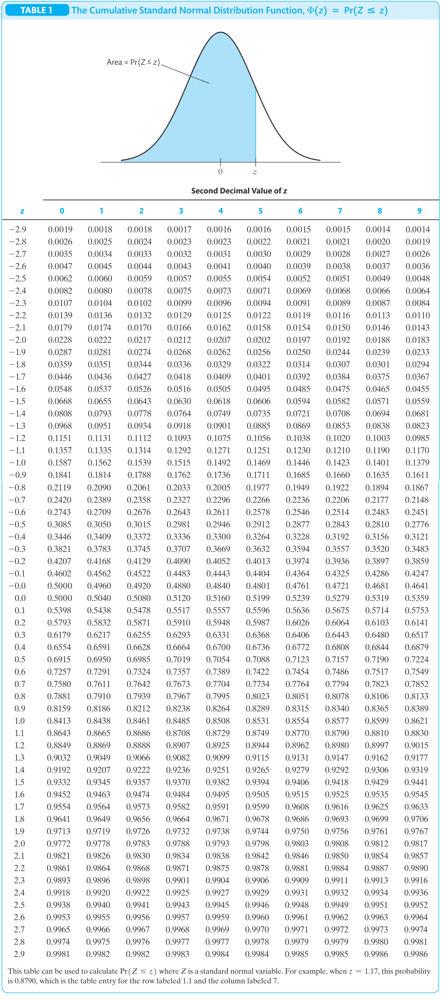
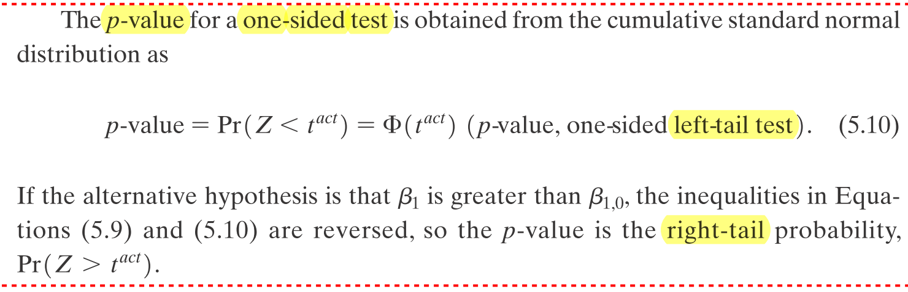

---
output:
  html_document:
    css: !expr c("./assets/style.css")
    includes:
      in_header: !expr c("./assets/header_01.html")
params:
  dat_link_01: "https://ilias.uni-hohenheim.de/goto.php?target=file_1535039_download&client_id=UHOH"
  dat_nam_01: "CASchools_02_data.txt"
  dat_link_02: "https://ilias.uni-hohenheim.de/goto.php?target=file_1535040_download&client_id=UHOH"
  dat_nam_02: "CPS_02_data.txt"
editor_options: 
  chunk_output_type: console
---

<!--..........................................................................-->
<!--..........................................................................-->

<!-- Include header -->

````{=html}
```{r, include=TRUE, echo=FALSE, results='asis'}
xfun::file_string('./assets/header_02.html')
```
````

<!--..........................................................................-->
<!--..........................................................................-->

```{r,include=FALSE}

library(knitr)
knitr::opts_chunk$set(
  include=FALSE,
  echo = FALSE,
  warning = FALSE,
  message = FALSE,
  fig.align = 'center')
# See: https://stackoverflow.com/questions/36230790/missing-horizontal-scroll-bar-in-r-markdown-html-code-chunks-and-output
options(width=1000)

```

```{r}

# # 1) clear workspace # exclude to be able to use params in yml header!
# rm(list=ls(all=TRUE))

# 2) load libraries
library(kableExtra)
library(texreg)

# 3) load r-scripts
source("./r-scripts/r_helper_functions.R")
source("./r-scripts/texreg_extract_fun_02.R")

# 4) load data
cas.dat <- read.table(file = "./data-sets/CASchools_02_data.txt",
                      header = TRUE,
                      sep = ",",
                      colClasses = c("numeric","numeric","numeric","numeric","numeric"))

cps.dat <- read.table(file = "./data-sets/CPS_02_data.txt",
                      header = TRUE,
                      sep = ",",
                      colClasses = c("numeric","numeric","numeric","numeric"))

```

```{r,klippy, echo=FALSE, include=TRUE}

# See: https://rlesur.github.io/klippy/articles/klippy.html
klippy::klippy(tooltip_message = 'Click to copy', tooltip_success = 'Done', position = c('top', 'right'))

```

<!--..........................................................................-->
<!--..........................................................................-->

<hr />

<!--..........................................................................-->
# Exercise Sheet No 05 {.tabset .tabset-fade}
<!--..........................................................................-->

<hr />

<p class="head01">
Linear Regression with Multiple Regressors (Part 1)
</p>

<!--..........................................................................-->
## Set-Up

<span style="text-decoration: none; font-size: 18pt">
1)
</span>
<span style="text-decoration: underline; font-size: 18pt">
Create your (working) directory
</span>

Create a new folder on your computer in which you can save all necessary files, i.e., the data set, the <span class="R">R</span> *script* with the implementation of your analysis and the <span class="R">R</span> *helper function script* with some helper functions provided by us.

This folder, i.e., the path or directory of this folder, will be your so-called working directory.

<hr />

<span style="text-decoration: none; font-size: 18pt">
2)
</span>
<span style="text-decoration: underline; font-size: 18pt">
Download the data set
</span>

<!-- Download the data sets `CASchools_01_data` from <span class="R">ILIAS</span> directly or by using the link below: -->

<!-- <p class="down01"> -->
<!-- <a href="https://ilias.uni-hohenheim.de/goto.php?target=file_1523858_download&client_id=UHOH">Download `CASchools_01_data.txt`</a> -->
<!-- </p> -->

Download the data sets ``r params$dat_nam_01`` and ``r params$dat_nam_02`` from <span class="R">ILIAS</span> directly or by using the link below:

<p class="down01">
<a href="`r params$dat_link_01`">Download ``r params$dat_nam_01``</a>
</p>

<p class="down01">
<a href="`r params$dat_link_02`">Download ``r params$dat_nam_02``</a>
</p>

Save the data set into a (working) directory of your choice.

<hr />

<span style="text-decoration: none; font-size: 18pt">
3)
</span>
<span style="text-decoration: underline; font-size: 18pt">
Prepare *script*
</span>

Open a new <span class="R">R</span> *script* and save it into into your (working) directory.

Run the following code chunk to prepare your <span class="R">R</span> *script*, i.e., to clear the work space and set your working directory.

```{r,include=TRUE,echo=TRUE,eval=FALSE}

# Clear workspace
rm(list = ls(all = TRUE))
# Set working directory
setwd(".../set/your/working/directory/...")

```

<hr />

<div style="display:none">

<span style="text-decoration: none; font-size: 18pt">
X)
</span>
<span style="text-decoration: underline; font-size: 18pt">
Install *libraries*
</span>

Run the following code chunk to make sure that all necessary *libraries* are installed.

*Note*, You have to run this code chunk only once. After running this code chunk you have installed all necessary *libraries* for the class and we will load them whenever we need them.

```{r,include=TRUE,echo=TRUE,eval=FALSE,include=FALSE}

# packages we will use in the course
pac <- c("moments", "sandwich", "lmtest", "car", "plm", "ivreg", "dynlm", "forecast", "urca")

# install and/or load packages
checkpac <- function(x) {
  if (!require(x, character.only = TRUE)) {
    install.packages(x)
  }
  require(x, character.only = TRUE)
}

# check if packages are install yet
suppressWarnings(sapply(pac, checkpac))

```

<hr />

</div>

<span style="text-decoration: none; font-size: 18pt">
4)
</span>
<span style="text-decoration: underline; font-size: 18pt">
Install/load *packages* and download/save/include *helper function script*
</span>

<span style="text-decoration: underline">Step 1</span>) Install all relevant <span class="R">R</span> *packages* and download and save the <span class="R">R</span> *script* `r_helper_functions.R` from <span class="R">ILIAS</span> by running the following code chunk.

```{r,include=TRUE,echo=TRUE,eval=FALSE}

# Download R-helper functions
source("https://ilias.uni-hohenheim.de/data/UHOH/lm_data/lm_1856939/MA_EconometricMethods_WiSe2324_PracticalClass/r-scripts/prepare_r_packages_and_helper_functions.R")

```

*Note*, the required <span class="R">R</span> *packages* are `"moments"`, `"sandwich"`, `"lmtest"`, `"lmtest"`, `"car"`, `"plm"`, `"ivreg"`, `"dynlm"`, `"forecast"`, `"urca"`.

<div style="margin-top: 5px;">
<span style="text-decoration: underline">Step 2</span>) Include the <span class="R">R</span> *script* `r_helper_functions.R` into your <span class="R">R</span> *script* by running the following code chunk.
</div>

```{r,include=TRUE,echo=TRUE,eval=FALSE}

# Include R-helper functions
source("r_helper_functions.R")

```

*Note*, more information on the helper functions can be found [here](./00_ExerciseSheet_HelperFunctions_XX.html).


<!-- <hr /> -->

## Task 1 {.tabset .tabset-fade}

<hr />

<p class="head01">
Earnings and education
</p>

We continue our analysis of earnings and education. For this we use the data set `CPS_02_data.txt` contains information about earnings (in USD) and years of education of 7986 full-time workers. The data set contains the variables described in Table 1 of the exercise sheet or the table below.

<hr />

<p class="head02">
Variables
</p>

<!--..........................................................................-->
<button type="button" class="collapsible02"> *Show Variable Description* </button>
<div class="col_content">

| Variable   | Description                                                           | 
|------------|-----------------------------------------------------------------------| 
| $ahe$      | Average hourly earnings.                                              | 
| $age$      | Age in years.                                                         | 
| $female$   | Equals $1$ for female and equals $0$ otherwise.                       | 
| $bachelor$ | Equals $1$ for bachelor degree and equals $0$ for high school degree. | 

</div>
<!--..........................................................................-->

<!--..........................................................................-->
<button type="button" class="collapsible02"> *Show Estimation Results* </button>
<div class="col_content">

```{r}

# cps.dat <- read.table(file = "CPS_02_data.txt",
#                       header = TRUE,
#                       sep = ",",
#                       colClasses = c("numeric","numeric","numeric","numeric","numeric"))

# Model 1
lm.res.01 <- lm(ahe ~ age, data = cps.dat)
summary(lm.res.01)
# Model 2
lm.res.02 <- lm(ahe ~ age + female + bachelor, data = cps.dat)
summary(lm.res.02)

library(sandwich)
library(lmtest)
# inference for estimated coefficients (based on heteroskedasticity)
ct.rob.01 <- coeftest(lm.res.01, vcov=vcovHC(lm.res.01, type="HC1"))
ct.rob.01

summary(lm.res.01)

summary(lm.res.01, vcov=vcovHC(lm.res.01, type="HC1"))

lm.ct.res.01 <- lm_ct_fun(ahe ~ age, data=cps.dat, hc.type = "HC1")
lm.ct.res.01$ct

# library("sandwich")
# library("lmtest")
# Model 1
ct.01 <- coeftest(lm.res.01, vcov=vcovHC(lm.res.01, type="HC1"))
se.01 <- ct.01[, 2]
pval.01 <- ct.01[, 4]
# Model 2
ct.02 <- coeftest(lm.res.02, vcov=vcovHC(lm.res.02, type="HC1"))
se.02 <- ct.02[, 2]
pval.02 <- ct.02[, 4]

```

```{r,include=TRUE}
screenreg(list(lm.res.01,lm.res.02),
          override.se = list(se.01,se.02),
          override.pvalues = list(pval.01,pval.02),
          caption = "Estimation Results",
          caption.above = TRUE,
          label = "Tab01",
          stars = numeric(0),
          custom.model.names = NULL,
          custom.coef.names = c("intercept","age","female","bachelor"),
          float.pos = "h",
          single.row = TRUE,
          booktabs = TRUE,
          dcolumn = TRUE,
          use.packages = FALSE,
          ci.force = FALSE,
          digits = 3,
          include.rsquared = TRUE,
          include.adjrs = TRUE,
          include.rmse = TRUE,
          include.nobs = TRUE)
```

</div>
<!--..........................................................................-->


<hr />

<!--..........................................................................-->
### Task a) 

Load the data set into your favorite statistics software and describe the structure of the data set. How are the variables $female$ and $bachelor$ defined?

<hr />

<p class="head02">
Load data set
</p>

<!--..........................................................................-->
<button type="button" class="collapsible01"> *Show Code* </button>
<div class="cod_content">
```{r,include=TRUE,echo=TRUE,results=FALSE,eval=FALSE}
# use absolute or relative path to load data
cps.dat <- read.table(file = "CPS_02_data.txt",
                      header = TRUE,
                      sep = ",",
                      colClasses = c("numeric","numeric","numeric","numeric"))
```
</div>
<!--..........................................................................-->

<hr />

<p class="head02">
Structure and summary
</p>

<!--..........................................................................-->
<button type="button" class="collapsible01"> *Show Code* </button>
<div class="cod_content">
```{r,include=TRUE,echo=TRUE,results=FALSE,fig.show='hide'}
# first six observations
head(cps.dat)
# summary statistics
summary(cps.dat)
```
</div>
<!--..........................................................................-->
<button type="button" class="collapsible01"> *Show Output* </button>
<div class="cod_content">
```{r,include=TRUE,echo=FALSE,results=TRUE}
# first six observations
head(cps.dat)
# summary statistics
summary(cps.dat)
```
</div>
<!--..........................................................................-->

<!--..........................................................................-->
<button type="button" class="collapsible02"> *Interpretation: Structure* </button>
<div class="col_content">

<div style="color: red" class="showSol01">

* $ahe$ is a non-negative continuous variable.
* $age$ only takes on non-negative integer values between $25$ and $34$ years.
* $female$ is a binary variable. $41.5\%$ are female
* $bachelor$ is a binary variable. $45.6\%$ have a bachelor degree

</div>

<div style="color: red" class="noSol01">

*Add your results here!*

</div>

</div>
<!--..........................................................................-->


<!--..........................................................................-->
### Task b) 

Run a regression of average hourly earnings on the variable $age$ (Model 1) and another regression on the variables $age$, $female$, and $bachelor$ (Model 2). The results are depicted in the table below. Which model would you prefer for explaining the differences in average hourly earnings and why?

<hr />

<p class="head02">
Model estimation
</p>

<!--..........................................................................-->
<!-- <button type="button" class="collapsible01"> *Show Code* </button> -->
<!-- <div class="cod_content"> -->

```{r,include=FALSE,echo=TRUE,results=FALSE,fig.show='hide'}
# Model 1
lm.res.01 <- lm(ahe ~ age, data = cps.dat)
summary(lm.res.01)
# Model 2
lm.res.02 <- lm(ahe ~ age + female + bachelor, data = cps.dat)
summary(lm.res.02)
```

<!-- </div> -->
<!--..........................................................................-->
<!-- <button type="button" class="collapsible01"> *Show Output* </button> -->
<!-- <div class="cod_content"> -->

```{r,include=FALSE,echo=FALSE,results=TRUE}
# Model 1
lm.res.01 <- lm(ahe ~ age, data = cps.dat)
summary(lm.res.01)
# Model 2
lm.res.02 <- lm(ahe ~ age + female + bachelor, data = cps.dat)
summary(lm.res.02)
```

<!-- </div> -->
<!--..........................................................................-->

<!--..........................................................................-->
<button type="button" class="collapsible01"> *Show Code* </button>
<div class="cod_content">
```{r,include=TRUE,echo=TRUE,results=FALSE,fig.show='hide'}
# Model 1
lm.ct.res.01 <- lm_ct_fun(ahe ~ age, data = cps.dat, hc.type="HC1")
lm.ct.res.01$ct  # robust
# Model 2
lm.ct.res.02 <- lm_ct_fun(ahe ~ age + female + bachelor, data = cps.dat, hc.type="HC1")
lm.ct.res.02$ct  # robust
```
</div>
<!--..........................................................................-->
<button type="button" class="collapsible01"> *Show Output* </button>
<div class="cod_content">
```{r,include=TRUE,echo=FALSE,results=TRUE}
# Model 1
lm.ct.res.01 <- lm_ct_fun(ahe ~ age, data = cps.dat, hc.type = "HC1")
lm.ct.res.01$ct  # robust
# Model 2
lm.ct.res.02 <- lm_ct_fun(ahe ~ age + female + bachelor, data = cps.dat, hc.type="HC1")
lm.ct.res.02$ct  # robust
```
</div>
<!--..........................................................................-->

<!--..........................................................................-->
<button type="button" class="collapsible01"> *Show Results (after some rearrangement!)* </button>
<div class="col_content">

```{r,include=TRUE}
screenreg(list(lm.res.01,lm.res.02),
          override.se = list(se.01,se.02),
          override.pvalues = list(pval.01,pval.02),
          caption = "Estimation Results",
          caption.above = TRUE,
          label = "Tab01",
          stars = numeric(0),
          custom.model.names = NULL,
          custom.coef.names = c("intercept","age","female","bachelor"),
          float.pos = "h",
          single.row = TRUE,
          booktabs = TRUE,
          dcolumn = TRUE,
          use.packages = FALSE,
          ci.force = FALSE,
          digits = 3,
          include.rsquared = TRUE,
          include.adjrs = TRUE,
          include.rmse = TRUE,
          include.nobs = TRUE)
```

</div>
<!--..........................................................................-->

<!--..........................................................................-->
<button type="button" class="collapsible02"> *$R^2$ vs $\overline{R}^2$* </button>
<div class="col_content">

<hr />

$R^2$:

\begin{align}
R^2 &= 1 - \frac{SSR}{TSS}
\end{align}

<!--..........................................................................-->
<button type="button" class="collapsible01"> *Show Code/Output* </button>
<div class="cod_content">
```{r,include=TRUE,echo=TRUE,results=TRUE}
# Model 1
lm.ct.res.01$sum$r.squared
# Model 2
lm.ct.res.02$sum$r.squared
```
</div>
<!--..........................................................................-->

<hr />

$\overline{R}^2$:

\begin{align}
\overline{R}^2 &= 1 - \frac{n-1}{n-k-1} \frac{SSR}{TSS}\\
\end{align}

<!--..........................................................................-->
<button type="button" class="collapsible01"> *Show Code/Output* </button>
<div class="cod_content">
```{r,include=TRUE,echo=TRUE,results=TRUE}
# Model 1
lm.ct.res.01$sum$adj.r.squared
# Model 2
lm.ct.res.02$sum$adj.r.squared
```
</div>
<!--..........................................................................-->

with an adjustment factor

\begin{align}
\frac{n-1}{n-k-1} > 1.
\end{align}

<hr />

<u>Thus</u>,

\begin{align}
R^2 > \overline{R}^2
\end{align}

<!-- See also: Stock and Watson (2020), p. 223 f. -->

<!-- See also: @StockWatson2020Introduction, p. 223 f. -->

See also: Stock and Watson (2020), p. 223f.

</div>
<!--..........................................................................-->

<!--..........................................................................-->
<button type="button" class="collapsible02"> *Interpretation* </button>
<div class="col_content">

<div style="color: red" class="showSol01">

<u>Evaluation for prediction</u>:

* Model 2 has necessarily a higher $R^2$ than Model 1.
* Model 2 has also a higher adjusted $R^2$ than Model 1.
* $\Rightarrow$ Preference for Model 2 based on better fitting.

<u>Evaluation for causal inference</u>:

* Model 2 has more explanatory variables and thus, controls for potential omitted variable bias (see Task 2).
* $\Rightarrow$ Preference for Model 2 based for causal inference.
* Note: Both models lead to a similar estimated effect of age on earnings.

</div>

<div style="color: red" class="noSol01">

*Add your results here!*

</div>

</div>
<!--..........................................................................-->


<!--..........................................................................-->
### Task c) 

The 26-year-old Bob holds a bachelor's degree. Predict Bob's earnings using the estimated regression.

<hr />

<p class="head02">
Results
</p>

<!--..........................................................................-->
<button type="button" class="collapsible02"> *Results* </button>
<div class="col_content">

```{r, include=FALSE}
res <- round(lm.ct.res.02$ct[1,1],3) + 
       round(lm.ct.res.02$ct[2,1],3) * 26 + 
       round(lm.ct.res.02$ct[3,1],3) * 0 + 
       round(lm.ct.res.02$ct[4,1],3) * 1
```

<div style="color: red" class="showSol01">

$$
\widehat{AHE}_{Bob} = `r round(lm.ct.res.02$ct[1,1],3)` + \left(`r round(lm.ct.res.02$ct[2,1],3)`\right) \times 26 + \left(`r round(lm.ct.res.02$ct[3,1],3)`\right) \times 0 + \left(`r round(lm.ct.res.02$ct[4,1],3)`\right) \times 1 = `r round(res,3)`\$
$$

</div>

<div style="color: red" class="noSol01">

*Add your results here!*

</div>

</div>
<!--..........................................................................-->


<!--..........................................................................-->
### Task d) 

Joe claims that it is not possible to earn 0.50\$ more by just being one year older. State and test a corresponding hypothesis based on a reasonable significance level. Think about the presence and consequences of heteroskedasticity!

<!-- <hr /> -->

<!-- <p class="head02"> -->
<!-- Estimation results (again) -->
<!-- </p> -->

<!--..........................................................................-->
<!-- <button type="button" class="collapsible01"> *Show Results (after some rearrangement!)* </button> -->
<!-- <div class="col_content"> -->

```{r,include=FALSE}
screenreg(list(lm.res.01,lm.res.02),
          override.se = list(se.01,se.02),
          override.pvalues = list(pval.01,pval.02),
          caption = "Estimation Results",
          caption.above = TRUE,
          label = "Tab01",
          stars = numeric(0),
          custom.model.names = NULL,
          custom.coef.names = c("intercept","age","female","bachelor"),
          float.pos = "h",
          single.row = TRUE,
          booktabs = TRUE,
          dcolumn = TRUE,
          use.packages = FALSE,
          ci.force = FALSE,
          digits = 3,
          include.rsquared = TRUE,
          include.adjrs = TRUE,
          include.rmse = TRUE,
          include.nobs = TRUE)
```

<!-- </div> -->
<!--..........................................................................-->

<hr />

<p class="head02">
Hypothesis
</p>

<!--..........................................................................-->
<button type="button" class="collapsible02"> *Statement of hypothesis* </button>
<div class="col_content">

<div style="color: red" class="showSol01">

<!-- \begin{align} -->
<!-- H_0&: \quad \beta_{age} \leq 0.5 \quad \text{vs.} \\ -->
<!-- H_1&: \quad \beta_{age} > 0.5 \quad \alpha = 5\% -->
<!-- \end{align} -->

\begin{align}
H_0&: \quad \beta_{age} = 0.5 \quad \text{vs.} \\
H_1&: \quad \beta_{age} \neq 0.5 \quad \alpha = 5\%
\end{align}

</div>

<div style="color: red" class="noSol01">

*Add your results here!*

</div>

</div>
<!--..........................................................................-->

<hr />

<p class="head02">
Based on test statistic
</p>

<!--..........................................................................-->
<button type="button" class="collapsible02"> *Calculation of test statistic* </button>
<div class="col_content">

```{r,include=FALSE}
tes.sta.val <- lm.ct.res.02$ct[1,1]/lm.ct.res.02$ct[1,2]
tes.sta.val
pval <- 2*pnorm(-abs(tes.sta.val))
pval
pval <- 2*pt(-abs(tes.sta.val), df=nrow(cps.dat)-4)
pval
lm.ct.res.02$ct

tes.sta.val <- (round(lm.ct.res.02$ct[2,1],3)-0.5)/round(lm.ct.res.02$ct[2,2],3)

```

<div style="color: red" class="showSol01">

\begin{align}
t^{act} &= \frac{\hat{\beta}_{age}^{act} - 0.5}{SE\left(\hat{\beta}_{age}\right)} \\
t^{act} &= \frac{`r round(lm.ct.res.02$ct[2,1],3)` - 0.5}{`r round(lm.ct.res.02$ct[2,2],3)`} \\
t^{act} &= `r round(tes.sta.val,3)`
\end{align}

</div>

<div style="color: red" class="noSol01">

*Add your results here!*

</div>

</div>
<!--..........................................................................-->

<!--..........................................................................-->
<button type="button" class="collapsible02"> *Conclusion based on test statistic* </button>
<div class="col_content">

<div style="color: red" class="showSol01">

<u>Conclusion</u>:

<!-- * $t^{act} < 1.64$ -->
<!-- * $H_0$ cannot be rejected at 5\% significance level. -->

* $|t^{act}| > 1.96$ but $|t^{act}| < 2.58$
* $H_0$ can be rejected at 5\% but not at 1\% significance level.

<!-- * Note: No rejection for $\left(\alpha=0.01\right)$ as $|t^{act}| < 2.33$. -->

</div>

<div style="color: red" class="noSol01">

*Add your results here!*

</div>

</div>
<!--..........................................................................-->

<hr />

<p class="head02">
Based on $p$-value
</p>

<!--..........................................................................-->
<button type="button" class="collapsible02"> *And/or calculation of $p$-value of test statistic* </button>
<div class="col_content">

```{r,include=FALSE}

# qnorm(0.05)
# pval.01 <- 1-pnorm(round(tes.sta.val,3))
# # pval <- 1*pt(-abs(tes.sta.val), df=nrow(cas.dat)-4)
# pval.01
# pval.01 <- 1-0.0212
# pval.01

pval.00 <- 2*pnorm(-abs(tes.sta.val))
pval.00
pval.00 <- 2*pt(-abs(tes.sta.val), df=nrow(cas.dat)-2)
pval.00

```

<div style="color: red" class="showSol01">

<!-- \begin{align} -->
<!-- p-\text{value} &= \Phi\left(Z > t^{act}\right) \\ -->
<!-- &= 1 - \Phi\left(Z < t^{act}\right) \\ -->
<!-- &= 1 - \Phi\left(`r round(tes.sta.val,3)`\right) \\ -->
<!-- &= 1 - 0.0212 \\ -->
<!-- &= `r round(pval.01,3)` -->
<!-- \end{align} -->

\begin{align}
p-\text{value} &= 2*\Phi\left(-|t^{act}|\right) \\
&= 2*\Phi\left(`r -abs(round(tes.sta.val,3))`\right) \\
&= `r signif(pval.00,3)`
\end{align}

</div>

<div style="color: red" class="noSol01">

*Add your results here!*

</div>

</div>
<!--..........................................................................-->

<!--..........................................................................-->
<button type="button" class="collapsible02"> *And/or conclusion based on $p$-value* </button>
<div class="col_content">

<div style="color: red" class="showSol01">

<u>Conclusion</u>:

* $p\text{-value}<0.05$ but $p\text{-value}>0.01$
* $H_0$ can be rejected at 5\% but not at 1\% significance level.

<u>Definition $p$-value</u>:

* The p-value is the probability of observing a value of $\hat{\beta}$ at least as different from $\beta_{1,0}$ as the estimate actually computed $\left(\hat{\beta}^{act}_1\right)$, assuming that the null hypothesis is correct.
* Type I error, i.e. rejecting $H_0$ even if it is true.

</div>

<div style="color: red" class="noSol01">

*Add your results here!*

</div>

</div>
<!--..........................................................................-->

<hr />

<p class="head02">
CDF Standard Normal Distribution
</p>

<!--..........................................................................-->
<button type="button" class="collapsible02"> *Table of Stock and Watson (2020)* </button>
<div class="col_content">



<p class="sou01">
Source: Stock and Watson (2020), p. 763-764
</p>

<br>

</div>
<!--..........................................................................-->

<hr />

<p class="head02">
An Illustration of the $p$-value
</p>

<!--..........................................................................-->
<button type="button" class="collapsible01"> *Show Code* </button>
<div class="cod_content">
```{r,include=TRUE,echo=TRUE,results=FALSE,fig.show='hide'}
ill_hyp_tes_fun(t.act = -2.033, test = "two.sid")
```
</div>
<!--..........................................................................-->
<button type="button" class="collapsible01"> *Show Output* </button>
<div class="cod_content">
```{r,include=TRUE,echo=FALSE,results=TRUE}
ill_hyp_tes_fun(t.act = -2.033, test = "two.sid")
```
</div>
<!--..........................................................................-->

<div style="display: none">

<hr />

<p class="head02">
Some Notes
</p>

<!--..........................................................................-->
<button type="button" class="collapsible02"> *Some Notes from Stock and Watson (2020)* </button>
<div class="col_content">

<hr />

<p class="head02">
Decision for two- and one-sided tests
</p>


<p class="sou01">
Source: Stock and Watson (2020), p. 799
</p>

<br>

<hr />

<p class="head02">
Calculating p-values for one-sided tests
</p>



<p class="sou01">
Source: Stock and Watson (2020), p. 183
</p>

<br>

Note, here:

* Use "left-tail probabilities" for case 2 (above)
* Use "right-tail probabilities" for case 1 (above)
* Task 1d) above is an application of case 1.

<!-- Thus, we have almost no evidence against the null hypothesis that we earn less than 0.50\$ -->

</div>
<!--..........................................................................-->

</div>

```{r,include=FALSE,echo=TRUE,results=FALSE,fig.show='hide'}

# # test value (absolute)
# t.act <- abs(-2.033) # try some other test values here!
# # plot parameters
# par(mfrow=c(1,1),
#     mar=c(4,2,4,2))
# # plot the standard normal density on the interval [-6,6]
# curve(dnorm(x),
#       xlim = c(-6, 6),
#       yaxs = "i",
#       xlab = "z",
#       ylab = "",
#       lwd = 2,
#       axes = "F",
#       ylim = c(0,0.45))
# # add x-axis
# axis(3,at = c(-6, 0, 1.64, 2.33, 6), las=2,
#      labels = c("", "0", "1.64", "2.33", ""))
# axis(1,at = c(-6, round(t.act,2), 6))
# # shade p-value region in right tail
# polygon(x = c(t.act, seq(t.act, 6, 0.01), 6),
#         y = c(0, dnorm(seq(t.act, 6, 0.01)), 0), 
#         col = "steelblue")
# # add critical value lines
# abline(v=1.64, lty=2)
# abline(v=2.33, lty=2)
# # add actual test value lines
# abline(v=t.act, col="red", lty=2)
# 
# 
# # test value
# t.act <- -2.033 # try some other test values here!
# two.sid <- FALSE
# 
# # plot parameters
# par(mfrow=c(1,1),
#     mar=c(4,2,4,2))
# # plot the standard normal density on the interval [-6,6]
# curve(dnorm(x),
#       xlim = c(-6, 6),
#       yaxs = "i",
#       xlab = "z",
#       ylab = "",
#       lwd = 2,
#       axes = "F",
#       ylim = c(0,0.45))
# if(t.act>0 & two.sid==FALSE){
#   # add x-axis
#   axis(3,at = c(-6, 0, 1.64, 2.33, 6), las=2,
#        labels = c("", "0", "1.64", "2.33", ""))
#   axis(1,at = c(-6, round(t.act,2), 6))
#   # shade p-value region in right tail
#   polygon(x = c(t.act, seq(t.act, 6, 0.01), 6),
#           y = c(0, dnorm(seq(t.act, 6, 0.01)), 0), 
#           col = "steelblue")
#   # add critical value lines
#   abline(v=1.64, lty=2)
#   abline(v=2.33, lty=2)
#   # add actual test value lines
#   abline(v=t.act, col="red", lty=2)
# } else if(t.act<0 & two.sid==FALSE){
#   # add x-axis
#   axis(3,at = c(-6, -2.33, -1.64, 0, 6), las=2,
#        labels = c("", "-2.33", "-1.64", "0", ""))
#   axis(1,at = c(-6, round(t.act,2), 6))
#   # shade p-value region in left tail
#   polygon(x = c(-6, seq(-6, t.act, 0.01), t.act),
#           y = c(0, dnorm(seq(-6, t.act, 0.01)), 0), 
#           col = "steelblue")
#   # add critical value lines
#   abline(v=-1.64, lty=2)
#   abline(v=-2.33, lty=2)
#   # add actual test value lines
#   abline(v=t.act, col="red", lty=2)
# } else {
#   t.act <- abs(t.act)
#   # add x-axis
#   axis(3,at = c(-6, -2.58, -1.96, 0, 1.96, 2.58, 6), las=2,
#        labels = c("","-2.58", "-1.96", "0", "1.96", "2.58", ""))
#   axis(1,at = c(0, round(-t.act,2), round(t.act,2)))
#   # shade p-value/2 region in left tail
#   polygon(x = c(-6, seq(-6, -t.act, 0.01), -t.act),
#           y = c(0, dnorm(seq(-6, -t.act, 0.01)),0), 
#           col = "steelblue")
#   # shade p-value/2 region in right tail
#   polygon(x = c(t.act, seq(t.act, 6, 0.01), 6),
#           y = c(0, dnorm(seq(t.act, 6, 0.01)), 0), 
#           col = "steelblue")
#   # add critical value lines
#   abline(v=-1.96, lty=2)
#   abline(v= 1.96, lty=2)
#   abline(v=-2.58, lty=2)
#   abline(v= 2.58, lty=2)
#   # add actual test value lines
#   abline(v=-t.act, col="red", lty=2)
#   abline(v=t.act, col="red", lty=2)
# } 

```


<!-- <hr /> -->

## Task 2 {.tabset .tabset-fade}

<hr />

<p class="head01">
Student teacher ratio and student performance
</p>

We return to our analysis of the relationship between student performance and class size. For this we use the data set `CASchool_02_data.csv` and the two variables $test score$ and $STR$ as obtained in the first exercise sheet. As an additional variable the data set contains the variable percent of English learners ($PctEL$).

<hr />

<p class="head02">
Variables
</p>

<!--..........................................................................-->
<button type="button" class="collapsible02"> *Show Variable Description* </button>
<div class="col_content">

| Variable   | Description                  | 
|------------|------------------------------| 
| $students$ | Total enrollment.            | 
| $teachers$ | Number of teachers.          | 
| $read$     | Average reading score.       | 
| $math$     | Average math score.          |
| $PctEL$    | Percent of English learners. |

</div>
<!--..........................................................................-->

<hr />

<p class="head02">
Load data set
</p>

<!--..........................................................................-->
<button type="button" class="collapsible01"> *Show Code* </button>
<div class="cod_content">
```{r,include=TRUE,echo=TRUE,results=FALSE,eval=FALSE}
# use absolute or relative path to load data
cas.dat <- read.table(file = "CASchools_02_data.txt",
                      header = TRUE,
                      sep = ",",
                      colClasses = c("numeric","numeric","numeric","numeric","numeric"))
```
</div>
<!--..........................................................................-->

<hr />

<p class="head02">
Construct variables
</p>

<!--..........................................................................-->
<button type="button" class="collapsible01"> *Show Code* </button>
<div class="cod_content">
```{r,include=TRUE,echo=TRUE,results=FALSE}
# compute STR and append it to cas.dat
cas.dat$STR <- cas.dat$students/cas.dat$teachers 
# compute TestScore and append it to cas.dat
cas.dat$score <- (cas.dat$read + cas.dat$math)/2 
```
</div>
<!--..........................................................................-->


<hr />

<!--..........................................................................-->
### Task a) 

Explain the problem of omitted variable bias. Under which conditions does omitted variable bias occur? What is the consequence of omitted variable bias?

<!--..........................................................................-->
<button type="button" class="collapsible02"> *Interpretation: Condition of OMB* </button>
<div class="col_content">

<div style="color: red" class="showSol01">

<p class="head03">
Explanation
</p>

Omitted variable bias is the bias in the OLS estimator (i.e., causal effect) that arises when the regressor, $X$, is correlated with an omitted variable.

<p class="head03">
Conditions
</p>

1) $X$ is correlated with the omitted variable.
2) The omitted variable is a determinant of the dependent variable $Y$.

Both conditions result in a violation of the first assumption of causal regression $\mathrm{E}(u_i\vert X_i) = 0$.

</div>

<div style="color: red" class="noSol01">

*Add your results here!*

</div>

</div>
<!--..........................................................................-->

<!--..........................................................................-->
<button type="button" class="collapsible02"> *Interpretation: Consequences of OMB* </button>
<div class="col_content">

<div style="color: red" class="showSol01">

<p class="head03">
Consequences
</p>

* The estimate $\hat\beta_1$ is inconsistent!
* Strength and direction of the bias are determined by $\rho_{xu}$, the correlation between the error term and the regressor (See Stock \& Watson, 2020, p. 214)

\begin{align}
\widehat{\beta}_1 \xrightarrow[]{p} \beta_1 + \rho_{xu} \frac{\sigma_u}{\sigma_x}
\end{align}

* Note, however, $\rho_{xu}$, is not observable!

</div>

<div style="color: red" class="noSol01">

*Add your results here!*

</div>

</div>
<!--..........................................................................-->


<!--..........................................................................-->
### Task b) 

Discuss the problem of omitting the variable $PctEL$. Check the condition for omitted variable bias above. Is omitting the variable $PctEL$ problematic? What consequences do you expect for the coefficient of $STR$ if we omit the variable $PctEL$?

<!--..........................................................................-->
<button type="button" class="collapsible01"> *Show Code* </button>
<div class="cod_content">
```{r,include=TRUE,echo=TRUE,results=FALSE}
# Correlations across observable variables
cor(cas.dat$PctEL, cas.dat$score)
cor(cas.dat$STR, cas.dat$PctEL)
```
</div>
<!--..........................................................................-->
<button type="button" class="collapsible01"> *Show Output* </button>
<div class="cod_content">
```{r,include=TRUE,echo=TRUE,results=TRUE}
# Correlations across observable variables
cor(cas.dat$PctEL, cas.dat$score)
cor(cas.dat$STR, cas.dat$PctEL)
```
</div>
<!--..........................................................................-->

<!--..........................................................................-->
<button type="button" class="collapsible02"> *Interpretation: OMB Condition (here)?* </button>
<div class="col_content">

```{r, include=FALSE}
cor <- cor(cas.dat$STR, cas.dat$PctEL)
cor
```

<div style="color: red" class="showSol01">

* Again, $\rho_{xu}$, is not observable!
* However, $PctEL$ is most probably (negatively) related with $u$. (Check correlation between $PctEL$ and $score$ as indication.)
* $STR$ and $PctEL$ is (positively) correlated with $\hat\rho= `r abs(round(cor,3))`$.
* <u>Story</u>: Non-native students (high $PctEL$) live in districts with worse schools (high $STR$) and, in addition, have lower $scores$ because worse English language skills.
* $\Rightarrow$ OVB is probably an issue!

<!-- * Story: Poorer less educated families (low $score$ and $PctEL$) live in districts with worse schools (high $STR$). -->
<!-- * As $u$ is not observable one might want to check the correlation between $PctEL$ and $score$. -->

</div>

<div style="color: red" class="noSol01">

*Add your results here!*

</div>

</div>
<!--..........................................................................-->

<!--..........................................................................-->
<button type="button" class="collapsible02"> *Interpretation: OMB Consequences (here)?* </button>
<div class="col_content">

<div style="color: red" class="showSol01">

\begin{align}
\hat\beta_1 &\xrightarrow[]{p} \beta_1 + \rho_{xu} \frac{\sigma_u}{\sigma_x} \\
\hat\beta_1 - \beta_1 &\approx - \rho_{xu} \frac{\sigma_u}{\sigma_x}
\end{align}

<!-- \beta_1 &\approx \hat\beta_1 - \rho_{xu} \frac{\sigma_u}{\sigma_x} -->

* $\rho_{x_{STR},y}<0$ and $\rho_{x_{STR},x_{PctEL}}>0$ indicate that $\rho_{xu}<0$
* $\Rightarrow$ Omitting $PctEL$ leads probably to a negatively biased estimate $\hat\beta_1$, i.e., the estimated negative effect of $STR$ is to high.

</div>

<div style="color: red" class="noSol01">

*Add your results here!*

</div>


</div>
<!--..........................................................................-->


<!--..........................................................................-->
### Task c) 

The table below shows the regression results with and without the variable $PctEL$. Are the results as expected?

<hr />

<p class="head02">
Model estimation
</p>

<!--..........................................................................-->
<button type="button" class="collapsible01"> *Show Code* </button>
<div class="cod_content">
```{r,include=TRUE,echo=TRUE,results=FALSE,fig.show='hide'}
# Model 1
lm.ct.res.03 <- lm_ct_fun(score ~ STR, data = cas.dat, hc.type = "HC1")
lm.ct.res.03$ct  # robust
# Model 2
lm.ct.res.04 <- lm_ct_fun(score ~ STR + PctEL, data = cas.dat, hc.type = "HC1")
lm.ct.res.04$ct  # robust
```
</div>
<!--..........................................................................-->
<button type="button" class="collapsible01"> *Show Output* </button>
<div class="cod_content">
```{r,include=TRUE,echo=FALSE,results=TRUE}
# Model 1
lm.ct.res.03 <- lm_ct_fun(score ~ STR, data = cas.dat, hc.type = "HC1")
lm.ct.res.03$ct  # robust
# Model 2
lm.ct.res.04 <- lm_ct_fun(score ~ STR + PctEL, data = cas.dat, hc.type = "HC1")
lm.ct.res.04$ct  # robust
```
</div>
<!--..........................................................................-->

<!--..........................................................................-->
<div class="col_content">

```{r,include=FALSE}
library("sandwich")
library("lmtest")
# Model 1
lm.res.03 <- lm(score ~ STR, data = cas.dat)
ct.03 <- coeftest(lm.res.03, vcov=vcovHC(lm.res.03, type = "HC1"))
se.03 <- ct.03[, 2]
pval.03 <- ct.03[, 4]
# Model 2
lm.res.04 <- lm(score ~ STR + PctEL, data = cas.dat)
ct.04 <- coeftest(lm.res.04, vcov=vcovHC(lm.res.04, type="HC1"))
se.04 <- ct.04[, 2]
pval.04 <- ct.04[, 4]
```

```{r,include=TRUE}
screenreg(list(lm.res.03,lm.res.04),
          override.se = list(se.03,se.04),
          override.pvalues = list(pval.03,pval.04),
          caption = "Estimation Results",
          caption.above = TRUE,
          label = "Tab01",
          stars = numeric(0),
          custom.model.names = NULL,
          custom.coef.names = c("intercept","STR","PctEL"),
          float.pos = "h",
          single.row = TRUE,
          booktabs = TRUE,
          dcolumn = TRUE,
          use.packages = FALSE,
          ci.force = FALSE,
          digits = 3,
          include.rsquared = TRUE,
          include.adjrs = TRUE,
          include.rmse = TRUE,
          include.nobs = TRUE)
```

</div>
<!--..........................................................................-->

<!--..........................................................................-->
<button type="button" class="collapsible02"> *Interpretation* </button>
<div class="col_content">

<div style="color: red" class="showSol01">

<u>Model 1</u>:

* $\hat\beta_{STR}=`r round(lm.ct.res.03$ct[2,1],3)`$
* Significant effect of $STR$ with $p-\text{value}=`r round(lm.ct.res.03$ct[2,4],3)`$

<u>Model 2</u>:

* $\hat\beta_{STR}=`r round(lm.ct.res.04$ct[2,1],3)`$
* Significant effect of $STR$ with $p-\text{value}=`r round(lm.ct.res.04$ct[2,4],3)`$

<u>Conclusion</u>:

* Before controlling for $PctEL$, $\hat\beta_{STR}$ is too negative, i.e., we overestimate the negative impact of $STR$.
* After controlling for $PctEL$, $\hat\beta_{STR}$ is no longer significant at a 1\% significant level.

</div>

<div style="color: red" class="noSol01">

*Add your results here!*

</div>


</div>
<!--..........................................................................-->


<!--..........................................................................-->
### Task d) 

What happens if we include the variable $PctEL$ and the variable $1-PctEL$ in the regression of Model 2 in Table 3 of the exercise sheet?

<hr />

<p class="head02">
Construct variables
</p>

<!--..........................................................................-->
<button type="button" class="collapsible01"> *Show Code* </button>
<div class="cod_content">
```{r,include=TRUE,echo=TRUE,results=FALSE}
# compute 1-PctEL
cas.dat$M1PctEL <- 1 - cas.dat$PctEL
```
</div>
<!--..........................................................................-->

<!--..........................................................................-->
<button type="button" class="collapsible02"> *Note* </button>
<div class="col_content">

Note, by using the *assignment* `cas.dat$M1PctEL <-` a new variable, here, called `M1PctEL`, is appended to the *data frame*, here, called `cas.dat`.
 
</div>
<!--..........................................................................-->


<hr />

<p class="head02">
Model estimation
</p>

<!--..........................................................................-->
<button type="button" class="collapsible01"> *Show Code* </button>
<div class="cod_content">
```{r,include=TRUE,echo=TRUE,results=FALSE,fig.show='hide'}
# Model 3
lm.ct.res.05 <- lm_ct_fun(score ~ STR + PctEL + M1PctEL, data = cas.dat, hc.type = "HC1")
lm.ct.res.05$sum # ordinary lm output (non-robust)
```
</div>
<!--..........................................................................-->
<button type="button" class="collapsible01"> *Show Output* </button>
<div class="cod_content">
```{r,include=TRUE,echo=FALSE,results=TRUE}
# Model 3
lm.ct.res.05 <- lm_ct_fun(score ~ STR + PctEL + M1PctEL, data = cas.dat, hc.type = "HC1")
lm.ct.res.05$sum # ordinary lm output (non-robust)
```

</div>
<!--..........................................................................-->

<!-- <p class="head03"> -->
<!-- Model 3 (linear algebra) -->
<!-- </p> -->

<!--..........................................................................-->
<!-- <button type="button" class="collapsible01"> *Show Code* </button> -->
<!-- <div class="cod_content"> -->

```{r,include=FALSE,echo=FALSE,results=FALSE,fig.show='hide'}
# Model 2 (matrix)
X.mat <- cbind(rep(1,nrow(cas.dat)),cas.dat$STR,cas.dat$PctEL)
head(X.mat)
y.vec <- cbind(cas.dat$score)
head(y.vec)
bet.hat <- solve(t(X.mat)%*%X.mat)%*%(t(X.mat)%*%y.vec)
bet.hat
```

<!-- </div> -->
<!--..........................................................................-->
<!-- <button type="button" class="collapsible01"> *Show Output* </button> -->
<!-- <div class="cod_content"> -->

```{r,include=FALSE,echo=FALSE,results=TRUE}
# Model 2 (matrix)
X.mat <- cbind(rep(1,nrow(cas.dat)),cas.dat$STR,cas.dat$PctEL)
head(X.mat)
y.vec <- cbind(cas.dat$score)
head(y.vec)
bet.hat <- solve(t(X.mat)%*%X.mat)%*%(t(X.mat)%*%y.vec)
bet.hat
```

<!-- </div> -->
<!--..........................................................................-->

<!-- <p class="head03"> -->
<!-- Model 3 (linear algebra) -->
<!-- </p> -->

<!--..........................................................................-->
<!-- <button type="button" class="collapsible01"> *Show Code* </button> -->
<!-- <div class="cod_content"> -->

```{r,include=FALSE,echo=FALSE,results=FALSE,fig.show='hide',eval=FALSE}
# Model 3 (matrix)
X.mat <- cbind(rep(1,nrow(cas.dat)),cas.dat$STR,cas.dat$PctEL,cas.dat$M1PctEL)
head(X.mat)
y.vec <- cbind(cas.dat$score)
head(y.vec)
bet.hat <- solve(t(X.mat)%*%X.mat)%*%(t(X.mat)%*%y.vec) # t(X.mat)%*%X.mat is singular
bet.hat
```

<!-- </div> -->

<!--..........................................................................-->
<!-- <button type="button" class="collapsible01"> *Show Output* </button> -->
<!-- <div class="cod_content"> -->

```{r,include=FALSE,echo=FALSE,results=TRUE,eval=FALSE}
# Model 3 (matrix)
X.mat <- cbind(rep(1,nrow(cas.dat)),cas.dat$STR,cas.dat$PctEL,cas.dat$PctELm1)
head(X.mat)
y.vec <- cbind(cas.dat$score)
head(y.vec)
bet.hat <- solve(t(X.mat)%*%X.mat)%*%(t(X.mat)%*%y.vec) # t(X.mat)%*%X.mat is singular
bet.hat
```

<!-- </div> -->
<!--..........................................................................-->

<!--..........................................................................-->
<button type="button" class="collapsible02"> *Interpretation* </button>
<div class="col_content">

<div style="color: red" class="showSol01">

<u>Output</u>:

`Coefficients: (1 not defined because of singularities)`

<u>Interpretation</u>:

* $1-PctEL$ is a linear combination of $PctEL$ ($\Rightarrow$ perfect multicollinearity between $1-PctEL$ and $PctEL$!).
* Thus, the effects of $PctEL$ and $1-PctEL$ can not be distinguished.

<!-- * $1-PctEL$ is a linear combination of $PctEL$. -->
<!-- * Thus, the matrix of the regressors $X^{'}X$ is singular and thus, not invertible. -->
<!-- * Or, in other words, the effects of $PctEL$ and $1-PctEL$ can not be distinguished. -->

</div>

<div style="color: red" class="noSol01">

*Add your results here!*

</div>

<!-- See: JamesWittenHastieTibshirani_2017_IntroductionStatisticalLearning.pdf, p. 114(pdf) -->

```{r,include=FALSE}
library(ISLR2)
data("Credit")
head(Credit)

# Model xx 01
lm.ct.res.xx.01 <- lm_ct_fun(Balance ~ Age + Limit, data=Credit, hc.type="HC1")
lm.ct.res.xx.01$ct 
# Model xx 02
lm.ct.res.xx.02 <- lm_ct_fun(Balance ~ Rating + Limit, data=Credit, hc.type="HC1")
lm.ct.res.xx.02$ct 
# both coefficients are no longer significant
# role of increasing sample size?

R2.01 <- summary(lm(Limit ~ Age, data=Credit))$r.squared
R2.02 <- summary(lm(Limit ~ Rating, data=Credit))$r.squared
VIF.01 <- 1/(1-R2.01)
VIF.01
VIF.02 <- 1/(1-R2.02)
VIF.02
```

</div>
<!--..........................................................................-->


<!-- <hr /> -->

<!-- ## Literature -->

<!-- <div id="refs"></div> -->

<!--..........................................................................-->
# 
<!--..........................................................................-->

<!--..........................................................................-->
<hr />

<p class="back01">
[Back To *Start*](./index.html)
</p>

<!--..........................................................................-->
<hr />


<!--..........................................................................--> 
<!-- THIS IS THE END --> 

<!-- Include bottom -->

````{=html}
```{r, include=TRUE, echo=FALSE, results='asis'}
xfun::file_string('./assets/bottom_01.html')
```
````

````{=html}

<script>

// Hide all solutions (by default)
var i, Sol01;
Sol01 = document.getElementsByClassName("showSol01");
for (i = 0; i < Sol01.length; i++) {
  Sol01[i].style.display = "none"; // type "block" for show or "none" (default) for exclude
}
  
var i, NoSol01;
NoSol01 = document.getElementsByClassName("noSol01");
for (i = 0; i < NoSol01.length; i++) {
  NoSol01[i].style.display = "block"; // type "block" (default) for show or "none" for exclude
}

</script>

````
