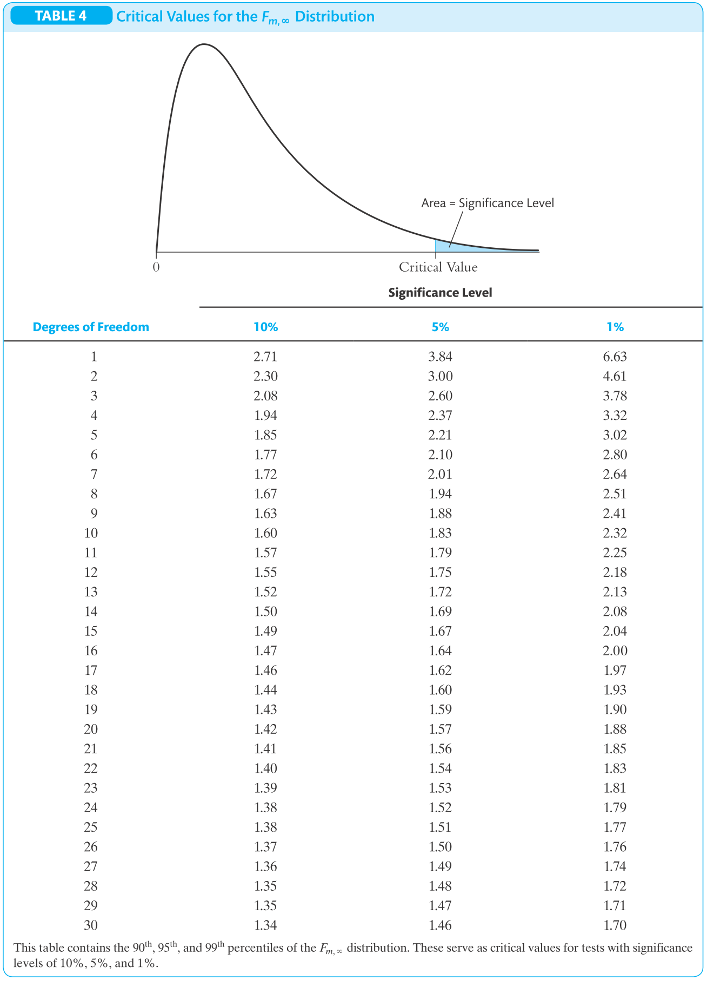

---
output:
  html_document:
    css: !expr c("./assets/style.css")
    includes:
      in_header: !expr c("./assets/header_01.html")
params:
  dat_link_01: "https://ilias.uni-hohenheim.de/goto.php?target=file_1538158_download&client_id=UHOH"
  dat_nam_01: "CASchools_03_data.txt"
editor_options: 
  chunk_output_type: console
---

<!--..........................................................................-->
<!--..........................................................................-->

<!-- Include header -->

````{=html}
```{r, include=TRUE, echo=FALSE, results='asis'}
xfun::file_string('./assets/header_02.html')
```
````

<!--..........................................................................-->
<!--..........................................................................-->

```{r,include=FALSE}

library(knitr)
knitr::opts_chunk$set(
  include=FALSE,
  echo = FALSE,
  warning = FALSE,
  message = FALSE,
  fig.align = 'center')
# See: https://stackoverflow.com/questions/36230790/missing-horizontal-scroll-bar-in-r-markdown-html-code-chunks-and-output
options(width=1000)

```

```{r}

# # 1) clear workspace # exclude to be able to use params in yml header!
# rm(list=ls(all=TRUE))

# 2) load libraries
library(kableExtra)
library(texreg)

# 3) load r-scripts
source("./r-scripts/r_helper_functions.R")
source("./r-scripts/texreg_extract_fun_02.R")

# 4) load data
cas.dat <- read.table(file = "./data-sets/CASchools_03_data.txt",
                      header = TRUE,
                      sep = ",")

```

```{r,klippy, echo=FALSE, include=TRUE}

# See: https://rlesur.github.io/klippy/articles/klippy.html
klippy::klippy(tooltip_message = 'Click to copy', tooltip_success = 'Done', position = c('top', 'right'))

```

<!--..........................................................................-->
<!--..........................................................................-->

<hr />

<!--..........................................................................-->
# Exercise Sheet No 06 {.tabset .tabset-fade}
<!--..........................................................................-->

<hr />

<p class="head01">
Linear Regression with Multiple Regressors (Part 2)
</p>

<hr />

<!--..........................................................................-->
## Set-Up

<span style="text-decoration: none; font-size: 18pt">
1)
</span>
<span style="text-decoration: underline; font-size: 18pt">
Create your (working) directory
</span>

Create a new folder on your computer in which you can save all necessary files, i.e., the data set, the <span class="R">R</span> *script* with the implementation of your analysis and the <span class="R">R</span> *helper function script* with some helper functions provided by us.

This folder, i.e., the path or directory of this folder, will be your so-called working directory.

<hr />

<span style="text-decoration: none; font-size: 18pt">
2)
</span>
<span style="text-decoration: underline; font-size: 18pt">
Download the data set
</span>

<!-- Download the data sets `CASchools_01_data` from <span class="R">ILIAS</span> directly or by using the link below: -->

<!-- <p class="down01"> -->
<!-- <a href="https://ilias.uni-hohenheim.de/goto.php?target=file_1523858_download&client_id=UHOH">Download `CASchools_01_data.txt`</a> -->
<!-- </p> -->

Download the data set ``r params$dat_nam_01`` from <span class="R">ILIAS</span> directly or by using the link below:

<p class="down01">
<a href="`r params$dat_link_01`">Download ``r params$dat_nam_01``</a>
</p>

Save the data set into a (working) directory of your choice.

<hr />

<span style="text-decoration: none; font-size: 18pt">
3)
</span>
<span style="text-decoration: underline; font-size: 18pt">
Prepare *script*
</span>

Open a new <span class="R">R</span> *script* and save it into into your (working) directory.

Run the following code chunk to prepare your <span class="R">R</span> *script*, i.e., to clear the work space and set your working directory.

```{r,include=TRUE,echo=TRUE,eval=FALSE}

# Clear workspace
rm(list = ls(all = TRUE))
# Set working directory
setwd(".../set/your/working/directory/...")

```

<hr />

<div style="display:none">

<span style="text-decoration: none; font-size: 18pt">
X)
</span>
<span style="text-decoration: underline; font-size: 18pt">
Install *libraries*
</span>

Run the following code chunk to make sure that all necessary *libraries* are installed.

*Note*, You have to run this code chunk only once. After running this code chunk you have installed all necessary *libraries* for the class and we will load them whenever we need them.

```{r,include=TRUE,echo=TRUE,eval=TRUE,include=FALSE}

# packages we will use in the course
pac <- c("moments", "sandwich", "lmtest", "car", "plm", "ivreg", "dynlm", "forecast", "urca")

# install and/or load packages
checkpac <- function(x) {
  if (!require(x, character.only = TRUE)) {
    install.packages(x)
  }
  require(x, character.only = TRUE)
}

# check if packages are install yet
suppressWarnings(sapply(pac, checkpac))

```

<hr />

</div>

<span style="text-decoration: none; font-size: 18pt">
4)
</span>
<span style="text-decoration: underline; font-size: 18pt">
Install/load *packages* and download/save/include *helper function script*
</span>

<span style="text-decoration: underline">Step 1</span>) Install all relevant <span class="R">R</span> *packages* and download and save the <span class="R">R</span> *script* `r_helper_functions.R` from <span class="R">ILIAS</span> by running the following code chunk.

```{r,include=TRUE,echo=TRUE,eval=FALSE}

# Download R-helper functions
source("https://ilias.uni-hohenheim.de/data/UHOH/lm_data/lm_1856939/MA_EconometricMethods_WiSe2324_PracticalClass/r-scripts/prepare_r_packages_and_helper_functions.R")

```

*Note*, the required <span class="R">R</span> *packages* are `"moments"`, `"sandwich"`, `"lmtest"`, `"lmtest"`, `"car"`, `"plm"`, `"ivreg"`, `"dynlm"`, `"forecast"`, `"urca"`.

<div style="margin-top: 5px;">
<span style="text-decoration: underline">Step 2</span>) Include the <span class="R">R</span> *script* `r_helper_functions.R` into your <span class="R">R</span> *script* by running the following code chunk.
</div>

```{r,include=TRUE,echo=TRUE,eval=FALSE}

# Include R-helper functions
source("r_helper_functions.R")

```

*Note*, more information on the helper functions can be found [here](./00_ExerciseSheet_HelperFunctions_XX.html).


<!--..........................................................................-->
## Preparations {.tabset .tabset-fade}

Load data, construct variables and estimation results.

<hr />

<p class="head02">
Variables
</p>

<!--..........................................................................-->
<button type="button" class="collapsible02"> *Show Variable Description* </button>
<div class="col_content">

| Variable   | Description                  | 
|------------|------------------------------| 
| $students$ | Total enrollment.            | 
| $teachers$ | Number of teachers.          | 
| $read$     | Average reading score.       | 
| $math$     | Average math score.          |
| $PctEL$    | Percent of English learners. |
| $Expen$    | Expenditure per student.     |

</div>
<!--..........................................................................-->

<p class="head02">
Load data set
</p>

<!--..........................................................................-->
<button type="button" class="collapsible01"> *Show Code* </button>
<div class="cod_content">
```{r,include=TRUE,echo=TRUE,results=FALSE,eval=FALSE}
# use absolute or relative path to load data
cas.dat <- read.table(file = "CASchools_03_data.txt",
                      header = TRUE,
                      sep = ",")
```
</div>
<!--..........................................................................-->

<p class="head02">
Construct variables
</p>

<!--..........................................................................-->
<button type="button" class="collapsible01"> *Show Code* </button>
<div class="cod_content">
```{r,include=TRUE,echo=TRUE,results=FALSE}
# compute STR and append it to cas.dat
cas.dat$STR <- cas.dat$students/cas.dat$teachers 
# compute TestScore and append it to cas.dat
cas.dat$score <- (cas.dat$read + cas.dat$math)/2 
```
</div>


<!-- <hr /> -->

## Task 1 {.tabset .tabset-fade}

<!-- <hr /> -->

<p class="head01">
Class size and student performance
</p>

We return to our analysis of class size and student performance. For this we use the complete California test score data set `CASchool_03_data.txt` and focus on the two variables $test score$ and $STR$ as obtained in the first exercise sheet again.

<hr />

<!--..........................................................................-->
### Task a) 

Load the data set into your favorite statistics software. Re-code $STR$ into a binary variable for small ($STR \leq 20$) and large class sizes ($STR > 20$) again and replicate and interpret the regression results depicted in Table 1 of the exercise sheet.

<hr />

<p class="head02">
Re-code $\underline{STR}$
</p>

<!--..........................................................................-->
<button type="button" class="collapsible01"> *Show Code* </button>
<div class="cod_content">
```{r,include=TRUE,echo=TRUE,results=FALSE,fig.show='hide'}
# re-coding of STR into binary variable
cas.dat$small <- round(cas.dat$STR,2)<20
```
</div>
<!--..........................................................................-->

<hr />

<p class="head02">
Regression results
</p>

<!--..........................................................................-->
<button type="button" class="collapsible01"> *Show Code* </button>
<div class="cod_content">
```{r,include=TRUE,echo=TRUE,results=FALSE,fig.show='hide'}
# model 1
lm.ct.res.01 <- lm_ct_fun(score ~ STR, data=cas.dat, hc.type="HC1")
lm.ct.res.01$ct
# model 2
lm.ct.res.02 <- lm_ct_fun(score ~ small, data=cas.dat, hc.type="HC1")
lm.ct.res.02$ct
# model 3
lm.ct.res.03 <- lm_ct_fun(score ~ STR + small, data=cas.dat, hc.type="HC1")
lm.ct.res.03$ct
```
</div>
<!--..........................................................................-->
<button type="button" class="collapsible01"> *Show Output* </button>
<div class="cod_content">
```{r,include=TRUE,echo=FALSE,results=TRUE}
# model 1
lm.ct.res.01 <- lm_ct_fun(score ~ STR, data=cas.dat, hc.type="HC1")
lm.ct.res.01$ct
# model 2
lm.ct.res.02 <- lm_ct_fun(score ~ small, data=cas.dat, hc.type="HC1")
lm.ct.res.02$ct
# model 3
lm.ct.res.03 <- lm_ct_fun(score ~ STR + small, data=cas.dat, hc.type="HC1")
lm.ct.res.03$ct
```
</div>
<!--..........................................................................-->

```{r,include=FALSE}

# model 1
se.01 <- lm.ct.res.01$ct[, 2]
pval.01 <- lm.ct.res.01$ct[, 4]
# Model 2
se.02 <- lm.ct.res.02$ct[, 2]
pval.02 <- lm.ct.res.02$ct[, 4]
# Model 3
se.03 <- lm.ct.res.03$ct[, 2]
pval.03 <- lm.ct.res.03$ct[, 4]

```

<!--..........................................................................-->
<button type="button" class="collapsible01"> *Show Results (after some rearrangement!)* </button>
<div class="col_content">

```{r,include=TRUE}
screenreg(list(lm.ct.res.01,lm.ct.res.02,lm.ct.res.03),
          override.se = list(se.01,se.02,se.03),
          override.pvalues = list(pval.01,pval.02,pval.03),
          caption = "Estimation Results",
          caption.above = TRUE,
          label = "Tab01",
          # stars = numeric(0),
          custom.model.names = NULL,
          custom.coef.names = c("intercept","STR","small"),
          float.pos = "h",
          single.row = TRUE,
          booktabs = TRUE,
          dcolumn = TRUE,
          use.packages = FALSE,
          ci.force = FALSE,
          digits = 3,
          include.rsquared = TRUE,
          include.adjrs = TRUE,
          include.rmse = TRUE,
          include.nobs = TRUE)
```

</div>
<!--..........................................................................-->

<hr />

<p class="head02">
Interpretation
</p>

<!--..........................................................................-->
<button type="button" class="collapsible02"> *Interpretation* </button>
<div class="col_content">

<div style="color: red" class="showSol01">

* <u>Model 1 and model 2</u>:
    * <u>Model 1</u>: Increasing $STR$ reduces expected $score$ ($\Rightarrow$ effect is significant!)
    * <u>Model 2</u>: Expected $score$ for smaller classes is higher than for larger classes ($\Rightarrow$ effect is significant!)
* <u>Model 3</u>:
    * Increasing $STR$ after controlling for small classes reduces expected $score$ (only at 5\% significant!)
    * Expected $score$ for small classes is no longer significantly different than for larger classes after controlling for $STR$.
    * $\Rightarrow$ Both variables $STR$ and $score$ measure similar characteristics.

</div>

<div style="color: red" class="noSol01">

*Add your results here!*

</div>

</div>
<!--..........................................................................-->


<!--..........................................................................-->
### Task b) 

Compare the three regression model w.r.t. to their fitting.

<hr />

<p class="head02">
Comparison w.r.t. fitting
</p>

<!--..........................................................................-->
<button type="button" class="collapsible02"> *Interpretation* </button>
<div class="col_content">

<div style="color: red" class="showSol01">

* $R^2$: Model 3 has (necessarily) the best fit w.r.t. $R^2$.
* $\overline{R}^2$: Model 1 has the best fit w.r.t. $\overline{R}^2$.
* $SER$: Model 1 has the best fit w.r.t. $SER$.
* Adding the variable $small$ after using $STR$ improves the fitting only marginally and thus, not enough to be justified by $\overline{R}^2$ and $SER$.

<p class="head02">
Remember
</p>

$$ SER = s_{\widehat{u}} = \sqrt{s_{\widehat{u}}^2} \ \ \ \text{where} \ \ \ s_{\widehat{u} }^2 = \frac{1}{n - k - 1} \sum_{i = 1}^n \hat{u}^2_i = \frac{SSR}{n - k - 1} $$

</div>

<div style="color: red" class="noSol01">

*Add your results here!*

</div>

</div>
<!--..........................................................................-->


<!--..........................................................................-->
### Task c) 

Compare the three regression model w.r.t. the effect of class size on student performance.

<hr />

<p class="head02">
Interpretation
</p>

<!--..........................................................................-->
<button type="button" class="collapsible02"> *Interpretation* </button>
<div class="col_content">

<div style="color: red" class="showSol01">

* <u>Model 1 and Model 2</u>: There is a significant (negative) effect of class size on student performance.
* <u>Model 3</u>: Less significant (negative) effect of $STR$ after accounting for a regression line shift for small classes. ($\Rightarrow$ Problem of imperfect multicolinearity!)

</div>

<div style="color: red" class="noSol01">

*Add your results here!*

</div>

</div>
<!--..........................................................................-->


<!--..........................................................................-->
### Task d) 

Discuss regression model three w.r.t. multicollinearity.

<hr />

<p class="head02">
Interpretation
</p>

<!--..........................................................................-->
<button type="button" class="collapsible02"> *Interpretation* </button>
<div class="col_content">

<div style="color: red" class="showSol01">

* The variables $STR$ and $small$ are related as $small$ is constructed based on $STR$.
* Though, this relationship is not linear but non-linear due to the "threshold" at $STR=20$.
* Still, both variables capture information about class size.
* As a results the estimated coefficients are estimated more imprecise.

</div>

<div style="color: red" class="noSol01">

*Add your results here!*

</div>

```{r,include=FALSE,echo=TRUE,results=FALSE,fig.show='hide'}

# # model xx
# lm.ct.res.xx <- lm_ct_fun(small ~ STR, data=cas.dat, hc.type="HC1")
# lm.ct.res.xx$ct
# 
# R2.xx <- summary(lm(STR ~ small, data=cas.dat))$r.squared
# VIF.xx <- 1/(1-R2.xx)
# VIF.xx

```


</div>
<!--..........................................................................-->


<!-- <hr /> -->

## Task 2 {.tabset .tabset-fade}

<!-- <hr /> -->

<p class="head01">
Expenditure per pupil and student performance
</p>

We now focus on the analysis of expenditure per pupil and student performance. For this we use again the complete California test score data set `CASchool_02_data.csv` and focus on the two variables $test score$, $STR$ (both as obtained in the first exercise sheet), $PctEL$ and $Expn$.


<hr />

<!--..........................................................................-->
### Task a) 

Replicate and interpret the regression results depicted in Table 2 of the exercise sheet.

<hr />

<p class="head02">
Regression estimation
</p>

<!--..........................................................................-->
<button type="button" class="collapsible01"> *Show Code* </button>
<div class="cod_content">
```{r,include=TRUE,echo=TRUE,results=FALSE,fig.show='hide'}
# model 4
lm.ct.res.04 <- lm_ct_fun(score ~ STR + PctEL + Expn, data = cas.dat, hc.type="HC1")
lm.ct.res.04$ct
```
</div>
<!--..........................................................................-->
<button type="button" class="collapsible01"> *Show Output* </button>
<div class="cod_content">
```{r,include=TRUE,echo=FALSE,results=TRUE}
# model 4
lm.ct.res.04 <- lm_ct_fun(score ~ STR + PctEL + Expn, data = cas.dat, hc.type="HC1")
lm.ct.res.04$ct
```
</div>
<!--..........................................................................-->

```{r,include=FALSE}

# model 4
se.04 <- lm.ct.res.04$ct[, 2]
pval.04 <- lm.ct.res.04$ct[, 4]

```

<!--..........................................................................-->
<button type="button" class="collapsible01"> *Show Results (after some rearrangement!)* </button>
<div class="col_content">

```{r,include=TRUE}
screenreg(list(lm.ct.res.04),
          override.se = list(se.04),
          override.pvalues = list(pval.04),
          caption = "Estimation Results",
          caption.above = TRUE,
          label = "Tab01",
          # stars = numeric(0),
          custom.model.names = NULL,
          custom.coef.names = c("intercept","STR","PctEL","Expn"),
          float.pos = "h",
          single.row = TRUE,
          booktabs = TRUE,
          dcolumn = TRUE,
          use.packages = FALSE,
          ci.force = FALSE,
          digits = 3,
          include.rsquared = TRUE,
          include.adjrs = TRUE,
          include.rmse = TRUE,
          include.nobs = TRUE)
```

</div>
<!--..........................................................................-->

<hr />

<p class="head02">
Interpretation
</p>

<!--..........................................................................-->
<button type="button" class="collapsible02"> *Interpretation* </button>
<div class="col_content">

<div style="color: red" class="showSol01">

* $STR$: After controlling for $PctEL$ and $Expn$ the effect of $STR$ is no longer significant!
* $PctEL$: Significant negative effect on $score$ (0.1 \% level)
* $Expn$: Significant positive effect on $score$ (5 \% level)

</div>

<div style="color: red" class="noSol01">

*Add your results here!*

</div>

</div>
<!--..........................................................................-->


<!--..........................................................................-->
### Task b) 

Test the joint hypothesis that the population coefficient of $STR$ and $Expn$ are zero based on the regression model of Task 2a) and the test results depicted in Table 3 and 4 of the exercise sheet.

<hr />

<p class="head02">
Test 
</p>

<!--..........................................................................-->
<button type="button" class="collapsible01"> *Show Code* </button>
<div class="cod_content">
```{r,include=TRUE,echo=TRUE,results=FALSE,fig.show='hide'}
# heteroskedasticity-robust F-test (all regressors equals zero)
lin.hyp.01 <- linearHypothesis(lm.ct.res.04, c("STR=0",
                                               "Expn=0"), white.adjust = "hc1")
lin.hyp.01
```
</div>
<!--..........................................................................-->
<button type="button" class="collapsible01"> *Show Output* </button>
<div class="cod_content">
```{r,include=TRUE,echo=FALSE,results=TRUE}
# heteroskedasticity-robust F-test (all regressors equals zero)
lin.hyp.01 <- linearHypothesis(lm.ct.res.04, c("STR=0",
                                               "Expn=0"), white.adjust = "hc1")
lin.hyp.01
```
</div>
<!--..........................................................................-->

<!--..........................................................................-->
<button type="button" class="collapsible02"> *Interpretation* </button>
<div class="col_content">

<p class="head01">
Hypothesis
</p>

<div style="color: red" class="showSol01">

\begin{align}
H_0&: \quad \beta_{STR} = \beta_{Expn} = 0 \quad \text{vs.} \\
H_1&: \quad \text{at least one} \neq 0 \quad \quad \alpha = 5\%
\end{align}

</div>

<div style="color: red" class="noSol01">

<p class="sub01">
*Add the hypothesis here!*
</p>

</div>

<p class="head01">
Test statistic
</p>

<div style="color: red" class="showSol01">

\begin{align}
F^{act}\left( `r lin.hyp.01$Df[2]`, `r lin.hyp.01$Res.Df[2]` \right) &= `r round(lin.hyp.01$F[2],3)`
\end{align}

</div>

<div style="color: red" class="noSol01">

<p class="sub01">
*Add the test statistic here!*
</p>

</div>

<p class="head01">
$p$-value
</p>

```{r}
pval <- round(lin.hyp.01$`Pr(>F)`[2],3)
```

<div style="color: red" class="showSol01">

\begin{align}
p-\text{value} &= Pr\left[ F\left( `r lin.hyp.01$Df[2]`, `r lin.hyp.01$Res.Df[2]` \right) > F^{act}\left( `r lin.hyp.01$Df[2]`, `r lin.hyp.01$Res.Df[2]` \right) \right] \\
p-\text{value} &= `r pval`
\end{align}

</div>

<div style="color: red" class="noSol01">

<p class="sub01">
*Add the $p$-value here!*
</p>

</div>

<p class="head01">
Decision
</p>

<div style="color: red" class="showSol01">

<p class="sub01">

* Rejection of $H_0$ as 

\begin{align}
F^{act}\left( `r lin.hyp.01$Df[2]`, \infty \right) &> F^{crit \, 5\%}\left( `r lin.hyp.01$Df[2]`, \infty \right) \\
F^{act}\left( `r lin.hyp.01$Df[2]`, \infty \right) &> 3.00
\end{align}

* Or, rejection of $H_0$ as $p-\text{value} < 0.05$.

</p>

</div>

<div style="color: red" class="noSol01">

<p class="sub01">
*Add the decision here!*
</p>

</div>

<p class="head01">
Note
</p>

* Check also the asymptotic critical value of the test statistic, i,e, $F\left(2,\infty\right)$, for $\alpha =5\%$.
* Use Table 4 in Stock and Watson (2020) on p. 767. (see below)

</div>
<!--..........................................................................-->

<hr />

<p class="head02">
Critical value for the $\underline{F\left(m,\infty\right)}$
</p>

<!--..........................................................................-->
<button type="button" class="collapsible02"> *Table of Stock and Watson (2020)* </button>
<div class="col_content">



<p class="sou01">
Source: Stock and Watson (2020) on p. 767
</p>

<br>

</div>
<!--..........................................................................-->


<!--..........................................................................-->
### Task c) {.tabset .tabset-fade} 

Test the hypothesis that the population coefficient of $STR$ and $Expn$ are identical based on the regression model estimated in Table 5 where the variable $W$ is defined such as $W \equiv STR + Expn$.

<hr />

#### Approach 1

<p class="head02">
Approach 1 based on F-test
</p>

<!--..........................................................................-->
<button type="button" class="collapsible01"> *Show Code* </button>
<div class="cod_content">
```{r,include=TRUE,echo=TRUE,results=FALSE,fig.show='hide'}
# heteroskedasticity-robust F test
lin.hyp.02 <- linearHypothesis(lm.ct.res.04, c("STR=Expn"), white.adjust = "hc1")
lin.hyp.02
```
</div>
<!--..........................................................................-->
<button type="button" class="collapsible01"> *Show Output* </button>
<div class="cod_content">
```{r,include=TRUE,echo=FALSE,results=TRUE}
# heteroskedasticity-robust F test
lin.hyp.02 <- linearHypothesis(lm.ct.res.04, c("STR=Expn"), white.adjust = "hc1")
lin.hyp.02
```
</div>
<!--..........................................................................-->

<!--..........................................................................-->
<button type="button" class="collapsible02"> *Interpretation* </button>
<div class="col_content">

<p class="head01">
Hypothesis
</p>

<div style="color: red" class="showSol01">

\begin{align}
H_0&: \quad \beta_{STR} = \beta_{Expn} \quad \quad \quad \text{vs.} \\
H_1&: \quad \beta_{STR} \neq \beta_{Expn} \quad \quad \alpha = 5\%
\end{align}

</div>

<div style="color: red" class="noSol01">

<p class="sub01">
*Add the hypothesis here!*
</p>

</div>

<p class="head01">
Test statistic
</p>

<div style="color: red" class="showSol01">

\begin{align}
F^{act}\left( `r lin.hyp.02$Df[2]`, `r lin.hyp.02$Res.Df[2]` \right) &= `r round(lin.hyp.02$F[2],3)`
\end{align}

</div>

<div style="color: red" class="noSol01">

<p class="sub01">
*Add the test statistic here!*
</p>

</div>

<p class="head01">
$p$-value
</p>

```{r}
pval <- round(lin.hyp.02$`Pr(>F)`[2],3)
```

<div style="color: red" class="showSol01">

\begin{align}
p-\text{value} &= Pr\left[ F\left( `r lin.hyp.02$Df[2]`, `r lin.hyp.02$Res.Df[2]` \right) > F^{act}\left( `r lin.hyp.02$Df[2]`, `r lin.hyp.02$Res.Df[2]` \right) \right] \\
p-\text{value} &= `r pval`
\end{align}

</div>

<div style="color: red" class="noSol01">

<p class="sub01">
*Add the $p$-value here!*
</p>

</div>

<p class="head01">
Decision
</p>

<div style="color: red" class="showSol01">


* No rejection of $H_0$ as 

\begin{align}
F^{act}\left( `r lin.hyp.02$Df[2]`, \infty \right) &< F^{crit \, 5\%}\left( `r lin.hyp.02$Df[2]`, \infty \right) \\
F^{act}\left( `r lin.hyp.02$Df[2]`, \infty \right) &< 3.84
\end{align}

* No Rejection of $H_0$ as $p-\text{value} > 0.05$.

</div>

<div style="color: red" class="noSol01">

<p class="sub01">
*Add the decision here!*
</p>

</div>

<p class="head01">
Note
</p>

* Check also the asymptotic critical value of the test statistic, i,e, $F\left(1,\infty\right)$, for $\alpha =5\%$.
* Use Table 4 in Stock and Watson (2020) on p. 767. (see below)

</div>
<!--..........................................................................-->

<hr>

<p class="head02">
Critical value for the $\underline{F\left(m,\infty\right)}$
</p>

<!--..........................................................................-->
<button type="button" class="collapsible02"> *Table of Stock and Watson (2020)* </button>
<div class="col_content">


<p class="sou01">
Source: Stock and Watson (2020) on p. 767
</p>

<br>

</div>
<!--..........................................................................-->


#### Approach 2

<p class="head02">
Approach 2 based on t-test
</p>

<p class="head03">
Construct variables
</p>

<!--..........................................................................-->
<button type="button" class="collapsible01"> *Show Code* </button>
<div class="cod_content">
```{r,include=TRUE,echo=TRUE,results=FALSE}
# compute STR + Expn
cas.dat$W <- cas.dat$STR + cas.dat$Expn
```
</div>

<hr />

<p class="head03">
Regression estimation
</p>

<!--..........................................................................-->
<button type="button" class="collapsible01"> *Show Code* </button>
<div class="cod_content">
```{r,include=TRUE,echo=TRUE,results=FALSE,fig.show='hide'}
# model 5
lm.ct.res.05 <- lm_ct_fun(score ~ STR + PctEL + W, data = cas.dat, hc.type="HC1")
lm.ct.res.05$ct
```
</div>
<!--..........................................................................-->
<button type="button" class="collapsible01"> *Show Output* </button>
<div class="cod_content">
```{r,include=TRUE,echo=FALSE,results=TRUE}
# model 5
lm.ct.res.05 <- lm_ct_fun(score ~ STR + PctEL + W, data = cas.dat, hc.type="HC1")
lm.ct.res.05$ct
```
</div>
<!--..........................................................................-->


```{r,include=FALSE}

# model 4
se.05 <- lm.ct.res.05$ct[, 2]
pval.05 <- lm.ct.res.05$ct[, 4]

```

<!--..........................................................................-->
<button type="button" class="collapsible01"> *Show Results (after some rearrangement!)* </button>
<div class="col_content">

```{r,include=TRUE}
screenreg(list(lm.ct.res.05),
          override.se = list(se.05),
          override.pvalues = list(pval.05),
          caption = "Estimation Results",
          caption.above = TRUE,
          label = "Tab01",
          # stars = numeric(0),
          custom.model.names = NULL,
          custom.coef.names = c("intercept","STR","PctEL","W"),
          float.pos = "h",
          single.row = TRUE,
          booktabs = TRUE,
          dcolumn = TRUE,
          use.packages = FALSE,
          ci.force = FALSE,
          digits = 3,
          include.rsquared = TRUE,
          include.adjrs = TRUE,
          include.rmse = TRUE,
          include.nobs = TRUE)
```

</div>
<!--..........................................................................-->

<hr />

<p class="head03">
Transformation
</p>

<!--..........................................................................-->
<button type="button" class="collapsible02"> *Transformation* </button>
<div class="col_content">

<div style="color: red" class="showSol01">

<div style="font-size: 12pt";>

\begin{align}
score_{i} &= \beta_{0} + \beta_{STR}STR_{i} + \beta_{PctEL}PctEL_{i} + \beta_{Expn}Expn_{i} + u_{i} \\
score_{i} &= \beta_{0} + \beta_{STR}STR_{i} + \beta_{PctEL}PctEL_{i} + \beta_{Expn}Expn_{i} + u_{i} \,\,\,\,\, | +\left(\beta_{Expn}STR_{i}-\beta_{Expn}STR_{i}\right)  \\
score_{i} &= \beta_{0} + \beta_{STR}STR_{i} - \beta_{Expn}STR_{i} + \beta_{PctEL}PctEL_{i} + \beta_{Expn}Expn_{i} + \beta_{Expn}STR_{i} + u_{i} \\
score_{i} &= \beta_{0} + \left(\beta_{STR} - \beta_{Expn}\right) STR_{i} + \beta_{PctEL}PctEL_{i} + \beta_{Expn} \left(Expn_{i} + STR_{i}\right) + u_{i} \\
score_{i} &= \beta_{0} + \gamma_{1} STR_{i} + \beta_{PctEL}PctEL_{i} + \beta_{Expn} W_{i} + u_{i} \\
\end{align}

</div>

with

\begin{align}
\gamma_{1} \equiv \beta_{STR} - \beta_{Expn} \\
W \equiv STR + Expn
\end{align}

</div>

<div style="color: red" class="noSol01">

*Add your results here!*

</div>


</div>
<!--..........................................................................-->

<hr />

<p class="head03">
Interpretation
</p>

<!--..........................................................................-->
<button type="button" class="collapsible02"> *Statement of hypothesis* </button>
<div class="col_content">

<div style="color: red" class="showSol01">

\begin{align}
H_0&: \quad \beta_{STR} - \beta_{Expn} = 0 \\
H_0&: \quad \gamma_{1} = 0 \quad \text{vs.} \\
H_1&: \quad \gamma_{1} \neq 0 \quad \alpha = 5\%
\end{align}

</div>

<div style="color: red" class="noSol01">

*Add your results here!*

</div>

</div>
<!--..........................................................................-->

<hr />

<p class="head03">
Based on test statistic
</p>

<!--..........................................................................-->
<button type="button" class="collapsible02"> *Calculation of test statistic* </button>
<div class="col_content">

```{r,include=FALSE}
tes.sta.val <- lm.ct.res.05$ct[2,1]/lm.ct.res.05$ct[2,2]
tes.sta.val
pval <- 2*pnorm(-abs(tes.sta.val))
pval
pval <- 2*pt(-abs(tes.sta.val), df=nrow(cas.dat)-4)
pval
lm.ct.res.05$ct

# tes.sta.val <- (round(lm.ct.res.05$ct[4,1],3)-0)/round(lm.ct.res.05$ct[4,2],3)

```


<div style="color: red" class="showSol01">

\begin{align}
t^{act} &= \frac{\hat{\gamma_{1}}^{act} - 0}{SE\left(\hat{\gamma_{1}}\right)} \\
t^{act} &= \frac{`r round(lm.ct.res.05$ct[2,1],3)` - 0}{`r round(lm.ct.res.05$ct[2,2],3)`} \\
t^{act} &= `r round(tes.sta.val,3)`
\end{align}

</div>

<div style="color: red" class="noSol01">

*Add your results here!*

</div>

</div>
<!--..........................................................................-->

<!--..........................................................................-->
<button type="button" class="collapsible02"> *Conclusion based on test statistic* </button>
<div class="col_content">

<div style="color: red" class="showSol01">

<u>Conclusion</u>:

* $|t^{act}| < 1.96$
* $H_0$ cannot be rejected at 5\%.

</div>

<div style="color: red" class="noSol01">

*Add your results here!*

</div>

</div>
<!--..........................................................................-->

<hr />

<p class="head03">
Based on $p$-value
</p>

<!--..........................................................................-->
<button type="button" class="collapsible02"> *And/or calculation of $p$-value of test statistic* </button>
<div class="col_content">

```{r,include=FALSE}
qnorm(0.05)
pval.01 <- 2*pnorm(-abs(round(tes.sta.val,3)))
pval <- 2*pt(-abs(tes.sta.val), df=nrow(cas.dat)-4)
pval
pval.01
pval.01 <- 2*(1-0.7257)
pval.01
```

<div style="color: red" class="showSol01">

\begin{align}
p-\text{value} &= 2*\Phi\left(-|t^{act}|\right) \\
&= 2*\Phi\left(`r -abs(round(tes.sta.val,3))`\right) \\
&= `r round(pval.01,3)`
\end{align}

</div>

<div style="color: red" class="noSol01">

*Add your results here!*

</div>

</div>
<!--..........................................................................-->

<!--..........................................................................-->
<button type="button" class="collapsible02"> *And/or conclusion based on $p$-value* </button>
<div class="col_content">

<!-- *Add your results here!* -->

<div style="color: red" class="showSol01">

<u>Conclusion</u>:

* $p\text{-value}>0.05$
* $H_0$ cannot be rejected at 5\% significance level.

<u>Definition $p$-value</u>:

* The p-value is the probability of observing a value of $\hat{\beta}$ at least as different from $\beta_{1,0}$ as the estimate actually computed $\left(\hat{\beta}^{act}_1\right)$, assuming that the null hypothesis is correct.
* Type I error, i.e. rejecting $H_0$ even if it is true.

</div>

<div style="color: red" class="noSol01">

*Add your results here!*

</div>

</div>
<!--..........................................................................-->

<hr />

<p class="head03">
CDF Standard Normal Distribution
</p>

<!--..........................................................................-->
<button type="button" class="collapsible02"> *Table of Stock and Watson (2020)* </button>
<div class="col_content">


<p class="sou01">
Source: Stock and Watson (2020), p. 763-764
</p>

<br>

</div>
<!--..........................................................................-->

<hr />

<p class="head03">
An Illustration of the $p$-value
</p>

<!--..........................................................................-->
<button type="button" class="collapsible01"> *Show Code* </button>
<div class="cod_content">
```{r,include=TRUE,echo=TRUE,results=FALSE,fig.show='hide'}
ill_hyp_tes_fun(t.act=-0.603, test=c("two.sid"))
```
</div>
<!--..........................................................................-->
<button type="button" class="collapsible01"> *Show Output* </button>
<div class="cod_content">
```{r,include=TRUE,echo=FALSE,results=TRUE}
ill_hyp_tes_fun(t.act=-0.603, test=c("two.sid"))
```
</div>
<!--..........................................................................-->

<!--..........................................................................-->
<button type="button" class="collapsible02"> *Interpretation: Conclusion* </button>
<div class="col_content">

<div style="color: red" class="showSol01">

* $\gamma_{1}$: Not significantly different from zero (5 \% level)
* $\Rightarrow$ Effect of $STR$ and $Expn$ are similar at (5 \% level)

</div>

<div style="color: red" class="noSol01">

*Add your results here!*

</div>

</div>
<!--..........................................................................-->


#### Relationship

<p class="head02">
Relationship between Approach 1 and 2
</p>

<!-- <hr /> -->

<!-- <p class="head02"> -->
<!-- Note the relationship between $\underline{t}$ and $\underline{F}$ statistic -->
<!-- </p> -->

<!--..........................................................................-->
<!-- <button type="button" class="collapsible02"> *Note: Relationship* </button> -->
<!-- <div class="col_content"> -->

<!-- *Add your interpretation here!* -->

Note, the relationship between $t$- and $F$-statistic.

$F$-statistic is is equal to the square of the $t$-statistic.

```{r,include=TRUE,echo=TRUE,results=TRUE}
# heteroskedasticity-robust t statistic
lm.ct.res.05$ct[2,3]^2
# heteroskedasticity-robust F statistic
lin.hyp.02$F[2]
```

<!-- </div> -->
<!--..........................................................................-->


<!-- <hr /> -->

<!-- ## Literature -->

<!-- <div id="refs"></div> -->

<!--..........................................................................-->
# 
<!--..........................................................................-->

<!--..........................................................................-->
<hr />

<p class="back01">
[Back To *Start*](./index.html)
</p>

<!--..........................................................................-->
<hr />


<!--..........................................................................--> 
<!-- THIS IS THE END --> 

<!-- Include bottom -->

````{=html}
```{r, include=TRUE, echo=FALSE, results='asis'}
xfun::file_string('./assets/bottom_01.html')
```
````

````{=html}

<script>

// Hide all solutions (by default)
var i, Sol01;
Sol01 = document.getElementsByClassName("showSol01");
for (i = 0; i < Sol01.length; i++) {
  Sol01[i].style.display = "none"; // type "block" for show or "none" (default) for exclude
}
  
var i, NoSol01;
NoSol01 = document.getElementsByClassName("noSol01");
for (i = 0; i < NoSol01.length; i++) {
  NoSol01[i].style.display = "block"; // type "block" (default) for show or "none" for exclude
}
</script>

````
