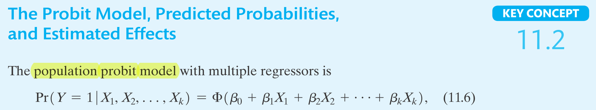
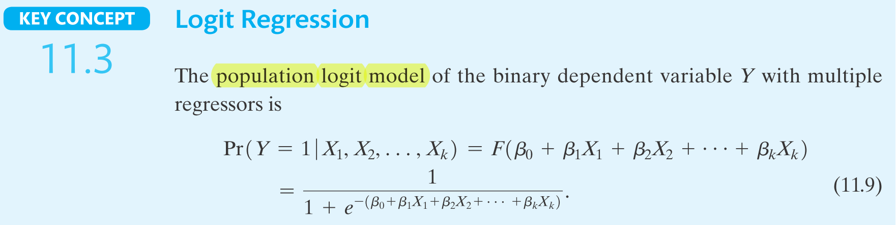

---
output:
  html_document:
    css: !expr c("./assets/style.css")
    includes:
      in_header: !expr c("./assets/header_01.html")
params:
  dat_link_01: "https://ilias.uni-hohenheim.de/goto.php?target=file_1548424_download&client_id=UHOH"
  dat_nam_01: "HMDA_data.txt"
editor_options: 
  chunk_output_type: console
---

<!--..........................................................................-->
<!--..........................................................................-->

<!-- Include header -->

````{=html}
```{r, include=TRUE, echo=FALSE, results='asis'}
xfun::file_string('./assets/header_02.html')
```
````

<!--..........................................................................-->
<!--..........................................................................-->

```{r,include=FALSE}

library(knitr)
knitr::opts_chunk$set(
  include=FALSE,
  echo = FALSE,
  warning = FALSE,
  message = FALSE,
  fig.align = 'center')
# See: https://stackoverflow.com/questions/36230790/missing-horizontal-scroll-bar-in-r-markdown-html-code-chunks-and-output
options(width=1000)

```

```{r}

# # 1) clear workspace # exclude to be able to use params in yml header!
# rm(list=ls(all=TRUE))

# 2) load libraries
library(kableExtra)
library(texreg)

# 3) load r-scripts
source("./r-scripts/r_helper_functions.R")
source("./r-scripts/texreg_extract_fun_02.R")

# 4) load data
hmda.dat <- read.table(file = "./data-sets/HMDA_data.txt",
                       header = TRUE,
                       sep = ",",
                       stringsAsFactors = TRUE)

```

```{r,klippy, echo=FALSE, include=TRUE}

# See: https://rlesur.github.io/klippy/articles/klippy.html
klippy::klippy(tooltip_message = 'Click to copy', tooltip_success = 'Done', position = c('top', 'right'))

```

<!--..........................................................................-->
<!--..........................................................................-->

<hr />

<!--..........................................................................-->
# Exercise Sheet No 10 {.tabset .tabset-fade}
<!--..........................................................................-->

<hr />

<p class="head01">
Regression Analysis with a Binary Dependent Variable
</p>

<hr />

<!--..........................................................................-->
## Set-Up

<span style="text-decoration: none; font-size: 18pt">
1)
</span>
<span style="text-decoration: underline; font-size: 18pt">
Create your (working) directory
</span>

Create a new folder on your computer in which you can save all necessary files, i.e., the data set, the <span class="R">R</span> *script* with the implementation of your analysis and the <span class="R">R</span> *helper function script* with some helper functions provided by us.

This folder, i.e., the path or directory of this folder, will be your so-called working directory.

<hr />

<span style="text-decoration: none; font-size: 18pt">
2)
</span>
<span style="text-decoration: underline; font-size: 18pt">
Download the data set
</span>

<!-- Download the data sets `CASchools_01_data` from <span class="R">ILIAS</span> directly or by using the link below: -->

<!-- <p class="down01"> -->
<!-- <a href="https://ilias.uni-hohenheim.de/goto.php?target=file_1523858_download&client_id=UHOH">Download `CASchools_01_data.txt`</a> -->
<!-- </p> -->

Download the data set ``r params$dat_nam_01`` from <span class="R">ILIAS</span> directly or by using the link below:

<p class="down01">
<a href="`r params$dat_link_01`">Download ``r params$dat_nam_01``</a>
</p>

Save the data set into a (working) directory of your choice.

<hr />

<span style="text-decoration: none; font-size: 18pt">
3)
</span>
<span style="text-decoration: underline; font-size: 18pt">
Prepare *script*
</span>

Open a new <span class="R">R</span> *script* and save it into into your (working) directory.

Run the following code chunk to prepare your <span class="R">R</span> *script*, i.e., to clear the work space and set your working directory.

```{r,include=TRUE,echo=TRUE,eval=FALSE}

# Clear workspace
rm(list = ls(all = TRUE))
# Set working directory
setwd(".../set/your/working/directory/...")

```

<hr />

<div style="display:none">

<span style="text-decoration: none; font-size: 18pt">
X)
</span>
<span style="text-decoration: underline; font-size: 18pt">
Install *libraries*
</span>

Run the following code chunk to make sure that all necessary *libraries* are installed.

*Note*, You have to run this code chunk only once. After running this code chunk you have installed all necessary *libraries* for the class and we will load them whenever we need them.

```{r,include=TRUE,echo=TRUE,eval=TRUE,include=FALSE}

# packages we will use in the course
pac <- c("moments", "sandwich", "lmtest", "car", "plm", "ivreg", "dynlm", "forecast", "urca")

# install and/or load packages
checkpac <- function(x) {
  if (!require(x, character.only = TRUE)) {
    install.packages(x)
  }
  require(x, character.only = TRUE)
}

# check if packages are install yet
suppressWarnings(sapply(pac, checkpac))

```

<hr />

</div>

<span style="text-decoration: none; font-size: 18pt">
4)
</span>
<span style="text-decoration: underline; font-size: 18pt">
Install/load *packages* and download/save/include *helper function script*
</span>

<span style="text-decoration: underline">Step 1</span>) Install all relevant <span class="R">R</span> *packages* and download and save the <span class="R">R</span> *script* `r_helper_functions.R` from <span class="R">ILIAS</span> by running the following code chunk.

```{r,include=TRUE,echo=TRUE,eval=FALSE}

# Download R-helper functions
source("https://ilias.uni-hohenheim.de/data/UHOH/lm_data/lm_1856939/MA_EconometricMethods_WiSe2324_PracticalClass/r-scripts/prepare_r_packages_and_helper_functions.R")

```

*Note*, the required <span class="R">R</span> *packages* are `"moments"`, `"sandwich"`, `"lmtest"`, `"lmtest"`, `"car"`, `"plm"`, `"ivreg"`, `"dynlm"`, `"forecast"`, `"urca"`.

<div style="margin-top: 5px;">
<span style="text-decoration: underline">Step 2</span>) Include the <span class="R">R</span> *script* `r_helper_functions.R` into your <span class="R">R</span> *script* by running the following code chunk.
</div>

```{r,include=TRUE,echo=TRUE,eval=FALSE}

# Include R-helper functions
source("r_helper_functions.R")

```

*Note*, more information on the helper functions can be found [here](./00_ExerciseSheet_HelperFunctions_XX.html).


<!-- <hr /> -->

## Task 1 {.tabset .tabset-fade}

<hr />

<p class="head01">
Access to Mortgages
</p>

We return to the analysis of the access to mortgages from the lecture. For this we use the data set `HMDA_data.txt` containing data compiled under the Home Mortgage Disclosure Act (HMDA) about mortgage applications filed in the Boston, Massachusetts, area in 1990 with the variables described below.

<hr />

<p class="head02">
Variables
</p>

<!--..........................................................................-->
<button type="button" class="collapsible02"> *Show Variable description* </button>
<div class="col_content">

| Variable | Description                                 | 
|----------|---------------------------------------------| 
| $deny$   | Factor. Was the mortgage denied?            |
| $pirat$  | Payments to income ratio.                   | 
| $black$  | Factor. Is the individual African-American? | 


</div>
<!--..........................................................................-->


<hr />

<!--..........................................................................-->
### Task a) 

Load the data set into your favorite statistics software. Transform the variable $deny$ into a binary variable ($1$ is deny and $0$ otherwise) and the discuss its descriptive statistics. Draw as scatter plot of $deny$ and $pirat$. Discuss the results.

<hr />

<p class="head02">
Load data set
</p>

<!--..........................................................................-->
<button type="button" class="collapsible01"> *Show Code* </button>
<div class="cod_content">
```{r,include=TRUE,echo=TRUE,results=FALSE,eval=FALSE}
# use absolute or relative path to load data
hmda.dat <- read.table(file = "HMDA_data.txt",
                       header = TRUE,
                       sep = ",",
                       stringsAsFactors = TRUE)
```
</div>
<!--..........................................................................-->

<hr />

<p class="head02">
Transform into binary variable
</p>

<!--..........................................................................-->
<button type="button" class="collapsible01"> *Show Code* </button>
<div class="cod_content">
```{r,include=TRUE,eval=FALSE,echo=TRUE,results=FALSE,fig.show='hide'}
# Original variable
str(hmda.dat$deny)
# Transform variable
hmda.dat$deny <- as.numeric(hmda.dat$deny) - 1
str(hmda.dat$deny)
```
</div>
<!--..........................................................................-->
<button type="button" class="collapsible01"> *Show Output* </button>
<div class="cod_content">
```{r,include=TRUE,echo=TRUE,results=TRUE}
# Original variable
str(hmda.dat$deny)
# Transform variable
hmda.dat$deny <- as.numeric(hmda.dat$deny) - 1
str(hmda.dat$deny)
```
</div>
<!--..........................................................................-->

<hr />

<p class="head02">
Descriptive statistic
</p>

<!--..........................................................................-->
<button type="button" class="collapsible01"> *Show Code* </button>
<div class="cod_content">
```{r,include=TRUE,echo=TRUE,results=FALSE,fig.show='hide'}
# Descriptive statistics
summary(hmda.dat$deny)
```
</div>
<!--..........................................................................-->
<button type="button" class="collapsible01"> *Show Output* </button>
<div class="cod_content">
```{r,include=TRUE,echo=TRUE,results=TRUE}
# Descriptive statistics
summary(hmda.dat$deny)
```
</div>
<!--..........................................................................-->

<hr />

<p class="head02">
Scatter Plot
</p>

<!--..........................................................................-->
<button type="button" class="collapsible01"> *Show Code* </button>
<div class="cod_content">
```{r,include=TRUE,echo=TRUE,results=FALSE,fig.show='hide'}
# Scatter plot
plot(x = hmda.dat$pirat, 
     y = hmda.dat$deny,
     main = "Scatterplot Mortgage Application Denial and the Payment-to-Income Ratio",
     xlab = "P/I ratio",
     ylab = "Deny",
     pch = 20,
     ylim = c(-0.4, 1.4),
     cex.main = 0.8)
```
</div>
<!--..........................................................................-->
<button type="button" class="collapsible01"> *Show Output* </button>
<div class="cod_content">
```{r,include=TRUE,echo=FALSE,results=TRUE}
# Scatter plot
plot(x = hmda.dat$pirat, 
     y = hmda.dat$deny,
     main = "Scatterplot Mortgage Application Denial and the Payment-to-Income Ratio",
     xlab = "P/I ratio",
     ylab = "Deny",
     pch = 20,
     ylim = c(-0.4, 1.4),
     cex.main = 0.8)
```
</div>
<!--..........................................................................-->

<!--..........................................................................-->
<button type="button" class="collapsible02"> *Interpretation* </button>
<div class="col_content">

<div style="color: red" class="showSol01">

* $deny$ is a binary variable.
* $12\%$ of all applications are denied.

</div>

<div style="color: red" class="noSol01">

*Add your Interpretation here!*

</div>

</div>
<!--..........................................................................-->


<!--..........................................................................-->
### Task b) 

Estimate a linear probability model with $deny$ as dependent and $pirat$ as independent variable. Calculate the "effect" of an increase of the variable $pirat$ from $0.2$ to $0.3$ and from $0.6$ to $0.7$. Add the fitted regression line to the scatter plot from task a). Discuss the results.

<hr />

<p class="head02">
Estimation
</p>

<!--..........................................................................-->
<button type="button" class="collapsible01"> *Show Code* </button>
<div class="cod_content">
```{r,include=TRUE,echo=TRUE,results=FALSE,fig.show='hide'}
# linear probability model 1
lin.mod.01 <- lm_ct_fun(deny ~ pirat, data = hmda.dat, hc.type="HC1")
lin.mod.01$ct
```
</div>
<!--..........................................................................-->
<button type="button" class="collapsible01"> *Show Output* </button>
<div class="cod_content">
```{r,include=TRUE,echo=TRUE,results=TRUE}
# linear probability model 1
lin.mod.01 <- lm_ct_fun(deny ~ pirat, data = hmda.dat, hc.type="HC1")
lin.mod.01$ct
```
</div>
<!--..........................................................................-->

<hr />

<p class="head02">
Scatter Plot
</p>

<!--..........................................................................-->
<button type="button" class="collapsible01"> *Show Code* </button>
<div class="cod_content">
```{r,include=TRUE,echo=TRUE,results=FALSE,fig.show='hide'}
# Scatter plot
plot(x = hmda.dat$pirat, 
     y = hmda.dat$deny,
     main = "Scatterplot Mortgage Application Denial and the Payment-to-Income Ratio",
     xlab = "P/I ratio",
     ylab = "Deny",
     pch = 20,
     ylim = c(-0.4, 1.4),
     cex.main = 0.8)
# Fitted regression line
abline(lin.mod.01, 
       lwd = 1.5, 
       col = "steelblue")
```
</div>
<!--..........................................................................-->
<button type="button" class="collapsible01"> *Show Output* </button>
<div class="cod_content">
```{r,include=TRUE,echo=FALSE,results=TRUE}
# Scatter plot
plot(x = hmda.dat$pirat, 
     y = hmda.dat$deny,
     main = "Scatterplot Mortgage Application Denial and the Payment-to-Income Ratio",
     xlab = "P/I ratio",
     ylab = "Deny",
     pch = 20,
     ylim = c(-0.4, 1.4),
     cex.main = 0.8)
# Fitted regression line
abline(lin.mod.01, 
       lwd = 1.5, 
       col = "steelblue")
```
</div>
<!--..........................................................................-->

<hr />

<p class="head02">
Effects
</p>

<!--..........................................................................-->
<button type="button" class="collapsible02"> *Calculation Effects* </button>
<div class="col_content">

<!-- *Add your results here!* -->

<p class="head03">
Individual Predictions
</p>

<div style="color: red" class="showSol01">

\begin{align*}
\widehat{Pr}\left(deny=1|pirat=.2\right) = -.0799 + .6035\times.2 = .0408
\end{align*}

\begin{align*}
\widehat{Pr}\left(deny=1|pirat=.3\right) = -.0799 + .6035\times.3 = .1012
\end{align*}

</div>

<div style="color: red" class="noSol01">

*Add your results here!*

</div>

<p class="head03">
Effect
</p>

<div style="color: red" class="showSol01">

\begin{align*}
\widehat{Pr}\left(deny=1|pirat=.3\right) - \widehat{Pr}\left(deny=1|pirat=.2\right) &= .0408 - .1012 \\
&= .0604 \\
&= .1 \times \widehat{\beta}_{pirat}
\end{align*}

</div>

<div style="color: red" class="noSol01">

*Add your results here!*

</div>

<p class="head03">
Interpretation
</p>

<div style="color: red" class="showSol01">

* Increase in probability by $.0604$
* Increase in probability by $6.04$ percentage points
* Significant at $0.01$% level.
* Constant effect for all levels of $pirat$

</div>

<div style="color: red" class="noSol01">

*Add your interpretation here!*

</div>

</div>
<!--..........................................................................-->


<!--..........................................................................-->
### Task c) 

Transform the variable $black$ into a binary variable ($1$ individual is African-American and $0$ otherwise) and include it as additional regressor. Calculate the "effect" of the variable $black$ for the fixed variable $pirat$ equals $0.3$. Discuss the results. Discuss the advantages and disadvantages of the linear probability model and a strategy to overcome the disadvantages.

<hr />

<p class="head02">
Transform into binary variable
</p>

<!--..........................................................................-->
<button type="button" class="collapsible01"> *Show Code* </button>
<div class="cod_content">
```{r,include=TRUE,eval=FALSE,echo=TRUE,results=FALSE,fig.show='hide'}
# Original variable
str(hmda.dat$black)
# Transform variable
hmda.dat$black <- as.numeric(hmda.dat$black) - 1
str(hmda.dat$black)
```
</div>
<!--..........................................................................-->
<button type="button" class="collapsible01"> *Show Output* </button>
<div class="cod_content">
```{r,include=TRUE,echo=TRUE,results=TRUE}
# Original variable
str(hmda.dat$black)
# Transform variable
hmda.dat$black <- as.numeric(hmda.dat$black) - 1
str(hmda.dat$black)
```
</div>
<!--..........................................................................-->

<hr />

<p class="head02">
Estimation
</p>

<!--..........................................................................-->
<button type="button" class="collapsible01"> *Show Code* </button>
<div class="cod_content">
```{r,include=TRUE,echo=TRUE,results=FALSE,fig.show='hide'}
# linear probability model 2
lin.mod.02 <- lm_ct_fun(deny ~ pirat + black, data = hmda.dat, hc.type="HC1")
lin.mod.02$ct
```
</div>
<!--..........................................................................-->
<button type="button" class="collapsible01"> *Show Output* </button>
<div class="cod_content">
```{r,include=TRUE,echo=TRUE,results=TRUE}
# linear probability model 2
lin.mod.02 <- lm_ct_fun(deny ~ pirat + black, data = hmda.dat, hc.type="HC1")
lin.mod.02$ct
```
</div>
<!--..........................................................................-->

<hr />

<p class="head02">
Effects
</p>

<!--..........................................................................-->
<button type="button" class="collapsible02"> *Calculation Effects* </button>
<div class="col_content">

<p class="head03">
Individual Predictions
</p>

<div style="color: red" class="showSol01">

\begin{align*}
\widehat{Pr}\left(deny=1|pirat=.3,black=0\right) = -.0905 + .5592\times.3 = .0773
\end{align*}

\begin{align*}
\widehat{Pr}\left(deny=1|pirat=.3,black=1\right) = -.0905 + .5592\times.3 + .1774 = .2547
\end{align*}

</div>

<div style="color: red" class="noSol01">

*Add your results here!*

</div>

<p class="head03">
Effect
</p>

<div style="color: red" class="showSol01">

\begin{align*}
&\phantom{=} \widehat{Pr}\left(deny=1|pirat=.3,black=1\right) - \widehat{Pr}\left(deny=1|pirat=.3,black=0\right) \\
&= .2547 - .0773 \\
&= .1774 \\
&= \widehat{\beta}_{black}
\end{align*}

</div>

<div style="color: red" class="noSol01">

*Add your results here!*

</div>

<p class="head03">
Interpretation
</p>

<div style="color: red" class="showSol01">

* Increase in probability by $.1774$
* Increase in probability by $17.74$ percentage points
* Significant at $0.1$% level.

</div>

<div style="color: red" class="noSol01">

*Add your interpretation here!*

</div>

</div>
<!--..........................................................................-->

<hr />

<p class="head02">
Discussion linear probability model
</p>

<!--..........................................................................-->
<button type="button" class="collapsible02"> *Discussion* </button>
<div class="col_content">

<div style="color: red" class="showSol01">

* <u>Advantages</u>: Easy to estimate and interpret
* <u>Disadvantages</u>: Functional form
  + Predicted probabilities can exceed 1 and fall below 0
  + Constant effect is potentially unrealistic

</div>

<div style="color: red" class="noSol01">

*Add your results here!*

</div>

</div>
<!--..........................................................................-->


<!--..........................................................................-->
### Task d) 

Estimate a probit regression model with $deny$ as dependent and $pirat$ as independent variable and repeat the analysis of task b). Include the variable $black$ as additional variable and repeat the analysis of task c).

<hr />

<p class="head02">
Specification
</p>

<!--..........................................................................-->
<button type="button" class="collapsible02"> *Remember: Specification* </button>
<div class="col_content">



<p class="sou01">
Source: Stock and Watson (2020) on p. 400
</p>

<br>

</div>
<!--..........................................................................-->

<p class="head02">
Estimation
</p>

<!--..........................................................................-->
<button type="button" class="collapsible01"> *Show Code* </button>
<div class="cod_content">
```{r,include=TRUE,echo=TRUE,results=FALSE,fig.show='hide'}
# probit model 1
prob.mod.01 <- glm_ct_fun(deny ~ pirat, family = binomial(link = "probit") , data = hmda.dat, hc.type="HC1")
prob.mod.01$ct
```
</div>
<!--..........................................................................-->
<button type="button" class="collapsible01"> *Show Output* </button>
<div class="cod_content">
```{r,include=TRUE,echo=TRUE,results=TRUE}
# probit model 1
prob.mod.01 <- glm_ct_fun(deny ~ pirat, family = binomial(link = "probit") , data = hmda.dat, hc.type="HC1")
prob.mod.01$ct
```
</div>
<!--..........................................................................-->

<!--..........................................................................-->
<button type="button" class="collapsible02"> *Note* </button>
<div class="col_content">

<p class="head03">
Different standard errors
</p>

* The standard errors for the probit model using the `glm()` function are different from the textbook.
* The reason is that the `glm()` function uses a different fitting algorithm than, e.g., the `probit` command in STATA.

<p class="head03">
Another function
</p>

<!--..........................................................................-->
<button type="button" class="collapsible01"> *Show Code* </button>
<div class="cod_content">
```{r,include=TRUE,echo=TRUE,results=FALSE,fig.show='hide'}
# Estimation
#install.packages("sampleSelection") # install package first
library("sampleSelection")
prob.mod.01.x <- probit(deny ~ pirat, data = hmda.dat)
# Robust inference
library("sandwich")
library("lmtest")
ct.prob.mod.01.x <- coeftest(prob.mod.01.x, vcov=vcovHC(prob.mod.01.x, type="HC0"))
ct.prob.mod.01.x
```
</div>
<!--..........................................................................-->
<button type="button" class="collapsible01"> *Show Output* </button>
<div class="cod_content">
```{r,include=TRUE,echo=TRUE,results=TRUE}
# Estimation
#install.packages("sampleSelection") # install package first
library("sampleSelection")
prob.mod.01.x <- probit(deny ~ pirat, data = hmda.dat)
# Robust inference
library("sandwich")
library("lmtest")
ct.prob.mod.01.x <- coeftest(prob.mod.01.x, vcov=vcovHC(prob.mod.01.x, type="HC0"))
ct.prob.mod.01.x
```
</div>
<!--..........................................................................-->

<!--
See: https://stackoverflow.com/questions/30236487/replicating-stata-probit-with-robust-errors-in-r
-->

</div>
<!--..........................................................................-->

<hr />

<p class="head02">
Scatterplot
</p>

<!--..........................................................................-->
<button type="button" class="collapsible01"> *Show Code* </button>
<div class="cod_content">
```{r,include=TRUE,echo=TRUE,results=FALSE,fig.show='hide'}
# Scatterplot
plot(x = hmda.dat$pirat, 
     y = hmda.dat$deny,
     main = "Mortgage Application Denial and the Payment-to-Income Ratio",
     xlab = "P/I ratio",
     ylab = "Deny",
     ylim = c(-0.4, 1.4))
# Fitted values
x <- seq(0, 3, 0.01)
y <- predict(prob.mod.01, list(pirat = x), type = "response")
# Fitted regression line
lines(x, y, lwd = 1.5, col = "steelblue")
```
</div>
<!--..........................................................................-->
<button type="button" class="collapsible01"> *Show Output* </button>
<div class="cod_content">
```{r,include=TRUE,echo=FALSE,results=TRUE}
# Scatterplot
plot(x = hmda.dat$pirat, 
     y = hmda.dat$deny,
     main = "Mortgage Application Denial and the Payment-to-Income Ratio",
     xlab = "P/I ratio",
     ylab = "Deny",
     ylim = c(-0.4, 1.4))
# Fitted values
x <- seq(0, 3, 0.01)
y <- predict(prob.mod.01, list(pirat = x), type = "response")
# Fitted regression line
lines(x, y, lwd = 1.5, col = "steelblue")
```
</div>
<!--..........................................................................-->

<p class="head02">
Estimation
</p>

<!--..........................................................................-->
<button type="button" class="collapsible01"> *Show Code* </button>
<div class="cod_content">
```{r,include=TRUE,echo=TRUE,results=FALSE,fig.show='hide'}
# probit model 2
prob.mod.02 <- glm_ct_fun(deny ~ pirat + black, family = binomial(link = "probit") , data = hmda.dat, hc.type="HC1")
prob.mod.02$ct
```
</div>
<!--..........................................................................-->
<button type="button" class="collapsible01"> *Show Output* </button>
<div class="cod_content">
```{r,include=TRUE,echo=TRUE,results=TRUE}
# probit model 2
prob.mod.02 <- glm_ct_fun(deny ~ pirat + black, family = binomial(link = "probit") , data = hmda.dat, hc.type="HC1")
prob.mod.02$ct
```
</div>
<!--..........................................................................-->

<hr />

<p class="head02">
Effects
</p>

<!--..........................................................................-->
<button type="button" class="collapsible02"> *Calculation Effects* </button>
<div class="col_content">

<!-- *Add your results here!* -->

<p class="head03">
Individual Predictions
</p>

<div style="color: red" class="showSol01">

\begin{align*}
\widehat{Pr}\left(deny=1|pirat=.3,black=0\right) &= \Phi\left( -2.2588 + 2.742\times.3 \right) \\
&= \Phi\left( -1.4362 \right) \\
&= .0749
\end{align*}

\begin{align*}
\widehat{Pr}\left(deny=1|pirat=.3,black=1\right) &= \Phi\left( -2.2588 + 2.742\times.3 + .7082 \right) \\
&= \Phi\left( -0.7280 \right) \\
&= .2327
\end{align*}

</div>

<div style="color: red" class="noSol01">

*Add your results here!*

</div>

<hr />

<p class="head02">
Cumulative standard normal distribution function
</p>

<!--..........................................................................-->
<button type="button" class="collapsible02"> *Table of Stock and Watson (2020)* </button>
<div class="col_content">


<p class="sou01">
Source: Stock and Watson (2020) on p. 763-764
</p>

</div>
<!--..........................................................................-->

<hr>

<p class="head03">
Effect
</p>

<div style="color: red" class="showSol01">

\begin{align*}
&\phantom{=} \widehat{Pr}(deny=1|pirat=.3,black=1) - \widehat{Pr}(deny=1|pirat=.3,black=0) \\
&= .2327 - .0749 \\
&= .1578 \\
&\neq \widehat{\beta}_{black} \\
&\neq \Phi\left(\widehat{\beta}_{black}\right)
\end{align*}

<p class="head03">
Interpretation
</p>

* Increase in probability by $.1578$
* Increase in probability by $15.78$ percentage points
* Being black significantly increases the probability of denial.

</div>

<div style="color: red" class="noSol01">

*Add your results here!*

</div>

</div>
<!--..........................................................................-->

<!--..........................................................................-->
<button type="button" class="collapsible01"> *Show Code* </button>
<div class="cod_content">
```{r,include=TRUE,echo=TRUE,results=FALSE,fig.show='hide'}
# Individual predictions
ind.pred <- predict(prob.mod.02, 
                    newdata = data.frame("pirat" = c(0.3, 0.3),
                                         "black" = c(0, 1)),
                    type = "response")
# Effect
diff(ind.pred)
```
</div>
<!--..........................................................................-->
<button type="button" class="collapsible01"> *Show Output* </button>
<div class="cod_content">
```{r,include=TRUE,echo=TRUE,results=TRUE}
# Individual predictions
ind.pred <- predict(prob.mod.02, 
                    newdata = data.frame("pirat" = c(0.3, 0.3),
                                         "black" = c(0, 1)),
                    type = "response")
# Effect
diff(ind.pred)
```
</div>
<!--..........................................................................-->

<hr />

<p class="head02">
Discussion probit model
</p>

<!--..........................................................................-->
<button type="button" class="collapsible02"> *Discussion* </button>
<div class="col_content">

<div style="color: red" class="showSol01">

* <u>Advantages</u>: Functional form
  + Predicted probabilities cannot exceed 1 and cannot fall below 0
  + Non-constant effect is potentially more realistic
* <u>Disadvantages</u>:
  + Estimated coefficients can only be interpreted qualitatively
  + For the calculation of the "effects" the table of the CDF of the standard normal distribution has to be used.

</div>

<div style="color: red" class="noSol01">

*Add your results here!*

</div>

</div>
<!--..........................................................................-->


<!--..........................................................................-->
### Task e) 

Repeat task d) using a logit model. Discuss the results.

<hr />

<p class="head02">
Specification
</p>

<!--..........................................................................-->
<button type="button" class="collapsible02"> *Remember: Specification* </button>
<div class="col_content">



<p class="sou01">
Source: Stock and Watson (2020) on p. 402
</p>

<br>

</div>
<!--..........................................................................-->

<p class="head02">
Estimation
</p>

<!--..........................................................................-->
<button type="button" class="collapsible01"> *Show Code* </button>
<div class="cod_content">
```{r,include=TRUE,echo=TRUE,results=FALSE,fig.show='hide'}
# logit model 1
log.mod.01 <- glm_ct_fun(deny ~ pirat, family = binomial(link = "logit") , data = hmda.dat, hc.type="HC1")
log.mod.01$ct
```
</div>
<!--..........................................................................-->
<button type="button" class="collapsible01"> *Show Output* </button>
<div class="cod_content">
```{r,include=TRUE,echo=TRUE,results=TRUE}
# logit model 1
log.mod.01 <- glm_ct_fun(deny ~ pirat, family = binomial(link = "logit") , data = hmda.dat, hc.type="HC1")
log.mod.01$ct
```
</div>
<!--..........................................................................-->

<hr />

<p class="head02">
Scatterplot
</p>

<!--..........................................................................-->
<button type="button" class="collapsible01"> *Show Code* </button>
<div class="cod_content">
```{r,include=TRUE,echo=TRUE,results=FALSE,fig.show='hide'}
# Scatterplot
plot(x = hmda.dat$pirat, 
     y = hmda.dat$deny,
     main = "Mortgage Application Denial and the Payment-to-Income Ratio",
     xlab = "P/I ratio",
     ylab = "Deny",
     ylim = c(-0.4, 1.4))
# Fitted values
x <- seq(0, 3, 0.01)
y.prob <- predict(prob.mod.01, list(pirat = x), type = "response")
y.log  <- predict(log.mod.01, list(pirat = x), type = "response")
# Fitted regression line
lines(x, y.prob, lwd = 1.5, col = "steelblue")
lines(x, y.log, lwd = 1.5, col = "black")
# Legend
legend("topright",inset=.02,
       horiz = TRUE,
       legend = c("Probit", "Logit"),
       col = c("steelblue", "black"), 
       lty = c(1, 1))
```
</div>
<!--..........................................................................-->
<button type="button" class="collapsible01"> *Show Output* </button>
<div class="cod_content">
```{r,include=TRUE,echo=FALSE,results=TRUE}
# Scatterplot
plot(x = hmda.dat$pirat, 
     y = hmda.dat$deny,
     main = "Mortgage Application Denial and the Payment-to-Income Ratio",
     xlab = "P/I ratio",
     ylab = "Deny",
     ylim = c(-0.4, 1.4))
# Fitted values
x <- seq(0, 3, 0.01)
y.prob <- predict(prob.mod.01, list(pirat = x), type = "response")
y.log  <- predict(log.mod.01, list(pirat = x), type = "response")
# Fitted regression line
lines(x, y.prob, lwd = 1.5, col = "steelblue")
lines(x, y.log, lwd = 1.5, col = "black")
# Legend
legend("topright",inset=.02,
       horiz = TRUE,
       legend = c("Probit", "Logit"),
       col = c("steelblue", "black"), 
       lty = c(1, 1))
```
</div>
<!--..........................................................................-->

<p class="head02">
Estimation
</p>

<!--..........................................................................-->
<button type="button" class="collapsible01"> *Show Code* </button>
<div class="cod_content">
```{r,include=TRUE,echo=TRUE,results=FALSE,fig.show='hide'}
# logit model 2
log.mod.02 <- glm_ct_fun(deny ~ pirat + black, family = binomial(link = "logit") , data = hmda.dat, hc.type="HC1")
log.mod.02$ct
```
</div>
<!--..........................................................................-->
<button type="button" class="collapsible01"> *Show Output* </button>
<div class="cod_content">
```{r,include=TRUE,echo=TRUE,results=TRUE}
# logit model 2
log.mod.02 <- glm_ct_fun(deny ~ pirat + black, family = binomial(link = "logit") , data = hmda.dat, hc.type="HC1")
log.mod.02$ct
```
</div>
<!--..........................................................................-->

<hr />

<p class="head02">
Effects
</p>

<!--..........................................................................-->
<button type="button" class="collapsible02"> *Calculation Effects* </button>
<div class="col_content">

<p class="head03">
Individual Predictions
</p>

<div style="color: red" class="showSol01">

\begin{align*}
\widehat{Pr}\left(deny=1|pirat=.3,black=0\right) &= F\left(-4.1256 + 5.3704\times.3\right) \\
&= \frac{1}{1+e^{-\left(-4.1256 + 5.3704\times.3\right)}} \\
&= .0748
\end{align*}

\begin{align*}
\widehat{Pr}\left(deny=1|pirat=.3,black=1\right) &= F\left(-4.1256 + 5.3704\times.3 + 1.2728\right) \\
&= \frac{1}{1+e^{-\left(-4.1256 + 5.3704\times.3 + 1.2728\right)}} \\
&= .2241
\end{align*}

</div>

<div style="color: red" class="noSol01">

*Add your results here!*

</div>

<p class="head03">
Effect
</p>

<div style="color: red" class="showSol01">

\begin{align*}
&\phantom{=} \widehat{Pr}(deny=1|pirat=.3,black=1) - \widehat{Pr}(deny=1|pirat=.3,black=0) \\
&= .2241 - .0748 \\
&= .1493 \\
&\neq \widehat{\beta}_{black} \\
&\neq F\left(\widehat{\beta}_{black}\right)
\end{align*}

</div>

<div style="color: red" class="noSol01">

*Add your results here!*

</div>

<p class="head03">
Interpretation
</p>

<div style="color: red" class="showSol01">

* Increase in probability by $.1493$
* Increase in probability by $14.93$ percentage points
* Being black significantly increases the probability of denial.

</div>

<div style="color: red" class="noSol01">

*Add your results here!*

</div>

</div>
<!--..........................................................................-->

<!--..........................................................................-->
<button type="button" class="collapsible01"> *Show Code* </button>
<div class="cod_content">
```{r,include=TRUE,echo=TRUE,results=FALSE,fig.show='hide'}
# Individual predictions
ind.pred <- predict(log.mod.02, 
                    newdata = data.frame("pirat" = c(0.3, 0.3),
                                         "black" = c(0, 1)),
                    type = "response")
# Effect
diff(ind.pred)
```
</div>
<!--..........................................................................-->
<button type="button" class="collapsible01"> *Show Output* </button>
<div class="cod_content">
```{r,include=TRUE,echo=TRUE,results=TRUE}
# Individual predictions
ind.pred <- predict(log.mod.02, 
                    newdata = data.frame("pirat" = c(0.3, 0.3),
                                         "black" = c(0, 1)),
                    type = "response")
# Effect
diff(ind.pred)
```
</div>
<!--..........................................................................-->

<hr />

<p class="head02">
Discussion logit model
</p>

<!--..........................................................................-->
<button type="button" class="collapsible02"> *Discussion* </button>
<div class="col_content">

<div style="color: red" class="showSol01">

Similar to the probit model!

</div>

<div style="color: red" class="noSol01">

*Add your results here!*

</div>

</div>
<!--..........................................................................-->


<!--..........................................................................-->
### Task f) 

Compare and contrast the results about the estimated "effect" of a change an increase of $pirat$ from $0.2$ to $0.3$ and $0.6$ to $0.7$ for the three estimated models as computed in b), d) and e).

<!--..........................................................................-->
<button type="button" class="collapsible01"> *Show Code* </button>
<div class="cod_content">
```{r,include=TRUE,echo=TRUE,results=FALSE,fig.show='hide'}
#...............................
# Linear probability model No 01
## 0.2 -> 0.3
pre.01.lin.mod.01 <- predict(lin.mod.01, newdata = data.frame("pirat" = c(0.2, 0.3)), type = "response")
eff.01.lin.mod.01 <- diff(pre.01.lin.mod.01)
eff.01.lin.mod.01
## 0.6 -> 0.7
pre.02.lin.mod.01 <- predict(lin.mod.01, newdata = data.frame("pirat" = c(0.6, 0.7)), type = "response")
eff.02.lin.mod.01 <- diff(pre.02.lin.mod.01)
eff.02.lin.mod.01
#...............................
# Probit model No 01
## 0.2 -> 0.3
pre.01.prob.mod.01 <- predict(prob.mod.01, newdata = data.frame("pirat" = c(0.2, 0.3)), type = "response")
eff.01.prob.mod.01 <- diff(pre.01.prob.mod.01)
eff.01.prob.mod.01
## 0.6 -> 0.7
pre.02.prob.mod.01 <- predict(prob.mod.01, newdata = data.frame("pirat" = c(0.6, 0.7)), type = "response")
eff.02.prob.mod.01 <- diff(pre.02.prob.mod.01)
eff.02.prob.mod.01
#...............................
# Logit model No 01
## 0.2 -> 0.3
pre.01.log.mod.01 <- predict(log.mod.01, newdata = data.frame("pirat" = c(0.2, 0.3)), type = "response")
eff.01.log.mod.01 <- diff(pre.01.log.mod.01)
eff.01.log.mod.01
## 0.6 -> 0.7
pre.02.log.mod.01 <- predict(log.mod.01, newdata = data.frame("pirat" = c(0.6, 0.7)), type = "response")
eff.02.log.mod.01 <- diff(pre.02.log.mod.01)
eff.02.log.mod.01
```
</div>
<!--..........................................................................-->
<button type="button" class="collapsible01"> *Show Output* </button>
<div class="cod_content">
```{r,include=TRUE,echo=TRUE,results=TRUE}
#...............................
# Linear probability model No 01
## 0.2 -> 0.3
pre.01.lin.mod.01 <- predict(lin.mod.01, newdata = data.frame("pirat" = c(0.2, 0.3)), type = "response")
eff.01.lin.mod.01 <- diff(pre.01.lin.mod.01)
eff.01.lin.mod.01
## 0.6 -> 0.7
pre.02.lin.mod.01 <- predict(lin.mod.01, newdata = data.frame("pirat" = c(0.6, 0.7)), type = "response")
eff.02.lin.mod.01 <- diff(pre.02.lin.mod.01)
eff.02.lin.mod.01
#...............................
# Probit model No 01
## 0.2 -> 0.3
pre.01.prob.mod.01 <- predict(prob.mod.01, newdata = data.frame("pirat" = c(0.2, 0.3)), type = "response")
eff.01.prob.mod.01 <- diff(pre.01.prob.mod.01)
eff.01.prob.mod.01
## 0.6 -> 0.7
pre.02.prob.mod.01 <- predict(prob.mod.01, newdata = data.frame("pirat" = c(0.6, 0.7)), type = "response")
eff.02.prob.mod.01 <- diff(pre.02.prob.mod.01)
eff.02.prob.mod.01
#...............................
# Logit model No 01
## 0.2 -> 0.3
pre.01.log.mod.01 <- predict(log.mod.01, newdata = data.frame("pirat" = c(0.2, 0.3)), type = "response")
eff.01.log.mod.01 <- diff(pre.01.log.mod.01)
eff.01.log.mod.01
## 0.6 -> 0.7
pre.02.log.mod.01 <- predict(log.mod.01, newdata = data.frame("pirat" = c(0.6, 0.7)), type = "response")
eff.02.log.mod.01 <- diff(pre.02.log.mod.01)
eff.02.log.mod.01
```
</div>
<!--..........................................................................-->

<!--..........................................................................-->
<button type="button" class="collapsible02"> *Compare Effects* </button>
<div class="col_content">


```{r}
mat <- cbind(rbind(eff.01.lin.mod.01, eff.02.lin.mod.01),
             rbind(eff.01.prob.mod.01,eff.02.prob.mod.01),
             rbind(eff.01.log.mod.01, eff.02.log.mod.01))
tab <- format(round(cbind(mat),3),3)
rownames(tab) <- c("0.2 - 0.3","0.6 - 0.7")
colnames(tab) <- c("Linear","Probit","Logit")
```


<p class="head03">
Overview effects
</p>

```{r,include=TRUE,results='asis'}
tab %>%
  kable("html",booktabs=T,escape=F,align="c") %>%
  kable_styling(full_width = T)
```

<!-- *Add your discussion here!* -->

<p class="head03">
Discussion effects
</p>

<div style="color: red" class="showSol01">

* <u>Probit & Logit vs. linear</u>:
  + Effects are quite different
  + Effects are constant for the linear probability model but different for the probit and logit model
* <u>Probit vs. Logit</u>: Effects are quite similar

</div>

<div style="color: red" class="noSol01">

*Add your results here!*

</div>

</div>
<!--..........................................................................-->


<!--..........................................................................-->
### Task g) 

Discuss potential measures of fit for the logit and probit model and calculate these measure for the probit and logit model in task d) and e).

<hr />

<p class="head02">
Measures of fit
</p>

<!--..........................................................................-->
<button type="button" class="collapsible02"> *Discussion* </button>
<div class="col_content">

<p class="head03">
$\underline{R}^2$
</p>

* Continuous variables: $R^2=1$ implies a perfect fit
* Binary dependent and continuous independent variable: $R^2=1$ is not possible!

<p class="head03">
Pseudo / MC Fadden $\underline{R}^2$
</p>

\begin{align*}
pseudo-R^2=1-\frac{ln\left(f_{full}^{max}\right)}{ln\left(f_{null}^{max}\right)}
\end{align*}

* $f_{full}^{max} \in \left[0,1\right]$ as the maximized likelihood of the full model.
* $f_{null}^{max} \in \left[0,1\right]$ as the maximized likelihood of the model with only a constant.

<!--
<p class="head03">
Adjusted Pseudo/MC Fadden $\underline{R}^2$
</p>

\begin{align*}
R^2=1-\frac{log L-k}{log L_0}
\end{align*}

with $k$ as number of coefficients without constant.
-->

<p class="head03">
Number of cases "correctly predicted"
</p>

* $Y_i$ is correctly if $y_i=1$ and $\widehat{Pr}(Y_i=1|X_i)>0.5$
* $Y_i$ is correctly if $y_i=0$ and $\widehat{Pr}(Y_i=1|X_i)\leq 0.5$

</div>
<!--..........................................................................-->

<hr />

<p class="head02">
Pseudo / MC Fadden $\underline{R}^2$
</p>

```{r,include=FALSE}
1-log(0.99)/log(0.01)

D=-2*logLik(prob.mod.02)[1]
D
prob.mod.02$deviance

logLik(prob.mod.02)[1]
exp(logLik(prob.mod.02)[1]) 

# See also: https://bookdown.org/egarpor/SSS2-UC3M/logreg-deviance.html
```


<!--..........................................................................-->
<button type="button" class="collapsible01"> *Show Code* </button>
<div class="cod_content">
```{r,include=TRUE,echo=TRUE,results=FALSE,fig.show='hide'}
# Pseudo / Mc Fadden R2
prob.mod.00 <- glm(deny ~ 1, family = binomial(link = "probit"), data = hmda.dat) # Estimate null model
pr2.prob.mod.02 <- 1-logLik(prob.mod.02)[1]/logLik(prob.mod.00)[1]
pr2.prob.mod.02
```
</div>
<!--..........................................................................-->
<button type="button" class="collapsible01"> *Show Output* </button>
<div class="cod_content">
```{r,include=TRUE,echo=TRUE,results=TRUE}
# Pseudo / Mc Fadden R2
prob.mod.00 <- glm(deny ~ 1, family = binomial(link = "probit"), data = hmda.dat) # Estimate null model
pr2.prob.mod.02 <- 1-logLik(prob.mod.02)[1]/logLik(prob.mod.00)[1]
pr2.prob.mod.02
```
</div>
<!--..........................................................................-->

<hr />

<p class="head02">
Percentage of correctly predicted
</p>

<!--..........................................................................-->
<button type="button" class="collapsible01"> *Show Code* </button>
<div class="cod_content">
```{r,include=TRUE,echo=TRUE,results=FALSE,fig.show='hide'}
# Data and model
y     <- hmda.dat$deny
model <- prob.mod.02
# Percentage of correctly predicted
y.pre   <- ifelse(model$fitted.values>.5,1,0)
cor.pre <- y.pre==y
pct.cor.pre <- 100*(sum(cor.pre)/length(y))
pct.cor.pre
```
</div>
<!--..........................................................................-->
<button type="button" class="collapsible01"> *Show Output* </button>
<div class="cod_content">
```{r,include=TRUE,echo=TRUE,results=TRUE}
# Data and model
y     <- hmda.dat$deny
model <- prob.mod.02
# Percentage of correctly predicted
y.pre   <- ifelse(model$fitted.values>.5,1,0)
cor.pre <- y.pre==y
pct.cor.pre <- 100*(sum(cor.pre)/length(y))
pct.cor.pre
```
</div>
<!--..........................................................................-->

<!--..........................................................................-->
<button type="button" class="collapsible01"> *Show Code/Output* </button>
<div class="cod_content">
```{r,include=TRUE,echo=TRUE,results=TRUE}
# Table for true and predicted
table(true = hmda.dat$deny, pred = round(fitted(prob.mod.02)))
```
</div>
<!--..........................................................................-->

<hr />

<p class="head02">
Results for logit model
</p>

<!--..........................................................................-->
<button type="button" class="collapsible01"> *Show Code/Output* </button>
<div class="cod_content">
```{r,include=TRUE,echo=TRUE,results=TRUE}
# Pseudo / Mc Fadden R2
log.mod.00 <- glm(deny ~ 1, family = binomial(link = "logit"), data = hmda.dat) # Estimate null model
pr2.log.mod.02 <- 1-logLik(log.mod.02)[1]/logLik(log.mod.00)[1]
pr2.log.mod.02

# Data and model
y     <- hmda.dat$deny
model <- log.mod.02
# Percentage of correctly predicted
y.pre   <- ifelse(model$fitted.values>.5,1,0)
cor.pre <- y.pre==y
pct.cor.pre <- 100*(sum(cor.pre)/length(y))
pct.cor.pre

```
</div>
<!--..........................................................................-->

<hr />

<p class="head02">
Interpretation
</p>

<!--..........................................................................-->
<button type="button" class="collapsible02"> *Interpretation* </button>
<div class="col_content">

<div style="color: red" class="showSol01">

* In general the fit of the probit and logit specification is very similar.
* According to the pseudo $R^2$ and PCP the logit specification results in a slightly better fit.

</div>

<div style="color: red" class="noSol01">

*Add your interpretation here!*

</div>

</div>
<!--..........................................................................-->


<!-- <hr /> -->

<!-- ## Literature -->

<!-- <div id="refs"></div> -->

<!--..........................................................................-->
#
<!--..........................................................................-->

<!--..........................................................................-->
<hr />

<p class="back01">
[Back To *Start*](./index.html)
</p>

<!--..........................................................................-->
<hr />


<!--..........................................................................--> 
<!-- THIS IS THE END --> 

<!-- Include bottom -->

````{=html}
```{r, include=TRUE, echo=FALSE, results='asis'}
xfun::file_string('./assets/bottom_01.html')
```
````

````{=html}

<script>

//// See: https://www.w3schools.com/jsref/met_element_remove.asp
//// Remove all solutions from html
//var i, Sol01;
//Sol01 = document.getElementsByClassName("showSol01");
//for (i = 0; i < Sol01.length; i++) {
//  //Sol01[i].remove();
//  Sol01[i].parentNode.removeChild(Sol01[i]);
//}


// swith from "bloc" to "none"

// Hide all solutions (by default)
var i, Sol01;
Sol01 = document.getElementsByClassName("showSol01");
for (i = 0; i < Sol01.length; i++) {
  Sol01[i].style.display = "none";
}
  
var i, NoSol01;
NoSol01 = document.getElementsByClassName("noSol01");
for (i = 0; i < NoSol01.length; i++) {
  NoSol01[i].style.display = "block";
}


// Hide all solutions (on cklick)
function hideAllSolutions01() {

  var i, Sol01;
  Sol01 = document.getElementsByClassName("showSol01");
  for (i = 0; i < Sol01.length; i++) {
    Sol01[i].style.display = "block";
  }
  
  var i, NoSol01;
  NoSol01 = document.getElementsByClassName("noSol01");
  for (i = 0; i < NoSol01.length; i++) {
    NoSol01[i].style.display = "none";
  }
  
}

// Show all solutions (on click)
function showAllSolutions01() {

  var i, Sol01;
  Sol01 = document.getElementsByClassName("showSol01");
  for (i = 0; i < Sol01.length; i++) {
    Sol01[i].style.display = "block";
  }
  
  var i, NoSol01;
  NoSol01 = document.getElementsByClassName("noSol01");
  for (i = 0; i < NoSol01.length; i++) {
    NoSol01[i].style.display = "none";
  }
  
}


// Hide exclude
var exc;
exc = document.getElementById("Exc01");
exc.style.display = "none";

var exc;
exc = document.getElementById("Exc02");
exc.style.display = "none";


  
</script>

````
