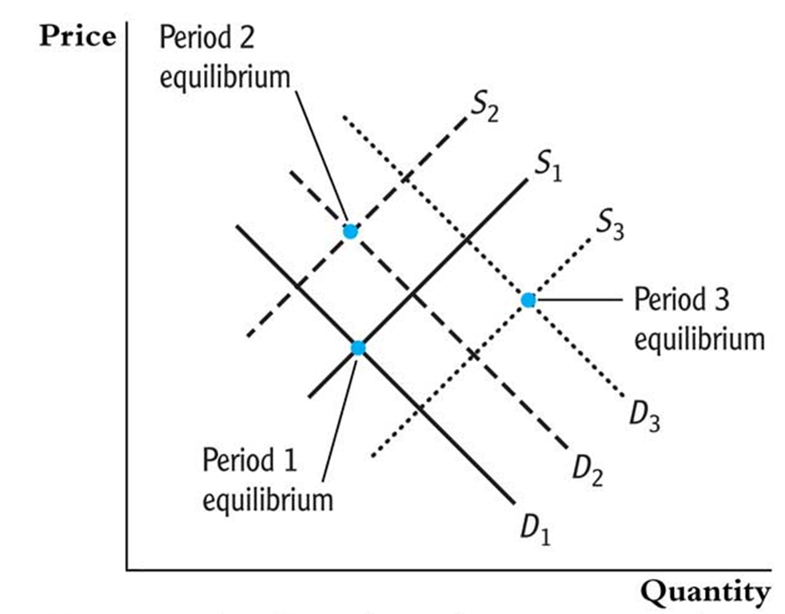
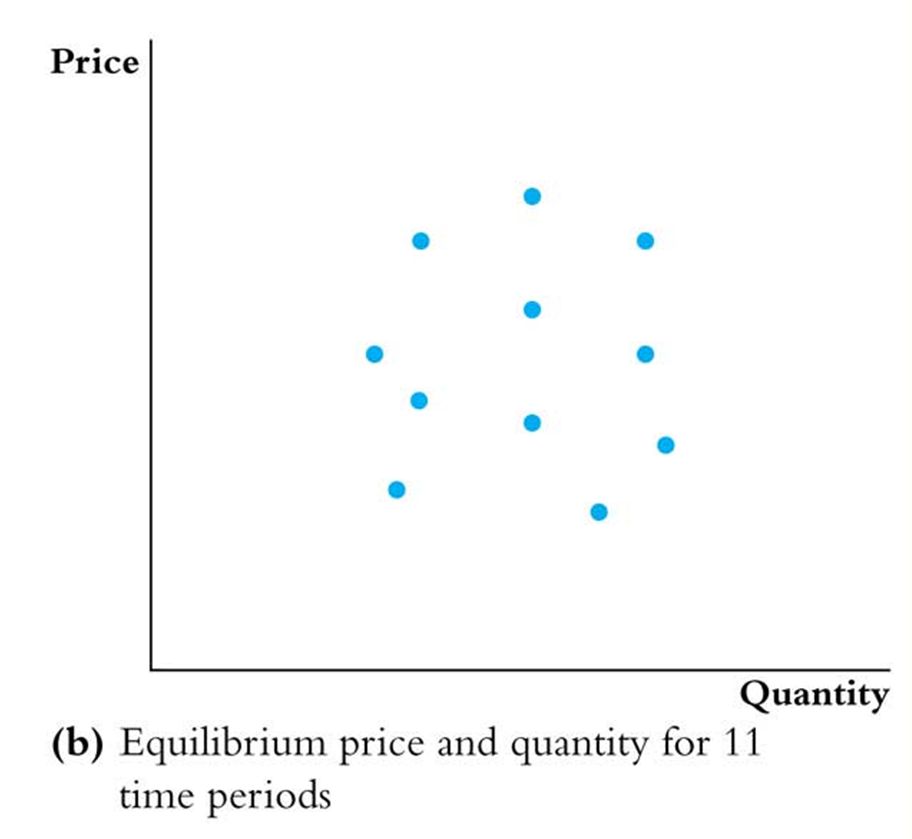
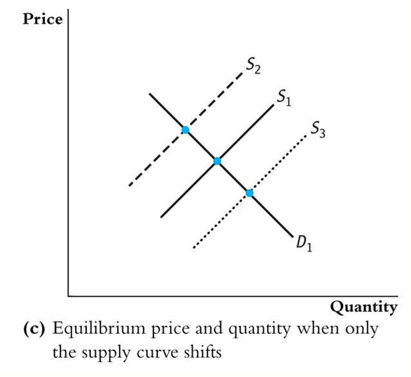
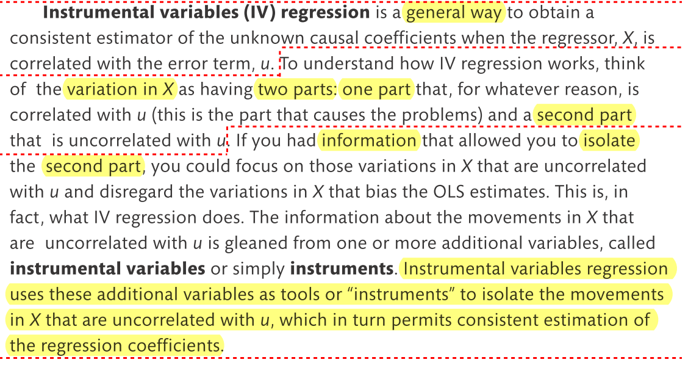

---
output:
  html_document:
    css: !expr c("./assets/style.css")
    includes:
      in_header: !expr c("./assets/header_01.html")
params:
  dat_link_01: "https://ilias.uni-hohenheim.de/goto.php?target=file_1555582_download&client_id=UHOH"
  dat_nam_01: "Cigarettes_data.txt"
editor_options: 
  chunk_output_type: console
---

<!--..........................................................................-->
<!--..........................................................................-->

<!-- Include header -->

````{=html}
```{r, include=TRUE, echo=FALSE, results='asis'}
xfun::file_string('./assets/header_02.html')
```
````

<!--..........................................................................-->
<!--..........................................................................-->

```{r,include=FALSE}

library(knitr)
knitr::opts_chunk$set(
  include=FALSE,
  echo = FALSE,
  warning = FALSE,
  message = FALSE,
  fig.align = 'center')
# See: https://stackoverflow.com/questions/36230790/missing-horizontal-scroll-bar-in-r-markdown-html-code-chunks-and-output
options(width=1000)

```

```{r}

# # 1) clear workspace # exclude to be able to use params in yml header!
# rm(list=ls(all=TRUE))

# 2) load libraries
library(kableExtra)
library(texreg)

# 3) load r-scripts
source("./r-scripts/r_helper_functions.R")
source("./r-scripts/texreg_extract_fun_02.R")

# 4) load data
cig.dat <- read.table(file = "./data-sets/Cigarettes_data.txt",
                      header = TRUE,
                      sep = ",",
                      stringsAsFactors = TRUE)

```

```{r,klippy, echo=FALSE, include=TRUE}

# See: https://rlesur.github.io/klippy/articles/klippy.html
klippy::klippy(tooltip_message = 'Click to copy', tooltip_success = 'Done', position = c('top', 'right'))

```

<!--..........................................................................-->
<!--..........................................................................-->

<hr />

<!--..........................................................................-->
# Exercise Sheet No 10 (Mock Exam Part II) {.tabset .tabset-fade}
<!--..........................................................................-->

<hr />

<p class="head01">
Instrumental Variable Regression
</p>

<hr />

<!--..........................................................................-->
## Set-Up

<span style="text-decoration: none; font-size: 18pt">
1)
</span>
<span style="text-decoration: underline; font-size: 18pt">
Create your (working) directory
</span>

Create a new folder on your computer in which you can save all necessary files, i.e., the data set, the <span class="R">R</span> *script* with the implementation of your analysis and the <span class="R">R</span> *helper function script* with some helper functions provided by us.

This folder, i.e., the path or directory of this folder, will be your so-called working directory.

<hr />

<span style="text-decoration: none; font-size: 18pt">
2)
</span>
<span style="text-decoration: underline; font-size: 18pt">
Download the data set
</span>

<!-- Download the data sets `CASchools_01_data` from <span class="R">ILIAS</span> directly or by using the link below: -->

<!-- <p class="down01"> -->
<!-- <a href="https://ilias.uni-hohenheim.de/goto.php?target=file_1523858_download&client_id=UHOH">Download `CASchools_01_data.txt`</a> -->
<!-- </p> -->

Download the data set ``r params$dat_nam_01`` from <span class="R">ILIAS</span> directly or by using the link below:

<p class="down01">
<a href="`r params$dat_link_01`">Download ``r params$dat_nam_01``</a>
</p>

Save the data set into a (working) directory of your choice.

<hr />

<span style="text-decoration: none; font-size: 18pt">
3)
</span>
<span style="text-decoration: underline; font-size: 18pt">
Prepare *script*
</span>

Open a new <span class="R">R</span> *script* and save it into into your (working) directory.

Run the following code chunk to prepare your <span class="R">R</span> *script*, i.e., to clear the work space and set your working directory.

```{r,include=TRUE,echo=TRUE,eval=FALSE}

# Clear workspace
rm(list = ls(all = TRUE))
# Set working directory
setwd(".../set/your/working/directory/...")

```

<hr />

<div style="display:none">

<span style="text-decoration: none; font-size: 18pt">
X)
</span>
<span style="text-decoration: underline; font-size: 18pt">
Install *libraries*
</span>

Run the following code chunk to make sure that all necessary *libraries* are installed.

*Note*, You have to run this code chunk only once. After running this code chunk you have installed all necessary *libraries* for the class and we will load them whenever we need them.

```{r,include=TRUE,echo=TRUE,eval=TRUE,include=FALSE}

# packages we will use in the course
pac <- c("moments", "sandwich", "lmtest", "AER", "car", "plm", "ivreg", "dynlm", "forecast", "urca")

# install and/or load packages
checkpac <- function(x) {
  if (!require(x, character.only = TRUE)) {
    install.packages(x)
  }
  require(x, character.only = TRUE)
}

# check if packages are install yet
suppressWarnings(sapply(pac, checkpac))

```

<hr />

</div>

<span style="text-decoration: none; font-size: 18pt">
4)
</span>
<span style="text-decoration: underline; font-size: 18pt">
Install/load *packages* and download/save/include *helper function script*
</span>

<span style="text-decoration: underline">Step 1</span>) Install all relevant <span class="R">R</span> *packages* and download and save the <span class="R">R</span> *script* `r_helper_functions.R` from <span class="R">ILIAS</span> by running the following code chunk.

```{r,include=TRUE,echo=TRUE,eval=FALSE}

# Download R-helper functions
source("https://ilias.uni-hohenheim.de/data/UHOH/lm_data/lm_1856939/MA_EconometricMethods_WiSe2324_PracticalClass/r-scripts/prepare_r_packages_and_helper_functions.R")

```

*Note*, the required <span class="R">R</span> *packages* are `"moments"`, `"sandwich"`, `"lmtest"`, `"lmtest"`, `"car"`, `"plm"`, `"ivreg"`, `"dynlm"`, `"forecast"`, `"urca"`.

<div style="margin-top: 5px;">
<span style="text-decoration: underline">Step 2</span>) Include the <span class="R">R</span> *script* `r_helper_functions.R` into your <span class="R">R</span> *script* by running the following code chunk.
</div>

```{r,include=TRUE,echo=TRUE,eval=FALSE}

# Include R-helper functions
source("r_helper_functions.R")

```

*Note*, more information on the helper functions can be found [here](./00_ExerciseSheet_HelperFunctions_XX.html).


<!-- <hr /> -->

<!--..........................................................................-->
## Task {.tabset .tabset-fade}

<hr />

<p class="head01">
Demand for Cigarettes
</p>

<!-- We return to the analysis of the elasticity of the demand for cigarettes from the lecture. For this we use the data set `Cigarettes_01_data.csv`. The data set contains data on cigarette consumption for the 48 continental US states in 1995 with the variables described below. -->

We want to analyze the elasticity of the demand for cigarettes. For this the first Table below shows the estimation results based on the $48$ continental US states in 1995 with observations about the variables described in the second Table below

<!--..........................................................................-->
<button type="button" class="collapsible01"> *Show Variable description* </button>
<div class="content01">

| Variable   | Description                                                  | 
|------------|--------------------------------------------------------------| 
| $packs$    | Number of packs per capita.                                  |
| $rprice$   | Average real price per pack of cigarettes (including tax).   | 
| $SalesTax$ | General sales tax (real).                                    | 
| $rincome$  | State personal income (total, real).                         | 
| $CigTax$   | Special tax on cigarettes and other tobacco products (real). | 

</div>
<!--..........................................................................-->

```{r,include=FALSE}

# Model 1 (IV first stage)
lm.res.01 <- lm(log(rprice) ~ salestax, data = cig.dat)
# Model 2 (IV second stage)
lm.res.02 <- lm(log(packs) ~ lm.res.01$fitted.values, data = cig.dat)
# Model 3 (IV first and second stage)
iv.res.01 <- ivreg(log(packs) ~ log(rprice) | salestax, data = cig.dat )

library("sandwich")
library("lmtest")
# Model 1 (IV first stage)
ct.01 <- coeftest(lm.res.01, vcov=vcovHC(lm.res.01, type="HC1"))
se.01 <- ct.01[, 2]
pval.01 <- ct.01[, 4]
# Model 2 (IV second stage)
ct.02 <- coeftest(lm.res.02, vcov=vcovHC(lm.res.02, type="HC1"))
se.02 <- ct.02[, 2]
pval.02 <- ct.02[, 4]
# Model 3 (IV first and second stage)
ct.03 <- coeftest(iv.res.01, vcov=vcovHC(iv.res.01, type="HC1"))
se.03 <- ct.03[, 2]
pval.03 <- ct.03[, 4]


# Model 5 (IV first stage, general)
lm.res.05 <- lm(log(rprice) ~ salestax + log(rincome) + cigtax, data = cig.dat)
ct.05 <- coeftest(lm.res.05, vcov=vcovHC(lm.res.05, type="HC1"))
se.05 <- ct.05[, 2]
pval.05 <- ct.05[, 4]

# Model 6 (IV second stage, simple)
lm.res.06 <- lm(log(packs) ~ lm.res.05$fitted.values + log(rincome), data = cig.dat)
ct.06 <- coeftest(lm.res.06, vcov=vcovHC(lm.res.06, type="HC1"))
se.06 <- ct.06[, 2]
pval.06 <- ct.06[, 4]

ct.06

# test
lin.hyp.02 <- linearHypothesis(lm.res.05, c("salestax", "cigtax"), white.adjust = "hc1")
lin.hyp.02

# ordinary OLS
lm.res.00 <- lm(log(packs) ~ log(rprice), data = cig.dat)
ct.00 <- coeftest(lm.res.00, vcov=vcovHC(lm.res.00, type="HC1"))
se.00 <- ct.00[, 2]
pval.00 <- ct.00[, 4]

```

<!--..........................................................................-->
<button type="button" class="collapsible01"> *Show Estimation Results* </button>
<div class="content01">

```{r,include=TRUE}
screenreg(list(lm.res.00, lm.res.05, lm.res.06),
          override.se = list(se.00, se.05, se.06),
          override.pvalues = list(pval.00, pval.05, pval.06),
          caption = "Estimation Results",
          caption.above = TRUE,
          label = "Tab02",
          stars = numeric(0),
          custom.model.names = c("log(packs)", "log(price)", "log(packs)"),
          custom.coef.names = c("Intercept","log(rprice)","SalesTax","log(rincome)","CigTax","X_2"),
          float.pos = "h",
          single.row = TRUE,
          booktabs = TRUE,
          dcolumn = TRUE,
          use.packages = FALSE,
          ci.force = FALSE,
          digits = 3,
          include.rsquared = TRUE,
          include.adjrs = TRUE,
          include.rmse = TRUE,
          include.nobs = FALSE)
```

</div>
<!--..........................................................................-->

<!-- [^1]: Use the data set `Cigarettes_data.txt` for the replication of the results below. -->

<!-- <span style="float:right; font-style:italic"> -->
<!-- Note, Use the data set `Cigarettes_data.txt` for the replication of the results below. -->
<!-- </span> -->

<!-- <br> -->


<!--..........................................................................-->
<hr />

<!--..........................................................................-->
### Task a)

<!-- Discuss the strategy of regressing $packs$ on $rprice$ to identify the elasticity of the demand for cigarettes w.r.t. the price of cigarettes. What is problematic about this strategy? -->

Discuss the strategy of regressing $packs$ on $rprice$ using OLS in Table 1 of the Exercise Sheet to identify the elasticity of the demand for cigarettes w.r.t. the price of cigarettes.

What is problematic about this strategy? 

<hr>

<p class="head02">
Simple OLS Estimation
</p>

<!--..........................................................................-->
<button type="button" class="collapsible01"> *Show Code* </button>
<div class="content01">
```{r,include=TRUE,echo=TRUE,results=TRUE,fig.show='hide'}
# Simple OLS
lm.res.01 <- lm_ct_fun(log(packs) ~ log(rprice), data = cig.dat, hc.type = "HC1")
lm.res.01$ct
```
</div>
<!--..........................................................................-->

<!--..........................................................................-->
<button type="button" class="collapsible01"> *Show Regression results* </button>
<div class="content01">

```{r, include=FALSE}

ct.01 <- coeftest(lm.res.01, vcov=vcovHC(lm.res.01, type="HC1"))
se.01 <- ct.01[, 2]
pval.01 <- ct.01[, 4]

```

```{r,include=TRUE}

screenreg(list(lm.res.01),
          override.se = list(se.01),
          override.pvalues = list(pval.01),
          caption = "OLS",
          caption.above = TRUE,
          label = "Tab01",
          #stars = numeric(0),
          custom.model.names = c("log rprice"),
          custom.coef.names = c("intercept","SalesTax"),
          float.pos = "h",
          single.row = TRUE,
          booktabs = TRUE,
          dcolumn = TRUE,
          use.packages = FALSE,
          ci.force = FALSE,
          digits = 3,
          include.rsquared = TRUE,
          include.adjrs = TRUE,
          include.rmse = TRUE,
          include.nobs = TRUE)

```

</div>
<!--..........................................................................-->

<!--..........................................................................-->
<button type="button" class="collapsible02"> *Interpretation: Discussion* </button>
<div class="content01">

<!-- *Add your interpretation here!* -->

<!--
<p class="head02">
Least Squares Assumption for causal inference
</p>

1. The conditional distribution of $u$ given $X=x$ has mean zero, i.e., $\mathrm{E}\left(u|X=x\right)=0$
    + Problem: Omitted variables, e.g., quality of schooling
    + $\Rightarrow$ See next chapter!
2. $\left(X_{i},Y_{i}\right)$ for $i=1,...,n$ are i.i.d.
3. Large outliers in $X$ and/or $Y$ are rare.
-->

<div style="color: red" class="showSol01">

<p class="head02">
Supply and demand
</p>

* Price $rprice$ and quantity $packs$ are determined by the interaction of demand and supply of cigarettes
* $\Rightarrow$ Thus, regressing $packs$ on $price$ results in simultaneous causality bias!

<p class="head02">
Problem
</p>

* $\mathrm{E}\left(u|X=x\right) \neq 0$
* $\Rightarrow$ $X$ is correlated with the error term $u$.

</div>

<div style="color: red" class="noSol01">

*Add your Interpretation here!*

</div>

</div>
<!--..........................................................................-->

<!--..........................................................................-->
<button type="button" class="collapsible02"> *Remember* </button>
<div class="content01">

<p class="head02">
Simultaneous causality bias
</p>

<p style="margin-left:30px;">
*Simultaneous causality bias* in the OLS regression of $ln\left(Q^{cig}\right)$ on $ln\left(P^{cig}\right)$ arises because price and quantity are determined by the interaction of *demand* and *supply*.
</p>

<!--

-->



<p class="sou01">
Source: Stock and Watson (2020) on p. 433
</p>

<br>

<hr>

<p class="head02">
Interaction of demand and supply produces...
</p>

<p style="margin-left:30px;">
Would a *regression* using these data produce the *demand curve*?
</p>



<p class="sou01">
Source: Stock and Watson (2020) on p. 433
</p>

<br>

<hr>

<p class="head02">
Idea
</p>

<p style="margin-left:30px;">
What would we get if only *supply* shifted?
</p>



<p class="sou01">
Source: Stock and Watson (2020) on p. 433
</p>

<br>

<hr>

<p class="head02">
Solution
</p>

<p style="margin-left:30px;">
Use an *instrumental variable* \(Z\) that only shifts *supply* but not *demand*!
</p>

</div>
<!--..........................................................................-->


<!--..........................................................................-->
<!-- <hr /> -->

<!--..........................................................................-->
### Task b) 

<!-- Discuss the motivation of using instrumental variable regression in general and in this application in particular. State the conditions for an instrumental variable to be valid. Is the variable $SalesTax$ a valid instrument to identify the elasticity of the demand for cigarettes w.r.t. the price of cigarettes? -->

Briefly explain the concept of instrumental variable regression and how it can be used to overcome the problem of endogenous regressors in general. 

<!--..........................................................................-->
<button type="button" class="collapsible02"> *Interpretation: Concept* </button>
<div class="content01">

<div style="color: red" class="showSol01">

<p class="head02">
General
</p>

\begin{align}
Y_i = \beta_0 + \beta_1 X_i + u_i
\end{align}

* Break variation of $X$ into two parts:
  - <u>Part I</u>: Correlated with $u$.
  - <u>Part II</u>: Uncorrelated with $u$.
* Identify part II using an instrument $Z$.

<!-- * Identify part II using an instrument $Z$. -->

<p class="head02">
Application
</p>

<!-- *Add your interpretation here!* -->

\begin{align}
ln\left(Q^{D}\right) = \beta_0 + \beta_1 ln\left(P\right) + u^{ln\left(Q^D\right)}
\end{align}

* Break variation of $ln\left(P\right)$ into two parts:
  - <u>Part I</u>: Correlated with $u^{ln\left(Q^D\right)}$.
  - <u>Part II</u>: Uncorrelated with $u^{ln\left(Q^D\right)}$.
* Use $SalesTax$ for the identification of part II.

</div>

<div style="color: red" class="noSol01">

*Add your Interpretation here!*

</div>

<!--..........................................................................-->
<button type="button" class="collapsible02"> *Stock and Watson (2020)* </button>
<div class="content01">



<p class="sou01">
Source: Stock and Watson (2020) on p. 433
</p>

<p>&nbsp;</p> 

</div>
<!--..........................................................................-->

</div>
<!--..........................................................................-->


<!--..........................................................................-->
<!-- <hr /> -->

<!--..........................................................................-->
### Task c) 

<!-- Use two stage least squares and the variable $SalesTax$ as an instrument to estimate the elasticity of the demand for cigarettes w.r.t. the price of cigarettes? Estimate the first and second stage regression. Discuss the results. -->

State the conditions for variables to be valid instruments in general. Briefly discuss if the variables $SalesTax$ and $CigTax$ fulfills the conditions in the case of analyzing the elasticity of the demand for cigarettes w.r.t. the price of cigarettes.

<hr>

<p class="head02">
Conditions
</p>

<!--..........................................................................-->
<button type="button" class="collapsible02"> *Interpretation: Valid Instrument* </button>
<div class="content01">

<div style="color: red" class="showSol01">

<p class="head02">
General
</p>

1) <u>Instrument relevance</u>: $\mathrm{Cor}\left(Z_i,X_i\right) \neq 0$
2) <u>Instrument exogeneity</u>: $\mathrm{Cor}\left(Z_i,u_i\right) = 0$

<p class="head02">
Application
</p>

<!-- *Add your interpretation here!* -->

<!-- See: S&W, 2020, 445 -->

1) <u>Instrument relevance</u>: $SalesTax$ and $CigTax$ is included in $rprice$ and thus relevant.
2) <u>Instrument exogeneity</u>:
    - Both have arguably no direct effect on the demand of cigarettes.
    - Both have arguably only an indirect effect on the demand of cigarettes through the price of cigarettes.
    - The choice for the level of the $SalesTax$ and $CigTax$ is driven by political considerations, not by factors related to the demand for cigarettes.
    - <u>Note</u>: If the tax would be specific on cigarettes and interpreted as a signal that smoking is bad, this condition is no longer valid.

```{r,include=FALSE,echo=TRUE}
# Correlation rprice and salestax
cor(cig.dat$rprice, cig.dat$salestax)
# Correlation rprice and cigtax
cor(cig.dat$rprice, cig.dat$cigtax)
```

<p class="head02">
Remember
</p>

In the supply and demand illustration above, an increase in $SalesTax$ and or $CigTax$ ...

<!-- * ... (1) shifts the supply curve up ($\Rightarrow$ instrument relevance)... -->
<!-- * ... (2) but has no effect on the demand curve ($\Rightarrow$ instrument exogeneity). -->

<!-- <p style="margin-left:30px;"> -->
<!-- ... (1) shifts the supply curve up ($\Rightarrow$ instrument relevance)... -->
<!-- ... (2) but has no effect on the demand curve ($\Rightarrow$ instrument exogeneity). -->
<!-- </p> -->

<span style="margin-left:30px;">
... (1) shifts the supply curve up ($\Rightarrow$ instrument relevance)...
</span>

<span style="margin-left:30px;">
... (2) but has no effect on the demand curve ($\Rightarrow$ instrument exogeneity).
</span>

<!-- tax as increase in marginal costs see Pigouvian tax in the case of negative externalities -->

</div>

<div style="color: red" class="noSol01">

*Add your Interpretation here!*

</div>

</div>
<!--..........................................................................-->


<!--..........................................................................-->
<!-- <hr /> -->

<!--..........................................................................-->
### Task d) 

<!-- Adjust the procedure in d) to receive valid standard errors. -->

Outline the strategy of Two-Stage Least Squares (2SLS) to analyze the the elasticity of the demand for cigarettes using the variables $SalesTax$ and $CigTax$ as instruments based on the results depicted in Table 1 of the Exercise Sheet. For this state the estimated first and second stage regression. What represents the variable denoted $X_2$ in the second stage regression in Table 1 of the Exercise Sheet? What is the estimated elasticity of the demand for cigarettes?

<hr>

<p class="head02">
First Stage Estimation
</p>

<!--..........................................................................-->
<button type="button" class="collapsible01"> *Show Code* </button>
<div class="content01">
```{r,include=TRUE,echo=TRUE,results=TRUE,fig.show='hide'}
# 1st stage regression
lm.res.02 <- lm_ct_fun(log(rprice) ~ salestax + log(rincome) + cigtax, data = cig.dat, hc.type = "HC1")
lm.res.02$ct
```
</div>
<!--..........................................................................-->

<!--..........................................................................-->
<button type="button" class="collapsible01"> *Show Regression results* </button>
<div class="content01">

```{r, include=FALSE}

ct.02 <- coeftest(lm.res.02, vcov=vcovHC(lm.res.02, type="HC1"))
se.02 <- ct.02[, 2]
pval.02 <- ct.02[, 4]

```

```{r,include=TRUE}

screenreg(list(lm.res.02),
          override.se = list(se.02),
          override.pvalues = list(pval.02),
          caption = "First Stage",
          caption.above = TRUE,
          label = "Tab01",
          #stars = numeric(0),
          custom.model.names = c("log rprice"),
          custom.coef.names = c("intercept","SalesTax","log(rincome)","cigtax"),
          float.pos = "h",
          single.row = TRUE,
          booktabs = TRUE,
          dcolumn = TRUE,
          use.packages = FALSE,
          ci.force = FALSE,
          digits = 3,
          include.rsquared = TRUE,
          include.adjrs = TRUE,
          include.rmse = TRUE,
          include.nobs = TRUE)

```

</div>
<!--..........................................................................-->

<!--..........................................................................-->

<!-- <button type="button" class="collapsible02"> *Interpretation: First Stage* </button> -->
<!-- <div class="content01"> -->

<!-- <div class="showSol01"> -->

<!-- *Add your interpretation here!* -->

<!-- * $\Rightarrow$ $SalesTax$ is not a weak instrument. -->

<!-- * ... -->

<!-- </div> -->

<!-- <div class="noSol01"> -->

<!-- *Add your Interpretation here!* -->

<!-- </div> -->

<!-- </div> -->

<!--..........................................................................-->

<p class="head02">
Second Stage Estimation
</p>

<!--..........................................................................-->
<button type="button" class="collapsible01"> *Show Code* </button>
<div class="content01">
```{r,include=TRUE,echo=TRUE,results=TRUE,fig.show='hide'}
# 2nd stage regression
lm.res.03 <- lm_ct_fun(log(packs) ~ lm.res.02$fitted.values + log(rincome), data = cig.dat, hc.type = "HC1")
lm.res.03$ct
```
</div>
<!--..........................................................................-->

<!--..........................................................................-->
<button type="button" class="collapsible01"> *Show Regression results* </button>
<div class="content01">

```{r, include=FALSE}

ct.03 <- coeftest(lm.res.03, vcov=vcovHC(lm.res.03, type="HC1"))
se.03 <- ct.03[, 2]
pval.03 <- ct.03[, 4]

```

```{r,include=TRUE}

screenreg(list(lm.res.03),
          override.se = list(se.03),
          override.pvalues = list(pval.03),
          caption = "Second Stage",
          caption.above = TRUE,
          label = "Tab01",
          #stars = numeric(0),
          custom.model.names = c("log packs"),
          custom.coef.names = c("intercept","X_2","log(rincome)"),
          float.pos = "h",
          single.row = TRUE,
          booktabs = TRUE,
          dcolumn = TRUE,
          use.packages = FALSE,
          ci.force = FALSE,
          digits = 3,
          include.rsquared = TRUE,
          include.adjrs = TRUE,
          include.rmse = TRUE,
          include.nobs = TRUE)

```

</div>
<!--..........................................................................-->

<!--..........................................................................-->

<!-- <button type="button" class="collapsible02"> *Interpretation: Second Stage* </button> -->
<!-- <div class="content01"> -->

<!-- <div class="showSol01"> -->

<!-- *Add your interpretation here!* -->

<!-- * Coefficients are the TSLS estimates -->
<!-- * Standard errors are wrong because first stage was estimated! -->

<!-- * ... -->

<!-- </div> -->

<!-- <div class="noSol01"> -->

<!-- *Add your Interpretation here!* -->

<!-- </div> -->

<!-- </div> -->

<!--..........................................................................-->

<!-- ### CHECK THIS! -->

<p class="head02">
2-Sage-Least-Squares
</p>

<!--..........................................................................-->
<button type="button" class="collapsible01"> *Show Code* </button>
<div class="content01">
```{r,include=TRUE,echo=TRUE,results=TRUE,fig.show='hide'}
# IV: first and second stage
iv.res.01 <- ivreg_ct_fun(log(packs) ~ log(rprice) + log(rincome)| salestax + cigtax + log(rincome), data = cig.dat, hc.type = "HC1")
iv.res.01$ct
```
</div>
<!--..........................................................................-->

<!--..........................................................................-->
<!-- <button type="button" class="collapsible01"> *Show Code* </button> -->
<!-- <div class="content01"> -->

```{r,include=FALSE,echo=TRUE,results=TRUE,fig.show='hide'}
# Model 3 (IV first and second stage) 
iv.res.01 <- ivreg(log(packs) ~ log(rprice) | salestax, data = cig.dat )
ct.03 <- coeftest(iv.res.01, vcov=vcovHC(iv.res.01, type="HC1"))
ct.03
```

<!-- </div> -->
<!--..........................................................................-->

```{r,include=FALSE,eval=FALSE}
# 2 steps
vcovHC(lm.res.02, type="const")
vcovHC(lm.res.02, type="HC1")

# ivreg
vcovHC(iv.res.01, type="const")
vcovHC(iv.res.01, type="HC1")
class(iv.res.01)

# > sandwich::vcovHC.default
sandwich_vcovHC_default_edit_01 <- function (x, type = c("HC3", "const", "HC", "HC0", "HC1", "HC2", "HC4", "HC4m", "HC5"), omega = NULL, sandwich = TRUE, ...) {
    type <- match.arg(type)
    rval <- meatHC(x, type = type, omega = omega)
    if (sandwich) 
        rval <- sandwich(x, meat. = rval, ...)
    return(rval)
}
# <bytecode: 0x00000232e5fe1f10>
# <environment: namespace:sandwich>

# <bytecode: 0x00000232e5fe1f10>
# <environment: namespace:sandwich>
# > sandwich::meatHC
sandwich_meatHC_edit_01 <- function (x, type = c("HC3", "const", "HC", "HC0", "HC1", "HC2", "HC4", "HC4m", "HC5"), omega = NULL, ...) {
    if (is.list(x) && !is.null(x$na.action)) {
      class(x$na.action) <- "omit"
    }
    X <- model.matrix(x)
    if (any(alias <- is.na(coef(x)))) {
      X <- X[, !alias, drop = FALSE]
    }
    attr(X, "assign") <- NULL
    n <- NROW(X)
    diaghat <- try(hatvalues(x), silent = TRUE)
    df <- n - NCOL(X)
    ef <- estfun(x, ...)
    res <- rowMeans(ef/X, na.rm = TRUE)
    res[apply(abs(ef) < .Machine$double.eps, 1L, all)] <- 0
    if (is.null(omega)) {
        type <- match.arg(type)
        if (type == "HC") {
          type <- "HC0"
        }
        switch(type,
               const = {omega <- function(residuals, diaghat, df) rep(1, length(residuals)) * sum(residuals^2)/df},
               HC0 = {omega <- function(residuals, diaghat, df) residuals^2},
               HC1 = {omega <- function(residuals, diaghat, df) residuals^2 * length(residuals)/df},
               HC2 = {omega <- function(residuals, diaghat, df) residuals^2/(1 - diaghat)}, 
               HC3 = {omega <- function(residuals, diaghat, df) residuals^2/(1 - diaghat)^2}, 
               HC4 = {omega <- function(residuals, diaghat, df) {
                 n <- length(residuals)
                 p <- as.integer(round(sum(diaghat), digits = 0))
                 delta <- pmin(4, n * diaghat/p)
                 residuals^2/(1 - diaghat)^delta
              }},
              HC4m = {omega <- function(residuals, diaghat, df) {
                gamma <- c(1, 1.5)
                n <- length(residuals)
                p <- as.integer(round(sum(diaghat), digits = 0))
                delta <- pmin(gamma[1], n * diaghat/p) + pmin(gamma[2], n * diaghat/p)
                residuals^2/(1 - diaghat)^delta
              }}, 
              HC5 = {omega <- function(residuals, diaghat, df) {
                k <- 0.7
                n <- length(residuals)
                p <- as.integer(round(sum(diaghat), digits = 0))
                delta <- pmin(n * diaghat/p, pmax(4, n * k * max(diaghat)/p))residuals^2/sqrt((1 - diaghat)^delta)
            }})
    }
    if (is.function(omega)) {
      omega <- omega(res, diaghat, df)
    }
    rval <- sqrt(omega) * X
    rval <- crossprod(rval)/n
    return(rval)
}
# <bytecode: 0x00000232e5fe5118>
# <environment: namespace:sandwich>

# check also:
# https://cran.r-project.org/web/packages/ivreg/index.html

```

<!--..........................................................................-->
<button type="button" class="collapsible01"> *Show Regression results* </button>
<div class="content01">

```{r,include=TRUE}
screenreg(list(lm.res.01,lm.res.02,lm.res.03),
          override.se = list(se.01,se.02,se.03),
          override.pvalues = list(pval.01,pval.02,pval.03),
          caption = "Estimation results (Overview)",
          caption.above = TRUE,
          label = "Tab01",
          #stars = numeric(0),
          custom.model.names = c("log(packs)", "log(price)", "log(packs)"),
          custom.coef.names = c("Intercept","log(rprice)","SalesTax","log(rincome)","CigTax","X_2"),
          float.pos = "h",
          single.row = TRUE,
          booktabs = TRUE,
          dcolumn = TRUE,
          use.packages = FALSE,
          ci.force = FALSE,
          digits = 3,
          include.rsquared = TRUE,
          include.adjrs = TRUE,
          include.rmse = TRUE,
          include.nobs = TRUE)
```

</div>
<!--..........................................................................-->

<!--..........................................................................-->
<button type="button" class="collapsible02"> *Interpretation* </button>
<div class="content01">

<div style="color: red" class="showSol01">

<!-- *Add your interpretation here!* -->

<!-- * Coefficients of the second stage regression (third column) and the IV regression (fourth column) are the the same. -->
<!-- * Standard errors of the IV regression (fourth column) are correct! -->

<p class="head03">
1st Stage Regression
</p>

\begin{align*}
\small log\left(rprice_i\right) = \beta_0 + \beta_{SalesTax} SalesTax_i + \beta_{CigTax} CigTax_i + \beta_{rincome} log\left(rincome_i\right) + u_i^{log\left(rprice_i\right)}
\end{align*}

<p class="head03">
2nd Stage Regression
</p>

\begin{align*}
\small log\left(packs_i\right) = \beta_0 + \beta_{rincome} log\left(rincome_i\right) + \beta_{X_2} X_{2i} + u_i
\end{align*}

<!-- with $X_{2i} \equiv \widehat{u}_i^{log\left(rprice_i\right)}$, i.e., $X_2$ represents the residuals of the first stage regression. -->

<p style="margin-left:30px;">
with $X_{2i} \equiv \widehat{log\left(rprice\right)}_i$, i.e., $X_2$ represents the fitted values of the first stage regression.
</p>

<p class="head03">
Results
</p>

* The estimated elasticity of the demand for cigarettes is $-1.28$
* I.e., a $1 \%$ price increase in cigarettes decreases demand for cigarettes by $1.28 \%$.  

<!-- <p class="head03"> -->
<!-- Role of $log\left(rincome_i\right)$ -->
<!-- </p> -->

<span style="font-size: 16pt; text-decoration: underline;"> Role of</span>: $log\left(rincome_i\right)$

* Income is an obvious determinant of demand in general.
* Thus, income is a demand shifter and not a valid instrument for the identification of the demand curve.
* However, income is a useful control variable for both the 1st and 2nd stage regression to counter potential omitted variable bias.


</div>

<div style="color: red" class="noSol01">

*Add your Interpretation here!*

</div>

</div>
<!--..........................................................................-->


<!--..........................................................................-->
<!-- <hr /> -->

<!--..........................................................................-->
### Task e) 

Briefly discuss the validity of the variables $SalesTax$ and $CigTax$ as instruments based on the test results depicted in Table 2 of the Exercise Sheet which is based on the first stage regression depicted in Table 1 of the Exercise Sheet.

<hr>

<p class="head02">
Validity of Instrument
</p>

<!--..........................................................................-->
<button type="button" class="collapsible01"> *Show Code* </button>
<div class="content01">
```{r,include=TRUE,echo=TRUE,results=FALSE}
# heteroskedasticity-robust F-test
lin.hyp.01 <- linearHypothesis(lm.res.02, c("salestax", "cigtax"), white.adjust = "hc1")
lin.hyp.01
```
</div>
<!--..........................................................................-->
<button type="button" class="collapsible01"> *Show Output* </button>
<div class="content01">
```{r,include=TRUE,echo=TRUE,results=TRUE}
# heteroskedasticity-robust F-test
lin.hyp.01 <- linearHypothesis(lm.res.02, c("salestax", "cigtax"), white.adjust = "hc1")
lin.hyp.01
```
</div>
<!--..........................................................................-->

<!--..........................................................................-->
<button type="button" class="collapsible02"> *Interpretation* </button>
<div class="content01">

<div style="color: red" class="showSol01">

<p class="head03">
Validity requires
</p>

* Instrument exogeneity
* Instrument relevance

<!-- We cannot explicitly check for exogeneity but we could check relvance using a *F*-test. -->

<span style="margin-left:30px;">
We cannot explicitly check for exogeneity but we could check relvance using a *F*-test.
</span>

<hr>

<p class="head03">
*F*-test (general)
</p>

* One way to check for *instrument relevance* is to check the *F*-statistic of the hypothesis that the coefficients of the instruments in the 1st stage regression are all zero.
* Rule of thumb: $F>10$ for the instruments to be valid.
* This is the same rule based on the *t*-statistic when there is only one instrument, as $t^2=F$.

<hr>

<p class="head03">
*F*-test (paticular)
</p>

<u>Hypothesis</u>:

\begin{align}
H_0&: \quad \beta_{SalesTax} = \beta_{CigTax} = 0 \quad \text{vs.} \\
H_1&: \quad \text{at least one} \neq 0
\end{align}

<span style="margin-left:30px;">
based on 1st stage regression
</span>

<u>Test statistic value</u>:

\begin{align}
F^{act}\left( `r lin.hyp.01$Df[2]`, `r lin.hyp.01$Res.Df[2]` \right) &= `r round(lin.hyp.01$F[2],3)`
\end{align}

<u>Conclusion</u>:

\begin{align}
F^{act}\left( `r lin.hyp.01$Df[2]`, `r lin.hyp.01$Res.Df[2]` \right) > 10
\end{align}

$\Rightarrow$ Together the variables $SalesTax$ and $CigTax$ are not weak!

</div>

<div style="color: red" class="noSol01">

*Add your Interpretation here!*

</div>

</div>
<!--..........................................................................-->

<!-- <p class="head01"> -->
<!-- Note -->
<!-- </p> -->

<!-- * Check also the asymptotic critical value of the test statistic, i,e, $F\left(2,\infty\right)$, for $\alpha =5\%$. -->
<!-- * Use Table 4 in Stock and Watson (2020) on p. 767. (see below) -->

<!-- <hr /> -->

<p class="head02">
Critical value for the $\underline{F\left(m,\infty\right)}$
</p>

<!--..........................................................................-->
<button type="button" class="collapsible02"> *Table of Stock and Watson (2020)* </button>
<div class="col_content">


<p class="sou01">
Source: Stock and Watson (2020) on p. 767
</p>

<br>

</div>
<!--..........................................................................-->


```{r,include=FALSE,eval=FALSE}

# > ivreg
ivreg_edit_01 <- function (formula, instruments, data, subset, na.action, weights, offset, contrasts = NULL, model = TRUE, y = TRUE, x = FALSE, method = c("OLS", "M", "MM"), ...) {
  
  instruments <- as.formula("~ salestax")
  data <- cig.dat
  attach(data)
  formula <- as.formula("log(packs) ~ log(rprice)")
  
  contrasts <- NULL
  model <- TRUE
  y <- TRUE
  x <- FALSE
  method <- c("OLS", "M", "MM")
  
  
  
  
  
  method <- match.arg(method, c("OLS", "M", "MM"))
  cl <- match.call()
  if (missing(data)) {
    data <- environment(formula)
  }
  mf <- match.call(expand.dots = FALSE)
  m <- match(c("formula", "data", "subset", "na.action", "weights", "offset"), names(mf), 0)
  mf <- mf[c(1, m)]
  mf$drop.unused.levels <- TRUE
  if (!missing(instruments)) {
      formula <- Formula::as.Formula(formula, instruments)
      cl$instruments <- NULL
      cl$formula <- formula(formula)
  } else {
    formula <- Formula::as.Formula(formula)
  }
  if (length(formula)[2L] == 3L) {
    formula <- Formula::as.Formula(formula(formula, rhs = c(2L, 1L), collapse = TRUE), formula(formula, lhs = 0L, rhs = c(3L, 1L), collapse = TRUE))
  }
  stopifnot(length(formula)[1L] == 1L, length(formula)[2L] %in% 1L:2L)
  has_dot <- function(formula) inherits(try(terms(formula), silent = TRUE), "try-error")
  if (has_dot(formula)) {
    f1 <- formula(formula, rhs = 1L)
    f2 <- formula(formula, lhs = 0L, rhs = 2L)
    if (!has_dot(f1) & has_dot(f2)) {
      formula <- Formula::as.Formula(f1, update(formula(formula, lhs = 0L, rhs = 1L), f2))
    }
  }
  mf$formula <- formula
  mf[[1]] <- as.name("model.frame")
  mf <- eval(mf, parent.frame())
  Y <- model.response(mf, "numeric")
  mt <- terms(formula, data = data)
  mtX <- terms(formula, data = data, rhs = 1)
  X <- model.matrix(mtX, mf, contrasts)
  if (length(formula)[2] < 2L) {
      mtZ <- NULL
      Z <- NULL
  } else {
      mtZ <- delete.response(terms(formula, data = data, rhs = 2))
      Z <- model.matrix(mtZ, mf, contrasts)
  }
  weights <- model.weights(mf)
  offset <- model.offset(mf)
  if (is.null(offset)) {
    offset <- 0
  }
  if (length(offset) == 1) {
    offset <- rep(offset, NROW(Y))
  }
  offset <- as.vector(offset)
  # rval <- ivreg.fit(X, Y, Z, weights, offset, method, ...)
  rval <- ivreg.fit(X, Y, Z, weights, offset, method)
  
  rval$call <- cl
  rval$formula <- formula(formula)
  rval$terms <- list(regressors = mtX, instruments = mtZ, full = mt)
  rval$na.action <- attr(mf, "na.action")
  rval$levels <- .getXlevels(mt, mf)
  rval$contrasts <- list(regressors = attr(X, "contrasts"), instruments = attr(Z, "contrasts"))
  if (model) {
    rval$model <- mf
  }
  if (y) {
    rval$y <- Y
  }
  if (x) {
    rval$x <- list(regressors = X, instruments = Z, projected = rval$x)
  } else {
    rval$x <- NULL
  }
  
  class(rval) <- if (rval$method == "OLS") { "ivreg" } else c("rivreg", "ivreg")
    
  return(rval)
    
}
# <bytecode: 0x000002033b974af0>
# <environment: namespace:ivreg>

# Model 3 (IV first and second stage) 

# xxx <- ivreg_edit_01(log(packs) ~ log(rprice) | salestax, data = cig.dat)
# xxx

xxx <- ivreg(log(packs) ~ log(rprice) | salestax, data = cig.dat)
xxx

```

<!-- ADD DISCUSSION OF ROLE OF INCOME AS SUPPLY/DEMAND SHIFTER -->

```{r, eval=FALSE}

# ivreg.fit
ivreg_fit_edit <- function (x, y, z, weights, offset, method = c("OLS", "M", "MM"), rlm.args = list(), ...) {
  
  
  
    method <- match.arg(method, c("OLS", "M", "MM"))
    n <- NROW(y)
    p <- ncol(x)
    if (missing(z)) {
      z <- NULL
    }
    if (missing(weights)) {
      weights <- NULL
    }
    if (missing(offset)) {
      offset <- rep(0, n)
    }
    stopifnot(n == nrow(x))
    if (!is.null(z)) {
      stopifnot(n == nrow(z))
    }
    if (!is.null(weights)) {
      stopifnot(n == NROW(weights))
    }
    stopifnot(n == NROW(offset))
    if (!is.null(z)) {
        if (ncol(z) < ncol(x)) {
          warning("more regressors than instruments")
        }
        auxreg <- if (is.null(weights)) { lm.fit(z, x, ...) } else { lm.wfit(z, x, weights, ...) }
        xz <- as.matrix(auxreg$fitted.values)
        colnames(xz) <- colnames(x)
    } else {
        auxreg <- NULL
        xz <- x
    }
    if (method == "OLS") {
        hats <- if (!is.null(auxreg)) { cbind(lm.influence(auxreg, do.coef = FALSE)$hat,0) } else { cbind(NA, matrix(0, nrow = n, ncol = 1)) }
    }
    exog <- structure(seq_along(colnames(x)), .Names = colnames(x))
    if (!is.null(auxreg)) {
        endo <- which(colMeans(as.matrix(auxreg$residuals^2)) > sqrt(.Machine$double.eps))
        inst <- rowMeans(as.matrix(coef(auxreg)^2)[, -endo, drop = FALSE])
        inst <- which(inst < sqrt(.Machine$double.eps) | is.nan(inst))
        endo <- exog[endo]
        exog <- exog[-endo]
    } else {
      endo <- inst <- integer()
    }
    if (method != "OLS" && length(endo) > 0) {
        rlm.args$x <- z
        rlm.args$method <- method
        if (!is.null(weights)) {
          rlm.args$weights <- weights
        }
        residuals <- matrix(0, n, p)
        hats <- rwts <- matrix(0, n, length(endo) + 1)
        coef <- coef(auxreg)
        j <- 0
        for (en in endo) {
            j <- j + 1
            rlm.args$y <- x[, en]
            xz[, en] <- fitted(st1 <- do.call(rlm, rlm.args))
            residuals[, en] <- residuals(st1)
            coef[, en] <- coef(st1)
            rwts[, j] <- st1$w
            hats[, j] <- hatvalues(st1)
        }
        auxreg$residuals <- residuals
        auxreg$coefficients <- coef
    }
    fit <- if (method == "OLS") {
        if (is.null(weights)) { lm.fit(xz, y, offset = offset, ...) } else { lm.wfit(xz, y, weights, offset = offset, ...) }
    } else {
        rlm.args$y <- y - offset
        rlm.args$x <- xz
        do.call(rlm, rlm.args)
    }
    if (method != "OLS") {
        rwts[, ncol(rwts)] <- fit$w
        hats[, ncol(hats)] <- hatvalues(fit)
        rownames(hats) <- rownames(rwts) <- names(y)
        colnames(hats) <- colnames(rwts) <- c(names(endo), "stage_2")
        fit$df.residual <- n - length(na.omit(coef(fit)))
    } else {
        hats[, 2] <- lm.influence(fit, do.coef = FALSE)$hat
        colnames(hats) <- c("stage_1", "stage_2")
    }
    ok <- which(!is.na(fit$coefficients))
    yhat <- drop(x[, ok, drop = FALSE] %*% fit$coefficients[ok]) + offset
    names(yhat) <- names(y)
    res <- y - yhat
    ucov <- chol2inv(fit$qr$qr[1:length(ok), 1:length(ok), drop = FALSE])
    colnames(ucov) <- rownames(ucov) <- names(fit$coefficients[ok])
    sigma <- if (method == "OLS") {
        rss <- if (is.null(weights)) { sum(res^2) } else { sum(weights * res^2) }
        sqrt(rss/fit$df.residual)
    } else {
        if (is.null(weights)) {
          mad(res, 0)
        } else {
          mad(sqrt(weights) * res, 0)
        }
    }
    
    rval <- list(coefficients = fit$coefficients, residuals = res, 
        residuals1 = auxreg$residuals, residuals2 = fit$residuals, 
        fitted.values = yhat, weights = weights, offset = if (identical(offset, 
            rep(0, n))) NULL else offset, n = n, nobs = if (is.null(weights)) n else sum(weights > 
            0), p = p, q = ncol(z), rank = fit$rank, df.residual = fit$df.residual, 
        cov.unscaled = ucov, sigma = sigma, x = xz, qr = fit$qr, 
        qr1 = auxreg$qr, rank1 = auxreg$rank, coefficients1 = coef(auxreg), 
        df.residual1 = auxreg$df.residual, exogenous = exog, 
        endogenous = endo, instruments = inst, method = method, 
        rweights = if (method == "OLS") NULL else rwts, 
        hatvalues = hats)
    
    return(rval)
    
}
# <bytecode: 0x0000020f65518440>
# <environment: namespace:ivreg>

```


<!--..........................................................................-->
#
<!--..........................................................................-->

<!--..........................................................................-->
<hr />

<p class="back01">
[Back To *Start*](./index.html)
</p>

<!--..........................................................................-->
<hr />


<!--..........................................................................--> 
<!-- THIS IS THE END --> 

<!-- Include bottom -->

````{=html}
```{r, include=TRUE, echo=FALSE, results='asis'}
xfun::file_string('./assets/bottom_01.html')
```
````

````{=html}

<script>

// Hide all solutions (by default)
var i, Sol01;
Sol01 = document.getElementsByClassName("showSol01");
for (i = 0; i < Sol01.length; i++) {
  Sol01[i].style.display = "none"; // type "block" for show or "none" (default) for exclude
}
  
var i, NoSol01;
NoSol01 = document.getElementsByClassName("noSol01");
for (i = 0; i < NoSol01.length; i++) {
  NoSol01[i].style.display = "block"; // type "block" (default) for show or "none" for exclude
}
</script>

````
